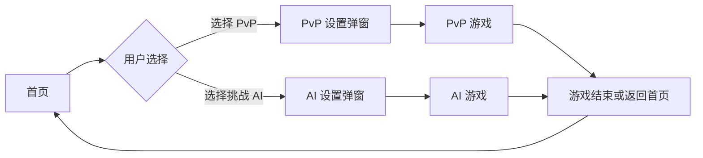
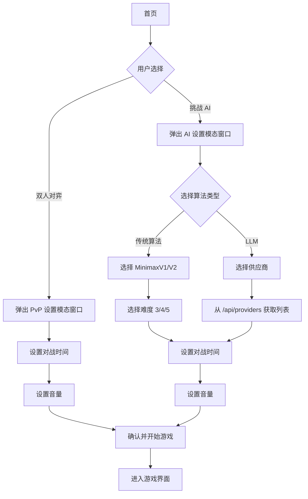
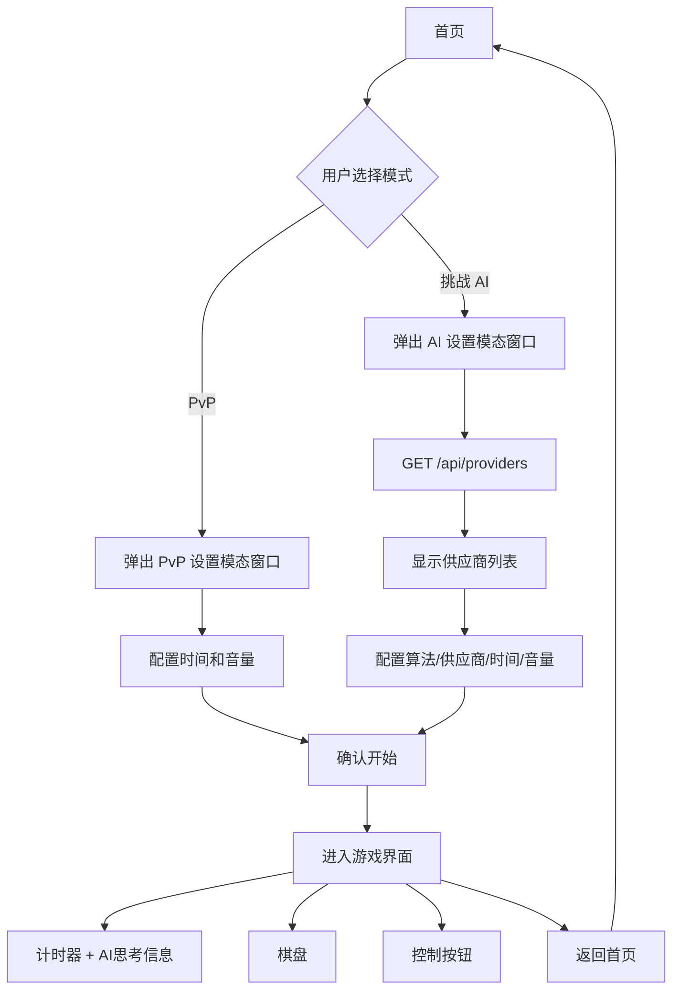

# Zen Chess 功能增强需求设计

## 需求概述

本次需求旨在优化用户体验和功能配置，主要包括PWA图标优化、UI布局调整、游戏模式控制、AI设置模态窗口以及服务端接口扩展。

---

## 功能设计

### 1. PWA 图标配置

**需求说明**  
iPhone用户添加应用到桌面时，使用项目中的 `logo.svg` 作为应用图标，提升品牌辨识度。

**影响范围**
- `index.html` - 添加 Web App Manifest 配置
- 新增或更新 `manifest.json` 文件
- `public/logo.svg` - 作为应用图标资源

**设计要点**
- 在 HTML 中添加 `<link rel="manifest">` 引用 Web App Manifest
- 在 Manifest 中配置 `icons` 数组，指定 `logo.svg` 作为应用图标
- 确保图标尺寸满足 iOS PWA 要求（推荐 192x192, 512x512）
- 添加 `apple-touch-icon` meta 标签以支持 iOS 设备

**技术方案**
| 配置项 | 值 | 说明 |
|--------|-----|------|
| manifest 路径 | `/manifest.json` | Web App Manifest 文件位置 |
| 图标资源 | `/logo.svg` | SVG 格式图标 |
| 图标尺寸 | 192x192, 512x512 | 标准 PWA 图标尺寸 |
| apple-touch-icon | `/logo.svg` 或转换后的 PNG | iOS 设备图标 |

---

### 2. 棋盘页面 UI 重构

**需求说明**  
移除独立的 AI Console 组件，将 AI 思考信息展示在时间倒计时下方，简化界面布局。

**影响范围**
- `App.tsx` - GameView 布局结构调整
- `App.tsx` - AIConsole 组件移除或重构
- AI 思考状态（`aiThinking`, `aiReasoning`）的显示位置调整

**当前结构**
```
GameView
├── 左侧边栏（Desktop）
│   ├── ScoreboardAndControls（计时器 + 控制按钮）
│   └── AIConsole（AI模式选择 + 思考信息）
└── 棋盘区域
```

**目标结构**
```
GameView
├── 计时器区域
│   ├── Red Timer
│   ├── Black Timer
│   └── AI 思考信息区（新增，仅当 AI 思考时显示）
├── 棋盘
└── 控制按钮区
```

**设计要点**
- 将 AI 思考信息整合到 `ScoreboardAndControls` 组件内部，显示在计时器下方
- 当 `aiThinking` 为 true 时显示加载动画
- 当 `aiReasoning` 有内容时显示 AI 分析文本
- 移除原有的 `AIConsole` 组件在游戏视图中的渲染
- 保持移动端和桌面端的响应式适配

**展示逻辑**
| 状态 | 显示内容 |
|------|----------|
| aiThinking = true | 显示"AI is thinking..."动画 |
| aiReasoning 有值 | 显示 AI 思考分析内容 |
| AI 模式关闭 | 不显示 AI 思考区域 |

---

### 3. 游戏模式控制优化

**需求说明**  
当用户从首页选择游戏模式（PvP 或挑战 AI）后，都需要通过模态窗口进行游戏配置。进入游戏后，不允许切换到其他模式，保持游戏模式的一致性。

**影响范围**
- `App.tsx` - 游戏模式状态管理
- 移除或禁用游戏中的 AI 模式切换功能

**当前问题**
- 用户进入游戏后仍可通过 AI Console 切换模式
- 可能导致游戏状态混乱

**设计方案**
- 引入 `gameMode` 状态变量，记录游戏启动时的模式（'pvp' | 'ai'）
- `startGame` 函数中设置 `gameMode`，并在整个游戏过程中保持不变
- 游戏进行中不再显示模式切换按钮
- 若需要切换模式，用户必须返回首页重新选择

**状态流转**


**实现要点**
| 字段 | 类型 | 说明 |
|------|------|------|
| gameMode | 'pvp' \| 'ai' | 记录游戏模式，在游戏中只读 |
| 模式锁定 | boolean | 进入游戏后锁定模式，禁止切换 |

---

### 4. 游戏设置模态窗口

**需求说明**  
当用户在首页选择游戏模式后，弹出对应的设置模态窗口进行配置。PvP 模式和 AI 模式共享相同的时间、音量设置，AI 模式额外包含算法和供应商配置。

**影响范围**
- 新增游戏设置模态窗口组件（可命名为 `GameSettingsModal`）
- `App.tsx` - 添加模态窗口状态管理
- 首页"双人对弈"和"挑战 AI"按钮点击事件调整

**模态窗口内容结构**

#### 4.1 PvP 设置模态窗口
包含以下配置项：
- **对战时间选择**
  - 无限时间（0秒）
  - 10分钟（600秒）
  - 20分钟（1200秒）
  - 可扩展更多选项
  
- **音量设置**
  - 音量滑块（0-1）
  - 静音/取消静音切换按钮

#### 4.2 AI 设置模态窗口
包含 PvP 的所有配置项，额外增加：

- **算法类型选择**
  - **选项 1：传统算法**
    - 子选项：MinimaxV1 / MinimaxV2
    - 难度选择：3（简单）/ 4（中等）/ 5（困难）
  
  - **选项 2：LLM**
    - 供应商选择：从服务器动态获取（通过 `/api/providers` 接口）
    - 默认显示：DeepSeek / Gemini（根据接口返回）

**交互流程**


**数据结构**

通用游戏设置配置对象：
| 字段 | 类型 | 说明 | 默认值 |
|------|------|------|--------|
| gameMode | 'pvp' \| 'ai' | 游戏模式 | - |
| gameTime | number | 对战时间（秒） | 600 |
| volume | number | 音量（0-1） | 0.5 |

AI 特有配置（仅在 AI 模式下使用）：
| 字段 | 类型 | 说明 | 默认值 |
|------|------|------|--------|
| algorithmType | 'traditional' \| 'llm' | 算法类型 | 'traditional' |
| minimaxVersion | 'v1' \| 'v2' | Minimax版本 | 'v2' |
| difficulty | 3 \| 4 \| 5 | 难度（搜索深度） | 4 |
| llmProvider | string | LLM供应商ID | 'deepseek' |

**UI 布局**

PvP 设置模态窗口：
- 模态窗口居中显示，半透明背景遮罩
- 分区域展示：时间选择 / 音量控制
- 底部包含"取消"和"开始游戏"按钮
- 响应式设计，适配移动端

AI 设置模态窗口：
- 模态窗口居中显示，半透明背景遮罩
- 分区域展示：算法选择 / 难度设置（传统算法）或供应商选择（LLM）/ 时间选择 / 音量控制
- 底部包含"取消"和"开始游戏"按钮
- 响应式设计，适配移动端

---

### 5. 供应商接口开发

**需求说明**  
新增 `/api/providers` 服务端接口，返回可用的 LLM 供应商列表。

**影响范围**
- `server/index.ts` - 新增路由处理
- 或新增 `api/providers.ts` 文件（Vercel Serverless Function）
- `api/common/config.ts` - 复用现有供应商配置

**接口设计**

| 项目 | 内容 |
|------|------|
| 路径 | `/api/providers` |
| 方法 | GET |
| 请求参数 | 无 |
| 响应格式 | JSON |

**响应数据结构**
```
{
  "providers": [
    {
      "id": "deepseek",
      "name": "DeepSeek",
      "available": true
    },
    {
      "id": "gemini",
      "name": "Gemini",
      "available": true
    },
    {
      "id": "openai",
      "name": "OpenAI",
      "available": false
    },
    {
      "id": "qianwen",
      "name": "Qwen",
      "available": true
    }
  ]
}
```

**字段说明**
| 字段 | 类型 | 说明 |
|------|------|------|
| id | string | 供应商唯一标识符（与现有 config 中的 key 一致） |
| name | string | 供应商显示名称 |
| available | boolean | 是否可用（基于 API Key 是否配置） |

**实现逻辑**
- 读取 `AI_PROVIDERS` 配置
- 遍历各供应商，检查 `apiKey` 是否为空
- 若 `apiKey` 存在且非空，则标记为 `available: true`
- 返回供应商列表数组

**错误处理**
| 错误场景 | HTTP 状态码 | 响应内容 |
|----------|-------------|----------|
| 请求成功 | 200 | 供应商列表 |
| 服务器内部错误 | 500 | `{ "error": "Internal Server Error" }` |

---

### 6. 首页音量设置迁移

**需求说明**  
将首页的音量设置控件移除，整合到游戏设置模态窗口中（PvP 和 AI 模式均包含）。

**影响范围**
- `App.tsx` - HomeView 组件移除音量控制 UI
- PvP 和 AI 设置模态窗口中均包含音量设置

**变更内容**
- 从 HomeView 中移除音量滑块和按钮
- 在 PvP 设置模态窗口中添加音量控制
- 在 AI 设置模态窗口中添加音量控制
- 音量状态（`volume`）在全局保持，不受模态窗口关闭影响

**用户体验优化**
- 用户在开始游戏前统一进行所有配置
- 两种模式的音量设置体验保持一致
- 音量设置在游戏过程中持久化

---

## 技术实现要点

### 前端改动
- **App.tsx**：状态管理扩展、布局重构、新增两个模态窗口组件（PvP 和 AI）
- **组件拆分**：建议将游戏设置模态窗口独立为单独组件，可考虑共享基础配置 UI
- **API 调用**：在 AI 设置模态窗口加载时调用 `/api/providers` 获取供应商列表
- **状态同步**：确保音量、时间等设置在模态窗口和游戏中同步

### 后端改动
- **新增 API**：`/api/providers` 接口实现
- **配置复用**：利用现有 `AI_PROVIDERS` 配置，无需新增数据源
- **环境变量依赖**：API Key 的配置依赖环境变量，需确保部署时正确设置

### Minimax 版本支持
- **minimaxV1**：对应现有 `api/minimax.ts` 中的实现
- **minimaxV2**：对应 `api/minimaxV2.ts` 中的优化版本
- 前端根据用户选择调用不同版本的算法
- minimaxV1和minimaxV2是通过minimaxWorker调用的，在前端使用webworker的方式
- 确保两个版本的接口签名一致，便于前端统一调用

---

## 数据流图



---

## 验收标准

### 功能验收
1. **PWA 图标**：iPhone 用户添加到桌面后，显示 `logo.svg` 作为应用图标
2. **AI 思考信息位置**：AI 思考内容显示在计时器下方，不再显示独立的 AI Console
3. **模式锁定**：选择任一模式后，游戏中无法切换到其他模式
4. **PvP 设置弹窗**：点击"双人对弈"后弹出模态窗口，包含时间、音量配置
5. **AI 设置弹窗**：点击"挑战 AI"后弹出模态窗口，包含算法选择、难度、供应商、时间、音量等配置
6. **供应商接口**：`/api/providers` 返回正确的供应商列表，包含 id、name、available 字段
7. **音量设置迁移**：首页移除音量控件，在两种游戏设置模态窗口中均可调整音量

### UI/UX 验收
- 两个模态窗口设计美观统一，符合 Zen 主题风格
- AI 思考信息区域布局合理，不影响棋盘操作
- 响应式布局在移动端和桌面端均表现良好
- 供应商列表动态加载，若接口失败有友好提示
- PvP 和 AI 模态窗口的时间、音量设置体验一致

### 技术验收
- 代码结构清晰，组件职责单一
- API 接口符合 RESTful 规范
- 状态管理无冗余，逻辑清晰
- 兼容现有 Minimax 服务和 OpenAI 服务调用

---

## 风险与注意事项

### 技术风险

- **SVG 兼容性**：部分 iOS 版本可能不完全支持 SVG 作为 PWA 图标，建议同时提供 PNG 格式备选方案
  - 生成 192x192 和 512x512 尺寸的 PNG 图标
  - 在 manifest.json 中同时配置 SVG 和 PNG 格式
  - 添加 `<link rel="apple-touch-icon" href="/logo-192.png">` 以确保 iOS 兼容性
- **供应商接口性能**：若供应商列表过多，建议增加缓存机制
  - 前端使用 `localStorage` 缓存供应商列表（有效期 1 小时）
  - 后端考虑使用内存缓存避免重复读取配置
  - 添加接口响应时间监控，若超过 500ms 则优化
- **状态管理复杂度**：新增配置项较多，需确保状态同步和重置逻辑正确

### 用户体验风险
- **模态窗口关闭行为**：用户关闭模态窗口后应返回首页，避免状态混乱
- **配置默认值**：首次打开模态窗口应提供合理的默认配置，减少用户操作负担

### 兼容性注意事项
- 确保现有游戏逻辑不受影响
- Minimax V1 和 V2 接口保持一致
- 供应商配置变更不影响已有 AI 功能

---

## 实施建议

### 开发顺序
1. **后端优先**：先实现 `/api/providers` 接口，便于前端集成测试
2. **UI 重构**：调整棋盘页面布局，移除 AI Console
3. **模态窗口开发**：
   - 先实现 PvP 设置模态窗口（较简单）
   - 再实现 AI 设置模态窗口（复用 PvP 的时间、音量 UI）
4. **PWA 配置**：最后完成 manifest 和图标配置
5. **集成测试**：全流程测试各模式切换和配置保存

### 测试要点
- 测试不同供应商的选择和调用
- 验证 Minimax V1/V2 切换
- 确认难度选择对搜索深度的影响
- 测试时间控制在不同配置下的表现
- 验证音量设置的持久化和同步

### 部署注意事项
- 确保服务器环境变量配置齐全（各供应商的 API Key）
- 验证 manifest.json 在生产环境的正确引用
- 测试 PWA 添加到桌面的实际效果
