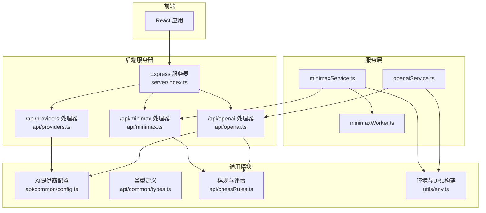
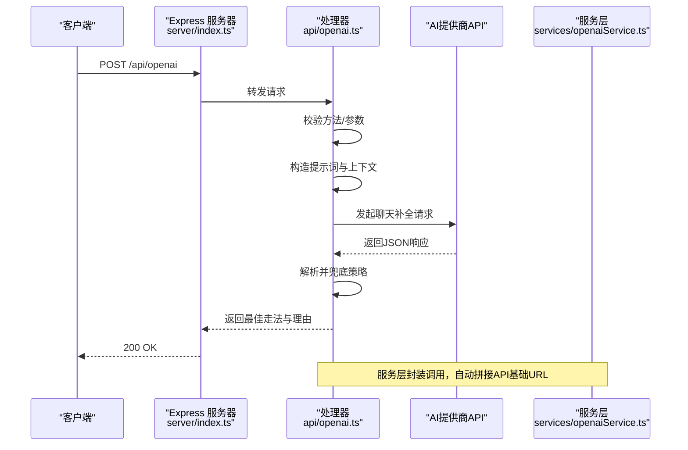
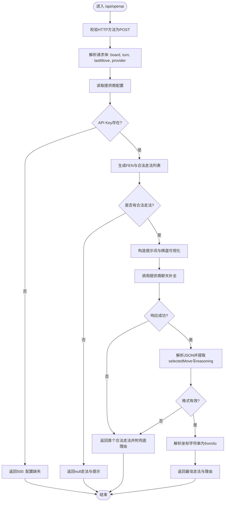
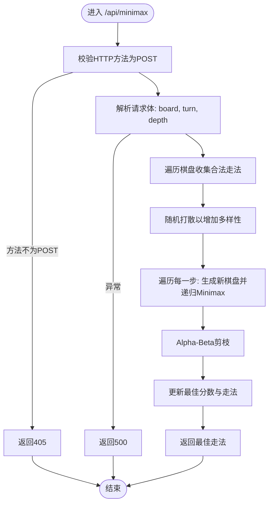
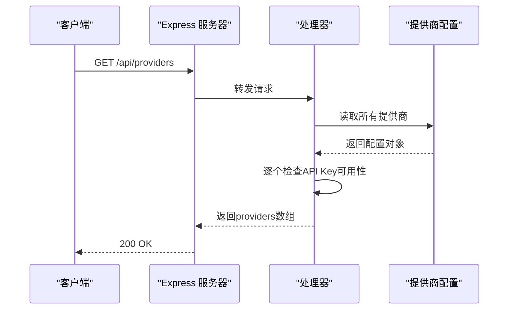
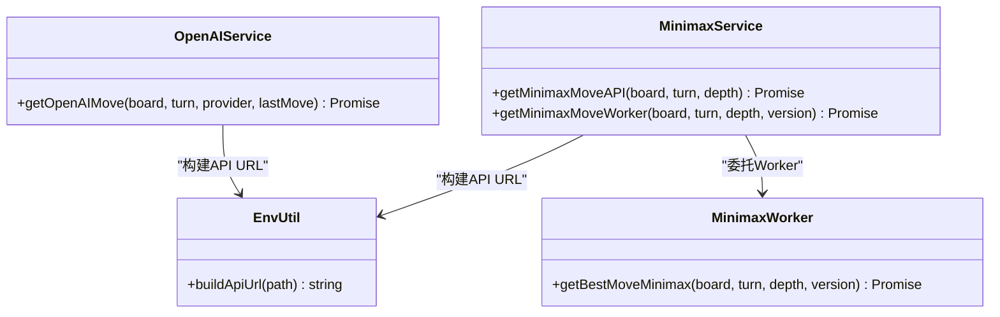
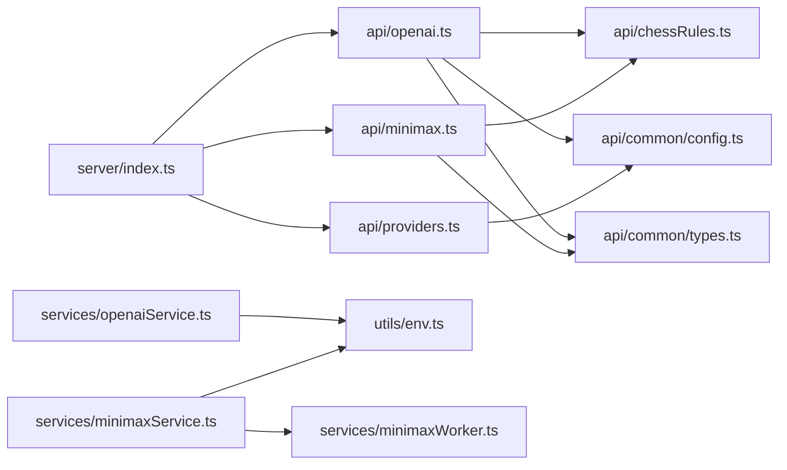

# API参考

<cite>
**本文引用的文件**
- [api/openai.ts](file://api/openai.ts)
- [api/minimax.ts](file://api/minimax.ts)
- [api/providers.ts](file://api/providers.ts)
- [api/common/config.ts](file://api/common/config.ts)
- [api/common/types.ts](file://api/common/types.ts)
- [api/chessRules.ts](file://api/chessRules.ts)
- [services/openaiService.ts](file://services/openaiService.ts)
- [services/minimaxService.ts](file://services/minimaxService.ts)
- [services/minimaxWorker.ts](file://services/minimaxWorker.ts)
- [utils/env.ts](file://utils/env.ts)
- [server/index.ts](file://server/index.ts)
- [README.md](file://README.md)
</cite>

## 目录
1. [简介](#简介)
2. [项目结构](#项目结构)
3. [核心组件](#核心组件)
4. [架构总览](#架构总览)
5. [详细组件分析](#详细组件分析)
6. [依赖关系分析](#依赖关系分析)
7. [性能考量](#性能考量)
8. [故障排查指南](#故障排查指南)
9. [结论](#结论)
10. [附录](#附录)

## 简介
本文件为后端REST API的完整参考，涵盖以下端点：
- POST /api/openai：基于LLM的AI走子决策，支持多提供商（OpenAI、Gemini、DeepSeek、Qwen），返回最佳走法及分析理由。
- POST /api/minimax：基于Minimax算法的AI走子决策，返回最佳走法。
- GET /api/providers：返回可用AI提供商列表及其可用性状态。

同时说明这些API在服务层如何被调用（openaiService.ts、minimaxService.ts），以及如何通过环境变量配置提供商、如何构建API URL等。

## 项目结构
后端API由Express服务器路由转发至Vercel风格的函数处理器，核心逻辑位于api/目录，服务层封装在services/目录，类型定义位于api/common/types.ts，环境变量工具位于utils/env.ts。

图表来源
- [server/index.ts](file://server/index.ts#L22-L41)
- [api/openai.ts](file://api/openai.ts#L1-L127)
- [api/minimax.ts](file://api/minimax.ts#L1-L125)
- [api/providers.ts](file://api/providers.ts#L1-L41)
- [services/openaiService.ts](file://services/openaiService.ts#L1-L37)
- [services/minimaxService.ts](file://services/minimaxService.ts#L1-L66)
- [services/minimaxWorker.ts](file://services/minimaxWorker.ts#L1-L19)
- [api/common/config.ts](file://api/common/config.ts#L1-L49)
- [api/common/types.ts](file://api/common/types.ts#L1-L68)
- [api/chessRules.ts](file://api/chessRules.ts#L1-L390)
- [utils/env.ts](file://utils/env.ts#L1-L51)

章节来源
- [server/index.ts](file://server/index.ts#L1-L64)
- [README.md](file://README.md#L71-L82)

## 核心组件
- /api/openai：接收棋盘、当前回合、上一步等信息，构造提示词，调用选定AI提供商的聊天补全接口，解析JSON并返回最佳走法与理由。
- /api/minimax：接收棋盘、当前回合、搜索深度，执行Minimax+Alpha-Beta剪枝，返回最佳走法。
- /api/providers：读取配置中的提供商列表，返回可用性状态。
- 服务层封装：openaiService.ts与minimaxService.ts分别封装对上述API的调用，便于前端复用。

章节来源
- [api/openai.ts](file://api/openai.ts#L1-L127)
- [api/minimax.ts](file://api/minimax.ts#L1-L125)
- [api/providers.ts](file://api/providers.ts#L1-L41)
- [services/openaiService.ts](file://services/openaiService.ts#L1-L37)
- [services/minimaxService.ts](file://services/minimaxService.ts#L1-L66)

## 架构总览
后端采用“Express路由 + Vercel风格函数处理器”的组合：Express负责路由与CORS、健康检查等，具体业务逻辑在api/*中实现；服务层在前端或独立服务中调用这些API。

图表来源
- [server/index.ts](file://server/index.ts#L22-L31)
- [api/openai.ts](file://api/openai.ts#L1-L127)
- [services/openaiService.ts](file://services/openaiService.ts#L1-L37)
- [utils/env.ts](file://utils/env.ts#L31-L51)

## 详细组件分析

### POST /api/openai
- 方法与路径
  - POST /api/openai
- 请求体字段
  - board: 棋盘二维数组，见类型定义
  - turn: 当前回合颜色
  - lastMove: 上一步走法（可选）
  - provider: AI提供商标识，默认openai
- 成功响应
  - from: 起点坐标
  - to: 终点坐标
  - reason: AI给出的分析理由
  - notation: 走法的中国象棋记谱（可选）
- 错误处理
  - 405: 方法不允许
  - 500: 配置缺失（API Key未配置）
  - 200: API返回错误或空响应时，返回首个合法走法并附带兜底理由
  - 502: 服务内部异常
- 关键流程
  - 生成FEN与合法走法列表
  - 构造可视化棋盘与提示词
  - 调用提供商API（含模型、温度、响应格式）
  - 解析JSON并校验格式，失败则兜底
- curl示例
  - curl -X POST "$API_BASE_URL/api/openai" -H "Content-Type: application/json" -d '{"board":[...],"turn":"w","provider":"openai"}'

图表来源
- [api/openai.ts](file://api/openai.ts#L1-L127)
- [api/chessRules.ts](file://api/chessRules.ts#L196-L257)
- [api/common/config.ts](file://api/common/config.ts#L1-L49)

章节来源
- [api/openai.ts](file://api/openai.ts#L1-L127)
- [api/chessRules.ts](file://api/chessRules.ts#L196-L257)
- [api/common/config.ts](file://api/common/config.ts#L1-L49)
- [services/openaiService.ts](file://services/openaiService.ts#L1-L37)
- [utils/env.ts](file://utils/env.ts#L31-L51)

### POST /api/minimax
- 方法与路径
  - POST /api/minimax
- 请求体字段
  - board: 棋盘二维数组
  - turn: 当前回合颜色
  - depth: 搜索深度（默认3）
- 成功响应
  - from: 起点坐标
  - to: 终点坐标
- 错误处理
  - 405: 方法不允许
  - 500: 内部错误（包含details）
- 关键流程
  - 收集所有合法走法
  - 执行Minimax+Alpha-Beta剪枝
  - 返回最佳走法
- curl示例
  - curl -X POST "$API_BASE_URL/api/minimax" -H "Content-Type: application/json" -d '{"board":[...],"turn":"w","depth":3}'

图表来源
- [api/minimax.ts](file://api/minimax.ts#L1-L125)
- [api/chessRules.ts](file://api/chessRules.ts#L196-L205)

章节来源
- [api/minimax.ts](file://api/minimax.ts#L1-L125)
- [api/chessRules.ts](file://api/chessRules.ts#L196-L205)
- [services/minimaxService.ts](file://services/minimaxService.ts#L1-L66)

### GET /api/providers
- 方法与路径
  - GET /api/providers
- 成功响应
  - providers: 数组，元素包含
    - id: 供应商标识
    - name: 名称
    - available: 是否可用（由API Key是否存在决定）
- 错误处理
  - 405: 方法不允许
  - 500: 内部错误
- curl示例
  - curl "$API_BASE_URL/api/providers"

图表来源
- [api/providers.ts](file://api/providers.ts#L1-L41)
- [api/common/config.ts](file://api/common/config.ts#L1-L49)

章节来源
- [api/providers.ts](file://api/providers.ts#L1-L41)
- [api/common/config.ts](file://api/common/config.ts#L1-L49)

### 服务层调用关系
- openaiService.ts
  - 调用POST /api/openai，传入board、turn、provider、lastMove
  - 返回最佳走法与reason
- minimaxService.ts
  - 调用POST /api/minimax，传入board、turn、depth
  - 返回最佳走法
  - 也可通过Web Worker方式调用minimaxWorker.ts，支持v1/v2版本切换
- URL构建
  - 使用utils/env.ts的buildApiUrl拼接API基础URL与路径

图表来源
- [services/openaiService.ts](file://services/openaiService.ts#L1-L37)
- [services/minimaxService.ts](file://services/minimaxService.ts#L1-L66)
- [services/minimaxWorker.ts](file://services/minimaxWorker.ts#L1-L19)
- [utils/env.ts](file://utils/env.ts#L31-L51)

章节来源
- [services/openaiService.ts](file://services/openaiService.ts#L1-L37)
- [services/minimaxService.ts](file://services/minimaxService.ts#L1-L66)
- [services/minimaxWorker.ts](file://services/minimaxWorker.ts#L1-L19)
- [utils/env.ts](file://utils/env.ts#L31-L51)

## 依赖关系分析
- 处理器依赖
  - /api/openai.ts 依赖：棋规（生成FEN、合法走法、坐标解析）、提供商配置、类型定义
  - /api/minimax.ts 依赖：棋规（合法走法、应用走法、评估棋盘）
  - /api/providers.ts 依赖：提供商配置
- 服务层依赖
  - openaiService.ts 依赖：utils/env.ts（构建URL）
  - minimaxService.ts 依赖：utils/env.ts（构建URL），comlink Worker包装
- Express路由
  - server/index.ts 将 /api/openai 与 /api/providers 路由转发到对应处理器

图表来源
- [api/openai.ts](file://api/openai.ts#L1-L127)
- [api/minimax.ts](file://api/minimax.ts#L1-L125)
- [api/providers.ts](file://api/providers.ts#L1-L41)
- [api/chessRules.ts](file://api/chessRules.ts#L1-L390)
- [api/common/config.ts](file://api/common/config.ts#L1-L49)
- [api/common/types.ts](file://api/common/types.ts#L1-L68)
- [services/openaiService.ts](file://services/openaiService.ts#L1-L37)
- [services/minimaxService.ts](file://services/minimaxService.ts#L1-L66)
- [services/minimaxWorker.ts](file://services/minimaxWorker.ts#L1-L19)
- [utils/env.ts](file://utils/env.ts#L1-L51)
- [server/index.ts](file://server/index.ts#L22-L41)

章节来源
- [server/index.ts](file://server/index.ts#L22-L41)
- [api/openai.ts](file://api/openai.ts#L1-L127)
- [api/minimax.ts](file://api/minimax.ts#L1-L125)
- [api/providers.ts](file://api/providers.ts#L1-L41)

## 性能考量
- /api/openai
  - 使用较低temperature与JSON响应格式，提升稳定性与可解析性
  - 对AI响应进行兜底策略，避免因外部API不稳定导致的失败
- /api/minimax
  - 默认深度较小，避免UI冻结；实际部署建议使用Worker或更高并发策略
  - Alpha-Beta剪枝减少无效分支，提高搜索效率
- 服务层
  - openaiService与minimaxService统一构建URL，便于在不同环境（本地/生产）切换

[本节为通用指导，无需列出章节来源]

## 故障排查指南
- 常见HTTP状态码
  - 405 Method Not Allowed：请求方法不被允许（仅支持POST或GET）
  - 500 Internal Server Error：服务器内部错误或配置缺失
  - 502 Bad Gateway：上游API返回错误
  - 200 OK：正常响应，但需注意部分情况下会返回兜底走法
- 常见问题定位
  - Provider配置缺失：确认环境变量OPENAI_API_KEY等已设置
  - API返回非JSON或为空：处理器会返回兜底走法并附带原因
  - Minimax计算异常：检查board与turn格式，确认深度合理
- 日志与调试
  - 处理器内包含关键步骤的日志输出，便于定位问题

章节来源
- [api/openai.ts](file://api/openai.ts#L1-L127)
- [api/minimax.ts](file://api/minimax.ts#L1-L125)
- [api/providers.ts](file://api/providers.ts#L1-L41)
- [server/index.ts](file://server/index.ts#L44-L58)

## 结论
本API参考文档梳理了后端暴露的三个核心REST端点与其在服务层的调用方式。通过明确的请求体、响应格式与错误处理策略，开发者可以稳定地集成AI走子能力。建议在生产环境中结合Worker与缓存策略优化Minimax性能，并通过环境变量集中管理各提供商的密钥与模型。

[本节为总结性内容，无需列出章节来源]

## 附录

### 环境变量与提供商配置
- 支持的提供商与环境变量前缀
  - OpenAI: OPENAI_API_KEY, OPENAI_MODEL, OPENAI_API_URL
  - Gemini: GEMINI_API_KEY, GEMINI_MODEL, GEMINI_API_URL
  - DeepSeek: DEEPSEEK_API_KEY, DEEPSEEK_MODEL, DEEPSEEK_API_URL
  - 阿里云千问: QIANWEN_API_KEY, QIANWEN_MODEL, QIANWEN_API_URL
- curl示例（示例中使用$API_BASE_URL替换为实际基础URL）
  - POST /api/openai
    - curl -X POST "$API_BASE_URL/api/openai" -H "Content-Type: application/json" -d '{"board":[...],"turn":"w","provider":"openai"}'
  - POST /api/minimax
    - curl -X POST "$API_BASE_URL/api/minimax" -H "Content-Type: application/json" -d '{"board":[...],"turn":"w","depth":3}'
  - GET /api/providers
    - curl "$API_BASE_URL/api/providers"

章节来源
- [README.md](file://README.md#L21-L43)
- [api/common/config.ts](file://api/common/config.ts#L1-L49)
- [utils/env.ts](file://utils/env.ts#L31-L51)