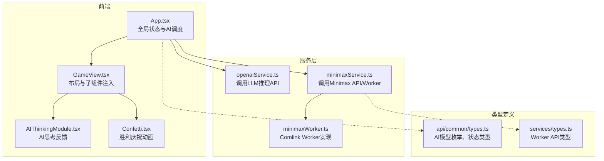
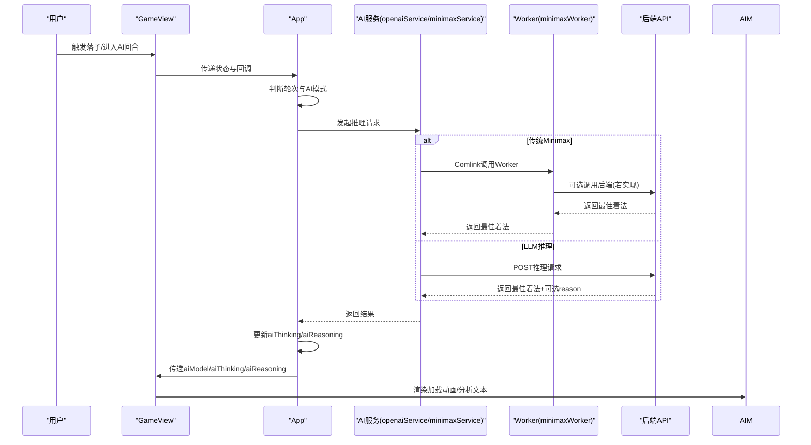
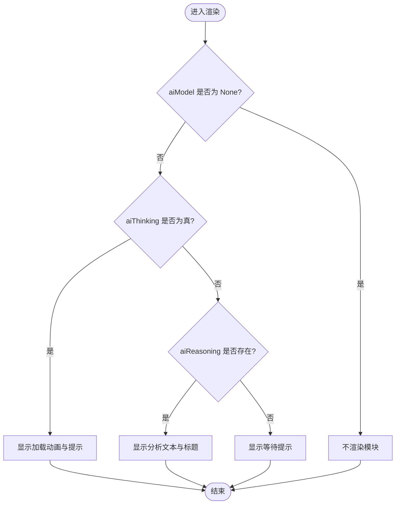
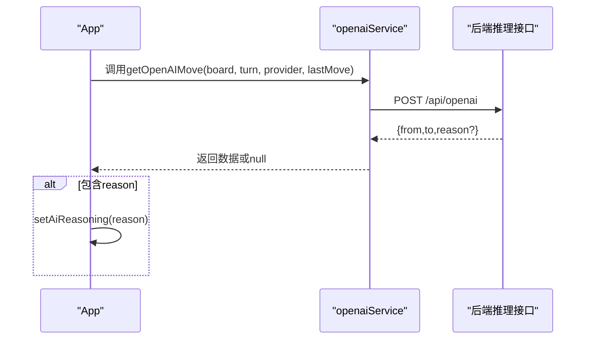
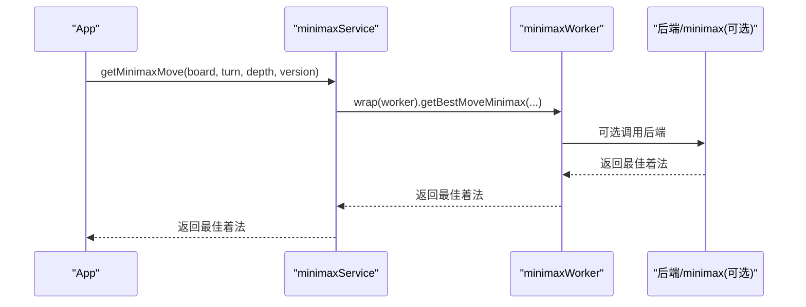
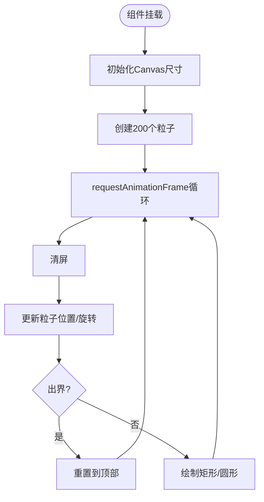
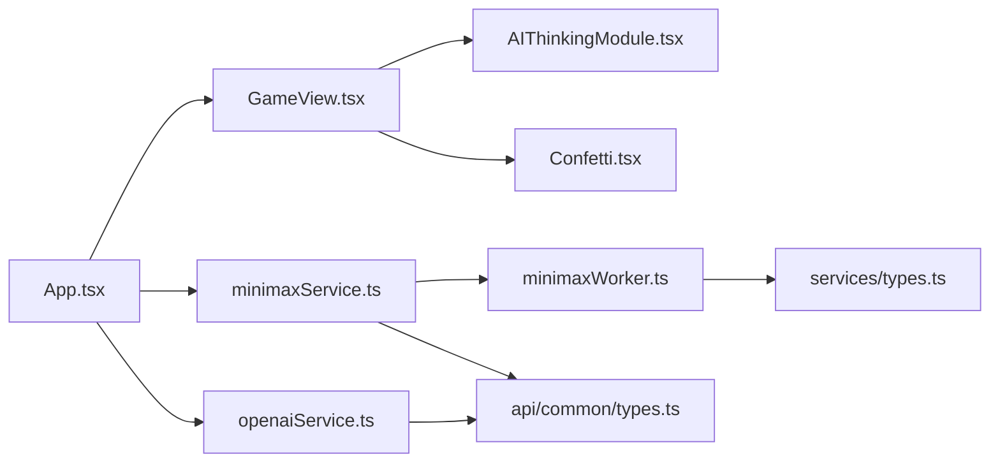

# AI交互模块

<cite>
**本文引用的文件列表**
- [App.tsx](file://App.tsx)
- [GameView.tsx](file://components/GameView.tsx)
- [AIThinkingModule.tsx](file://components/AIThinkingModule.tsx)
- [openaiService.ts](file://services/openaiService.ts)
- [minimaxService.ts](file://services/minimaxService.ts)
- [minimaxWorker.ts](file://services/minimaxWorker.ts)
- [Confetti.tsx](file://components/Confetti.tsx)
- [types.ts](file://api/common/types.ts)
- [types.ts](file://services/types.ts)
</cite>

## 目录
1. [简介](#简介)
2. [项目结构](#项目结构)
3. [核心组件](#核心组件)
4. [架构总览](#架构总览)
5. [详细组件分析](#详细组件分析)
6. [依赖关系分析](#依赖关系分析)
7. [性能考量](#性能考量)
8. [故障排查指南](#故障排查指南)
9. [结论](#结论)

## 简介
本文件聚焦于AI思考过程的视觉反馈机制与胜利庆祝动画实现，围绕以下目标展开：
- 解释AIThinkingModule如何基于AI状态（是否在思考、推理文本）动态呈现加载动画与分析内容
- 说明与后端或Web Worker的通信状态映射（openaiService与minimaxService）
- 介绍Confetti在游戏结束时的庆祝动画实现及与游戏状态的集成
- 提供动画性能优化建议（延迟加载、条件渲染等）

## 项目结构
本项目采用按功能分层的组织方式，AI交互模块位于前端组件与服务层之间，通过GameView进行组合使用；AI推理由服务层调用后端API或Web Worker执行，最终回传结果驱动UI更新。

图表来源
- [App.tsx](file://App.tsx#L32-L119)
- [GameView.tsx](file://components/GameView.tsx#L89-L171)
- [AIThinkingModule.tsx](file://components/AIThinkingModule.tsx#L1-L53)
- [openaiService.ts](file://services/openaiService.ts#L1-L37)
- [minimaxService.ts](file://services/minimaxService.ts#L1-L66)
- [minimaxWorker.ts](file://services/minimaxWorker.ts#L1-L19)
- [types.ts](file://api/common/types.ts#L38-L50)
- [types.ts](file://services/types.ts#L1-L5)

章节来源
- [App.tsx](file://App.tsx#L32-L119)
- [GameView.tsx](file://components/GameView.tsx#L89-L171)

## 核心组件
- AIThinkingModule：根据AI模型、思考状态与推理文本，动态切换“加载动画+提示语”、“分析结果展示”与“等待提示”，统一容器高度避免跳动。
- openaiService：封装向后端LLM推理接口的请求，返回最佳着法与可选的推理文本。
- minimaxService：封装Minimax算法调用，支持API直连与Web Worker两种路径；Worker通过Comlink暴露API。
- minimaxWorker：在Worker线程内执行Minimax计算，返回最佳着法。
- Confetti：基于Canvas的粒子系统，全屏覆盖并在窗口尺寸变化时自适应，仅在非进行中时渲染。

章节来源
- [AIThinkingModule.tsx](file://components/AIThinkingModule.tsx#L1-L53)
- [openaiService.ts](file://services/openaiService.ts#L1-L37)
- [minimaxService.ts](file://services/minimaxService.ts#L1-L66)
- [minimaxWorker.ts](file://services/minimaxWorker.ts#L1-L19)
- [Confetti.tsx](file://components/Confetti.tsx#L1-L92)

## 架构总览
AI思考反馈与后端/Worker通信的端到端流程如下：

图表来源
- [App.tsx](file://App.tsx#L340-L371)
- [openaiService.ts](file://services/openaiService.ts#L1-L37)
- [minimaxService.ts](file://services/minimaxService.ts#L47-L66)
- [minimaxWorker.ts](file://services/minimaxWorker.ts#L1-L19)
- [GameView.tsx](file://components/GameView.tsx#L123-L150)
- [AIThinkingModule.tsx](file://components/AIThinkingModule.tsx#L1-L53)

## 详细组件分析

### AIThinkingModule：思考反馈与状态映射
- 状态输入
  - aiModel：决定是否渲染模块（None时不渲染）
  - aiThinking：为true时显示“加载动画+提示”
  - aiReasoning：存在时显示“分析结果”
- 渲染策略
  - 加载动画：三个点依次弹跳，配合脉冲提示“AI正在思考...”
  - 分析展示：标题“分析”+图标+多行文本，带省略与淡入动画
  - 空闲提示：默认“等待AI行动...”
  - 容器高度固定，避免内容切换导致布局抖动
- 与GameView的集成
  - GameView将aiModel/aiThinking/aiReasoning作为props传入AIThinkingModule
- 与App状态联动
  - App在AI回合开始前设置aiThinking=true并清空aiReasoning
  - 接收推理结果后更新aiReasoning（LLM场景）并设置aiThinking=false

图表来源
- [AIThinkingModule.tsx](file://components/AIThinkingModule.tsx#L1-L53)
- [GameView.tsx](file://components/GameView.tsx#L123-L150)

章节来源
- [AIThinkingModule.tsx](file://components/AIThinkingModule.tsx#L1-L53)
- [GameView.tsx](file://components/GameView.tsx#L123-L150)

### openaiService：LLM推理调用
- 请求参数
  - board、turn、provider（默认值）、lastMove
- 响应处理
  - 校验HTTP状态与错误字段，失败时返回null
  - 成功时返回最佳着法与可选reason（用于UI展示）
- 与App的协作
  - App在AI回合调用openaiService，若返回reason则设置aiReasoning

图表来源
- [openaiService.ts](file://services/openaiService.ts#L1-L37)
- [App.tsx](file://App.tsx#L340-L371)

章节来源
- [openaiService.ts](file://services/openaiService.ts#L1-L37)
- [App.tsx](file://App.tsx#L340-L371)

### minimaxService与minimaxWorker：传统AI计算
- API路径
  - 直接调用后端/minimax，返回最佳着法
- Worker路径
  - 使用new Worker加载minimaxWorker.ts
  - 通过Comlink.wrap包装Worker API
  - Worker内部根据版本选择不同Minimax实现
- 与App的协作
  - App在AI回合调用getMinimaxMove，返回最佳着法后交由App执行落子

图表来源
- [minimaxService.ts](file://services/minimaxService.ts#L47-L66)
- [minimaxWorker.ts](file://services/minimaxWorker.ts#L1-L19)
- [App.tsx](file://App.tsx#L340-L371)

章节来源
- [minimaxService.ts](file://services/minimaxService.ts#L1-L66)
- [minimaxWorker.ts](file://services/minimaxWorker.ts#L1-L19)
- [App.tsx](file://App.tsx#L340-L371)

### Confetti：胜利庆祝动画
- 实现要点
  - Canvas全屏覆盖，随窗口尺寸变化自适应
  - 初始化200个粒子，随机颜色、形状、旋转速度
  - requestAnimationFrame循环渲染，粒子落地重置
  - 卸载时清理事件与动画帧
- 与游戏状态集成
  - App在检测到非进行中（红胜/黑胜）时渲染Confetti
  - 通过z-index与pointer-events控制层级与交互

图表来源
- [Confetti.tsx](file://components/Confetti.tsx#L1-L92)
- [App.tsx](file://App.tsx#L455-L456)

章节来源
- [Confetti.tsx](file://components/Confetti.tsx#L1-L92)
- [App.tsx](file://App.tsx#L455-L456)

## 依赖关系分析
- 组件耦合
  - GameView负责将App状态注入AIThinkingModule与Confetti
  - App集中管理AI状态（aiThinking、aiReasoning）与AI调度
- 服务层依赖
  - openaiService与minimaxService分别对接LLM与Minimax
  - minimaxService通过Comlink与minimaxWorker通信
- 类型契约
  - AIModel枚举定义了None/Traditional/OpenAI三种模式
  - MinimaxWorkerAPI定义了Worker暴露的方法签名

图表来源
- [App.tsx](file://App.tsx#L32-L119)
- [GameView.tsx](file://components/GameView.tsx#L89-L171)
- [AIThinkingModule.tsx](file://components/AIThinkingModule.tsx#L1-L53)
- [Confetti.tsx](file://components/Confetti.tsx#L1-L92)
- [openaiService.ts](file://services/openaiService.ts#L1-L37)
- [minimaxService.ts](file://services/minimaxService.ts#L1-L66)
- [minimaxWorker.ts](file://services/minimaxWorker.ts#L1-L19)
- [types.ts](file://api/common/types.ts#L38-L50)
- [types.ts](file://services/types.ts#L1-L5)

章节来源
- [types.ts](file://api/common/types.ts#L38-L50)
- [types.ts](file://services/types.ts#L1-L5)

## 性能考量
- 主线程压力控制
  - 将CPU密集的Minimax计算放入Web Worker，避免阻塞UI
  - 使用Comlink进行跨线程通信，减少序列化开销
- 动画与渲染优化
  - AIThinkingModule统一容器高度，避免布局抖动
  - 加载动画使用CSS动画而非频繁重排
  - Confetti仅在非进行中时渲染，避免不必要的Canvas绘制
- 条件渲染与懒加载
  - 当aiModel为None时，AIThinkingModule直接返回空，减少DOM节点
  - 在AI回合开始前设置aiThinking=true，结束后再渲染分析文本，避免闪烁
- 资源释放
  - Confetti卸载时取消requestAnimationFrame与移除窗口事件，防止内存泄漏

章节来源
- [minimaxService.ts](file://services/minimaxService.ts#L47-L66)
- [minimaxWorker.ts](file://services/minimaxWorker.ts#L1-L19)
- [AIThinkingModule.tsx](file://components/AIThinkingModule.tsx#L1-L53)
- [Confetti.tsx](file://components/Confetti.tsx#L1-L92)
- [App.tsx](file://App.tsx#L340-L371)

## 故障排查指南
- AI未响应
  - 检查App的AI调度逻辑是否在正确的轮次与视图下触发
  - 确认openaiService/minimaxService返回值是否为null（网络/后端错误）
- 加载动画不显示
  - 确认aiThinking状态已设置为true且aiModel非None
  - 检查AIThinkingModule的props是否正确传递
- 分析文本未显示
  - 确认LLM推理返回包含reason字段
  - 检查App是否成功设置aiReasoning
- 胜利动画不出现
  - 确认gameStatus已变为非进行中
  - 检查App渲染Confetti的条件分支
- Worker异常
  - 检查minimaxService创建Worker的URL与模块类型
  - 确认minimaxWorker正确expose方法并返回有效结果

章节来源
- [App.tsx](file://App.tsx#L340-L371)
- [openaiService.ts](file://services/openaiService.ts#L1-L37)
- [minimaxService.ts](file://services/minimaxService.ts#L47-L66)
- [minimaxWorker.ts](file://services/minimaxWorker.ts#L1-L19)
- [AIThinkingModule.tsx](file://components/AIThinkingModule.tsx#L1-L53)
- [Confetti.tsx](file://components/Confetti.tsx#L1-L92)

## 结论
本项目通过清晰的状态分层与组件职责划分，实现了从AI推理到UI反馈的完整闭环：
- AIThinkingModule以简洁直观的方式呈现思考过程与分析结果
- openaiService与minimaxService分别对接LLM与传统算法，后者通过Web Worker保障性能
- Confetti在游戏结束时提供即时的视觉庆祝，提升体验
- 通过条件渲染、统一容器高度与Canvas优化等手段，兼顾了性能与可维护性