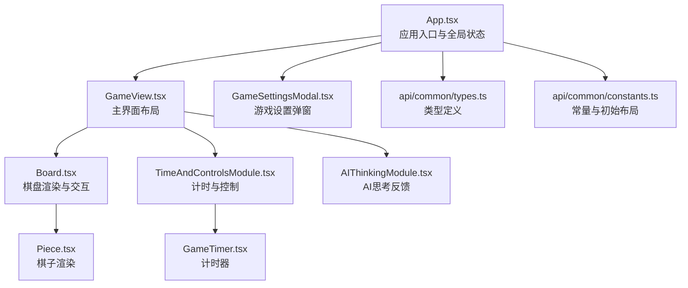
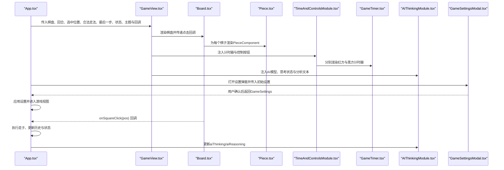
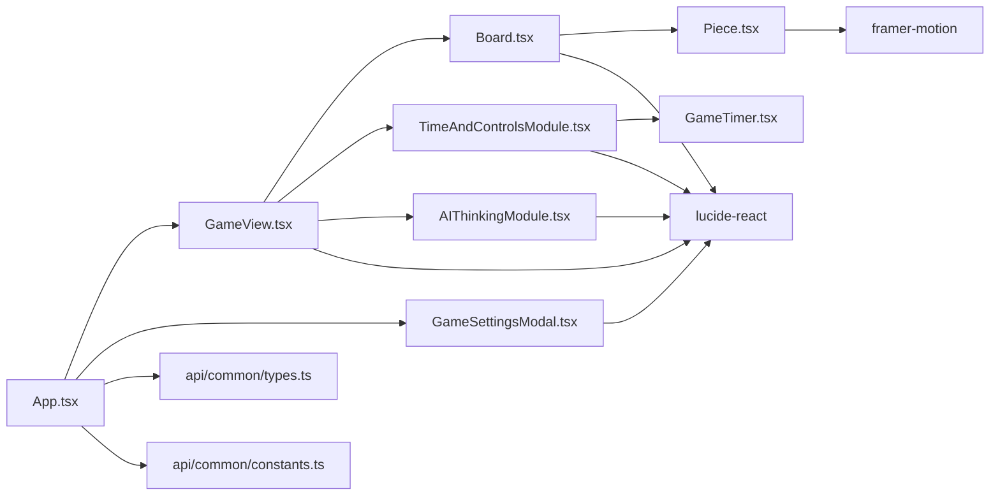

# UI组件

<cite>
**本文引用的文件**
- [App.tsx](file://App.tsx)
- [components/Board.tsx](file://components/Board.tsx)
- [components/Piece.tsx](file://components/Piece.tsx)
- [components/GameView.tsx](file://components/GameView.tsx)
- [components/AIThinkingModule.tsx](file://components/AIThinkingModule.tsx)
- [components/GameSettingsModal.tsx](file://components/GameSettingsModal.tsx)
- [components/TimeAndControlsModule.tsx](file://components/TimeAndControlsModule.tsx)
- [components/GameTimer.tsx](file://components/GameTimer.tsx)
- [api/common/types.ts](file://api/common/types.ts)
- [api/common/constants.ts](file://api/common/constants.ts)
</cite>

## 目录
1. [简介](#简介)
2. [项目结构](#项目结构)
3. [核心组件](#核心组件)
4. [架构总览](#架构总览)
5. [详细组件分析](#详细组件分析)
6. [依赖关系分析](#依赖关系分析)
7. [性能考量](#性能考量)
8. [故障排查指南](#故障排查指南)
9. [结论](#结论)
10. [附录](#附录)

## 简介
本文件聚焦于象棋游戏的UI组件，系统性阐述以下组件的职责与使用方式：
- Board.tsx：渲染10×9棋盘网格，绘制网格线、宫格、河界与坐标标记；处理方格点击事件；高亮选中与合法走法；展示最后一步来源/目标与吃子动画。
- Piece.tsx：根据棋子类型与颜色显示对应中文字符，支持选中高亮、最后一步高光、旋转视角、吃子爆炸动画等视觉反馈。
- GameView.tsx：作为游戏主界面布局容器，整合棋盘、计时器与AI思考模块；在桌面端与移动端采用不同的布局策略。
- AIThinkingModule.tsx：提供AI思考过程的视觉反馈（思考点阵动画与分析文本），提升交互体验。
- GameSettingsModal.tsx：提供游戏模式、AI类型、时间控制与音量等配置项的表单控件，支持传统算法与大语言模型两种AI路径。

同时，文档将说明各组件的props接口定义、调用示例与最佳实践，并强调framer-motion与lucide-react在动画与图标中的作用。

## 项目结构
UI组件位于components目录，业务逻辑与类型定义位于api/common与services目录。App.tsx作为应用入口，负责状态管理、规则计算与AI决策，并将状态与回调传递给GameView及其子组件。

图表来源
- [App.tsx](file://App.tsx#L395-L458)
- [components/GameView.tsx](file://components/GameView.tsx#L89-L171)
- [components/Board.tsx](file://components/Board.tsx#L69-L193)
- [components/Piece.tsx](file://components/Piece.tsx#L1-L78)
- [components/TimeAndControlsModule.tsx](file://components/TimeAndControlsModule.tsx#L1-L108)
- [components/GameTimer.tsx](file://components/GameTimer.tsx#L1-L61)
- [components/AIThinkingModule.tsx](file://components/AIThinkingModule.tsx#L1-L53)
- [components/GameSettingsModal.tsx](file://components/GameSettingsModal.tsx#L1-L337)
- [api/common/types.ts](file://api/common/types.ts#L1-L68)
- [api/common/constants.ts](file://api/common/constants.ts#L1-L91)

章节来源
- [App.tsx](file://App.tsx#L395-L458)
- [components/GameView.tsx](file://components/GameView.tsx#L89-L171)

## 核心组件
本节概述关键组件的职责与交互要点：
- Board.tsx：负责棋盘网格绘制（SVG）、交互层（可点击网格）、选中与合法走法高亮、最后一步来源/目标高光、吃子动画状态驱动的视觉反馈。
- Piece.tsx：根据棋子类型与颜色渲染中文字符，使用framer-motion实现布局切换、阴影、缩放、透明度与旋转等动画。
- GameView.tsx：统一布局容器，按桌面/移动端拆分左右侧边栏与中心棋盘区域，注入计时器与AI模块。
- AIThinkingModule.tsx：当AI处于思考或给出分析时，显示思考点阵动画与分析文本；否则提示等待AI行动。
- GameSettingsModal.tsx：提供PVP/AI模式选择、时间控制、音量调节，以及传统算法（Minimax v1/v2与难度）与LLM提供商选择。

章节来源
- [components/Board.tsx](file://components/Board.tsx#L69-L193)
- [components/Piece.tsx](file://components/Piece.tsx#L1-L78)
- [components/GameView.tsx](file://components/GameView.tsx#L89-L171)
- [components/AIThinkingModule.tsx](file://components/AIThinkingModule.tsx#L1-L53)
- [components/GameSettingsModal.tsx](file://components/GameSettingsModal.tsx#L1-L337)

## 架构总览
下图展示了从App.tsx到各UI组件的数据流与交互流程，包括点击事件、计时器、AI思考与设置确认等关键路径。

图表来源
- [App.tsx](file://App.tsx#L395-L458)
- [components/GameView.tsx](file://components/GameView.tsx#L89-L171)
- [components/Board.tsx](file://components/Board.tsx#L69-L193)
- [components/Piece.tsx](file://components/Piece.tsx#L1-L78)
- [components/TimeAndControlsModule.tsx](file://components/TimeAndControlsModule.tsx#L1-L108)
- [components/GameTimer.tsx](file://components/GameTimer.tsx#L1-L61)
- [components/AIThinkingModule.tsx](file://components/AIThinkingModule.tsx#L1-L53)
- [components/GameSettingsModal.tsx](file://components/GameSettingsModal.tsx#L1-L337)

## 详细组件分析

### Board.tsx：棋盘网格与交互
- 职责
  - 使用SVG绘制网格线、宫格交叉、河界文字与位置标记，支持可选木纹纹理滤镜。
  - 在交互层使用CSS网格实现10行9列的点击区域，逐格渲染棋子。
  - 根据选中位置、合法走法、最后一步来源/目标进行高亮；支持吃子动画状态驱动的视觉反馈。
  - 支持棋盘旋转（黑方视角）与主题化背景/边框/网格颜色。
- 关键props
  - board: 二维数组，表示10×9棋盘状态
  - onSquareClick: (pos: Position) => void，方格点击回调
  - selectedPos: Position | null，当前选中方格
  - validMoves: Position[], 合法走法列表
  - lastMove: Move | null，最近一次走法
  - rotateBlack?: boolean，是否旋转黑方视角
  - captureAnimation?: CaptureAnimationState | null，吃子动画状态
  - 主题类名与网格颜色：boardBgClass、boardBorderClass、gridColor、woodTexture
- 数据流与渲染
  - 通过BoardCell.memo化组件减少不必要的重渲染；Board.memo化外层容器。
  - 合法走法与吃子通过圆点与环形高亮表现；最后一步来源/目标通过蓝色高光标识。
  - 吃子动画通过captureAnimation匹配当前位置与棋子ID，触发Piece的爆炸/旋转/透明度动画。
- 使用示例（路径）
  - 在GameView中作为中心棋盘区域渲染，传入board、onSquareClick、selectedPos、validMoves、lastMove、captureAnimation与主题参数。

章节来源
- [components/Board.tsx](file://components/Board.tsx#L5-L193)
- [api/common/types.ts](file://api/common/types.ts#L16-L36)
- [api/common/types.ts](file://api/common/types.ts#L63-L68)

### Piece.tsx：棋子渲染与动画
- 职责
  - 根据棋子类型与颜色显示对应中文字符；支持选中高亮、最后一步来源/目标高光、旋转视角与吃子动画。
  - 使用framer-motion实现布局切换、阴影、缩放、透明度与旋转等动画，保证流畅的视觉反馈。
- 关键props
  - piece: Piece，包含类型、颜色与唯一ID
  - isSelected: boolean，是否选中
  - onSquareClick: (pos: Position) => void，点击回调
  - position: Position，棋子所在位置
  - isLastMoveSource?: boolean，是否为最后一步来源
  - isLastDest?: boolean，是否为最后一步目标
  - rotate?: boolean，是否旋转（黑方视角）
  - isCaptured?: boolean，默认false，触发吃子动画
- 动画与视觉
  - 选中时增大阴影与缩放；吃子时透明度归零、旋转+摇晃、z-index提升；布局切换使用弹簧动画。
  - 文字阴影与木纹叠加效果增强立体感。
- 使用示例（路径）
  - Board.tsx内部通过PieceComponent渲染每个棋子，传入piece、isSelected、onSquareClick、position、isLastMoveSource、isLastDest、rotate与isCaptured。

章节来源
- [components/Piece.tsx](file://components/Piece.tsx#L1-L78)
- [api/common/constants.ts](file://api/common/constants.ts#L16-L35)
- [api/common/types.ts](file://api/common/types.ts#L21-L26)

### GameView.tsx：游戏主界面布局
- 职责
  - 统一布局容器，桌面端左侧放置计时与AI模块，右侧为中心棋盘；移动端将计时与AI模块置于棋盘上方。
  - 提供顶部导航栏（返回首页、历史记录）与标题。
  - 接收来自App.tsx的状态与回调，向下传递给Board、TimeAndControlsModule与AIThinkingModule。
- 关键props
  - 棋局状态：board、turn、selectedPos、validMoves、lastMove、gameStatus、captureAnimation、historyLength
  - 计时器状态：initialTime、gameResetKey
  - AI状态：aiModel、aiThinking、aiReasoning
  - 回调：onSquareClick、onTimeOut、onUndo、onReset、onNavigateHome、onToggleHistory、isHistoryOpen
  - 主题：boardBgClass、boardBorderClass、gridColor、woodTexture
- 布局策略
  - 桌面端：左侧固定侧边栏，右侧自适应；移动端：顶部先渲染计时与AI模块，再渲染棋盘。
- 使用示例（路径）
  - App.tsx在游戏视图中注入上述props与回调，形成完整的交互闭环。

章节来源
- [components/GameView.tsx](file://components/GameView.tsx#L1-L171)
- [components/TimeAndControlsModule.tsx](file://components/TimeAndControlsModule.tsx#L1-L108)
- [components/AIThinkingModule.tsx](file://components/AIThinkingModule.tsx#L1-L53)
- [components/Board.tsx](file://components/Board.tsx#L69-L193)

### AIThinkingModule.tsx：AI思考反馈
- 职责
  - 当AI模型不为None时，显示思考反馈：AI思考中（点阵动画）或分析文本（带图标与多行省略）；否则提示等待AI行动。
- 关键props
  - aiModel: AIModel，AI类型枚举
  - aiThinking: boolean，是否处于思考阶段
  - aiReasoning: string | null，AI分析文本
- 视觉设计
  - 思考中：三个点阵按不同延迟依次弹跳，配合脉冲文本；分析文本：标题“分析”与斜体注释，限制最多5行。
- 使用示例（路径）
  - GameView.tsx在桌面端左侧与移动端顶部分别渲染AIThinkingModule，传入aiModel、aiThinking与aiReasoning。

章节来源
- [components/AIThinkingModule.tsx](file://components/AIThinkingModule.tsx#L1-L53)
- [api/common/types.ts](file://api/common/types.ts#L45-L49)

### GameSettingsModal.tsx：游戏设置表单
- 职责
  - 提供PVP/AI模式切换；时间控制（无限/10分钟/20分钟）；音量调节；AI算法类型（传统/LLM）选择；传统算法版本（v1/v2）与难度；LLM提供商动态加载与选择。
- 关键props
  - isOpen: boolean，是否打开
  - mode: 'pvp' | 'ai'，当前模式
  - initialSettings: Partial<GameSettings>，初始设置
  - onClose: () => void，关闭回调
  - onConfirm: (settings: GameSettings) => void，确认回调
- 表单控件与逻辑
  - AI算法类型：传统算法与LLM互斥；LLM模式下可加载可用提供商并默认选择第一个可用者。
  - 时间控制：提供三种选项，对应秒数；音量：范围输入与百分比显示。
  - 确认时根据模式与算法类型组装完整GameSettings并回传。
- 使用示例（路径）
  - App.tsx在开始游戏时打开GameSettingsModal，传入pendingGameMode与initialSettings，用户确认后由handleSettingsConfirm应用设置并进入游戏视图。

章节来源
- [components/GameSettingsModal.tsx](file://components/GameSettingsModal.tsx#L1-L337)
- [App.tsx](file://App.tsx#L116-L145)

### 计时器与控制模块
- TimeAndControlsModule.tsx
  - 职责：在同一行内渲染红方与黑方计时器，以及悔棋与重来按钮；根据游戏状态显示胜负信息。
  - 关键props：initialTime、gameResetKey、turn、gameStatus、onRedTimeOut、onBlackTimeOut、onUndo、onReset、historyLength、aiThinking
  - 交互：按钮禁用条件基于历史长度、AI思考状态与游戏状态；计时器激活条件基于当前回合与游戏状态。
- GameTimer.tsx
  - 职责：倒计时显示，支持无限时间、超时回调、重置键强制重置。
  - 关键props：initialTime、isActive、onTimeOut、label、colorClass、resetKey
  - 动画：临近超时闪烁提示。

章节来源
- [components/TimeAndControlsModule.tsx](file://components/TimeAndControlsModule.tsx#L1-L108)
- [components/GameTimer.tsx](file://components/GameTimer.tsx#L1-L61)

## 依赖关系分析
- 组件间耦合
  - GameView是布局中枢，向上接收App.tsx状态，向下分发给Board、TimeAndControlsModule与AIThinkingModule。
  - Board依赖Piece进行棋子渲染；Board与Piece共同消费captureAnimation状态以驱动吃子动画。
  - TimeAndControlsModule依赖GameTimer；GameTimer依赖外部onTimeOut回调。
  - AIThinkingModule仅消费AI状态，不直接操作棋盘。
  - GameSettingsModal仅在用户确认后影响App.tsx的游戏模式与AI配置。
- 外部依赖
  - framer-motion用于Piece的布局切换与多种动画属性（layoutId、animate、transition）。
  - lucide-react提供图标（Clock、Undo2、RotateCcw、Sparkles、BrainCircuit等）。
  - 类型与常量来自api/common/types.ts与api/common/constants.ts。

图表来源
- [App.tsx](file://App.tsx#L395-L458)
- [components/GameView.tsx](file://components/GameView.tsx#L89-L171)
- [components/Board.tsx](file://components/Board.tsx#L69-L193)
- [components/Piece.tsx](file://components/Piece.tsx#L1-L78)
- [components/TimeAndControlsModule.tsx](file://components/TimeAndControlsModule.tsx#L1-L108)
- [components/GameTimer.tsx](file://components/GameTimer.tsx#L1-L61)
- [components/AIThinkingModule.tsx](file://components/AIThinkingModule.tsx#L1-L53)
- [components/GameSettingsModal.tsx](file://components/GameSettingsModal.tsx#L1-L337)
- [api/common/types.ts](file://api/common/types.ts#L1-L68)
- [api/common/constants.ts](file://api/common/constants.ts#L1-L91)

## 性能考量
- 组件memo化
  - Board与BoardCell均使用memo包裹，避免父组件状态变化导致的重复渲染。
  - Piece使用memo包裹，结合layoutId与稳定动画配置，减少重排与重绘。
- 动画优化
  - Piece的layout切换使用弹簧动画，damping与stiffness平衡流畅与稳定性。
  - 吃子动画通过透明度与旋转组合，避免复杂物理模拟带来的性能损耗。
- 事件处理
  - App.tsx使用useCallback与ref同步最新状态，避免闭包陷阱导致的无效重渲染。
- SVG与网格
  - 棋盘网格使用SVG绘制，静态元素不随状态变化，减少DOM节点数量。

[本节为通用性能建议，无需特定文件引用]

## 故障排查指南
- 棋子点击无效
  - 检查GameView传入的onSquareClick是否正确绑定至App.tsx的handleSquareClickStable。
  - 确认gameStatus为Playing且非aiThinking/isAnimating。
- 合法走法高亮异常
  - 确认selectedPos与validMoves正确传入Board.tsx；检查BoardCell中isValidMove判断逻辑。
- 吃子动画未触发
  - 确认captureAnimation状态在App.tsx中正确设置；Board.tsx中isCaptured匹配位置与棋子ID。
- AI思考模块不显示
  - 确认aiModel非None；aiThinking与aiReasoning状态在App.tsx中正确更新。
- 计时器不计时
  - 确认TimeAndControlsModule的isActive条件满足（Playing且当前回合）；GameTimer的initialTime与resetKey正确传递。
- 设置弹窗无法加载LLM提供商
  - 检查buildApiUrl与网络请求；确认fetchProviders成功返回可用提供商列表。

章节来源
- [components/Board.tsx](file://components/Board.tsx#L140-L193)
- [components/Piece.tsx](file://components/Piece.tsx#L1-L78)
- [components/AIThinkingModule.tsx](file://components/AIThinkingModule.tsx#L1-L53)
- [components/TimeAndControlsModule.tsx](file://components/TimeAndControlsModule.tsx#L51-L108)
- [components/GameTimer.tsx](file://components/GameTimer.tsx#L1-L61)
- [components/GameSettingsModal.tsx](file://components/GameSettingsModal.tsx#L64-L104)

## 结论
本UI组件体系围绕GameView构建，Board与Piece负责棋盘与棋子的高保真渲染与动画，TimeAndControlsModule与GameTimer提供计时与控制，AIThinkingModule增强AI交互体验，GameSettingsModal则为用户提供灵活的配置入口。通过framer-motion与lucide-react的有机结合，组件在保持良好性能的同时提供了丰富的视觉反馈与交互细节。

[本节为总结性内容，无需特定文件引用]

## 附录

### 组件props接口定义与使用示例（路径）
- BoardProps（Board.tsx）
  - props定义：见[components/Board.tsx](file://components/Board.tsx#L5-L18)
  - 使用示例：在[components/GameView.tsx](file://components/GameView.tsx#L153-L167)中传入board、onSquareClick、selectedPos、validMoves、lastMove、captureAnimation与主题参数。
- PieceProps（Piece.tsx）
  - props定义：见[components/Piece.tsx](file://components/Piece.tsx#L6-L15)
  - 使用示例：在[components/Board.tsx](file://components/Board.tsx#L51-L62)中传入piece、isSelected、onSquareClick、position、isLastMoveSource、isLastDest、rotate与isCaptured。
- GameViewProps（GameView.tsx）
  - props定义：见[components/GameView.tsx](file://components/GameView.tsx#L8-L42)
  - 使用示例：在[App.tsx](file://App.tsx#L400-L434)中传入棋局状态、计时器状态、AI状态与回调。
- AIThinkingModuleProps（AIThinkingModule.tsx）
  - props定义：见[components/AIThinkingModule.tsx](file://components/AIThinkingModule.tsx#L5-L9)
  - 使用示例：在[components/GameView.tsx](file://components/GameView.tsx#L110-L128)与[components/GameView.tsx](file://components/GameView.tsx#L133-L151)中传入aiModel、aiThinking与aiReasoning。
- GameSettingsModalProps（GameSettingsModal.tsx）
  - props定义：见[components/GameSettingsModal.tsx](file://components/GameSettingsModal.tsx#L22-L28)
  - 使用示例：在[App.tsx](file://App.tsx#L441-L454)中传入isOpen、mode、initialSettings、onClose与onConfirm。

### 动画与图标库的作用
- framer-motion
  - 在Piece.tsx中用于layoutId、animate与transition，实现棋子布局切换与多维动画（阴影、缩放、透明度、旋转）。
- lucide-react
  - 在多个组件中提供图标支持，如计时器、撤销、重来、思考、算法与音量等，统一视觉风格与交互语义。

章节来源
- [components/Piece.tsx](file://components/Piece.tsx#L29-L76)
- [components/GameTimer.tsx](file://components/GameTimer.tsx#L51-L60)
- [components/TimeAndControlsModule.tsx](file://components/TimeAndControlsModule.tsx#L66-L86)
- [components/AIThinkingModule.tsx](file://components/AIThinkingModule.tsx#L22-L51)
- [components/GameSettingsModal.tsx](file://components/GameSettingsModal.tsx#L120-L175)