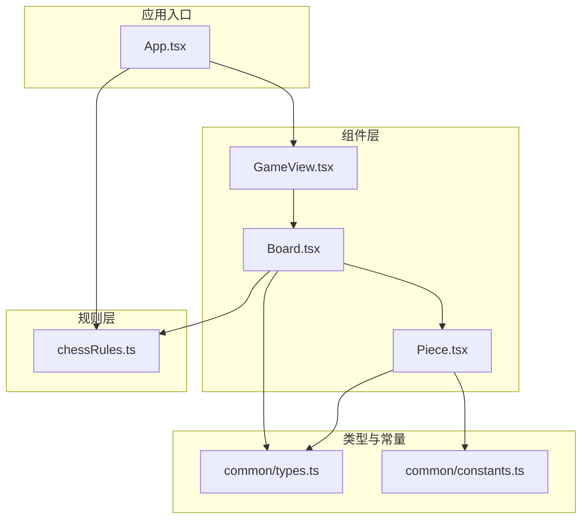
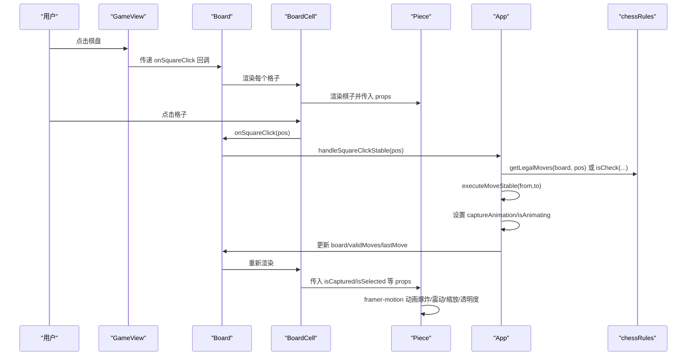
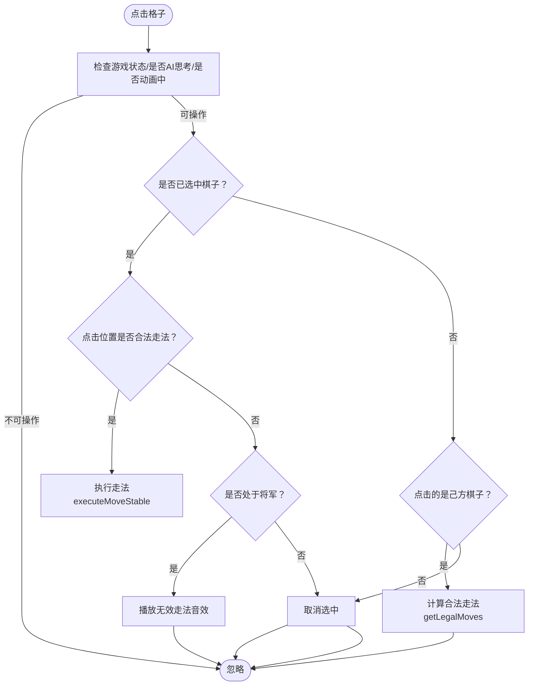
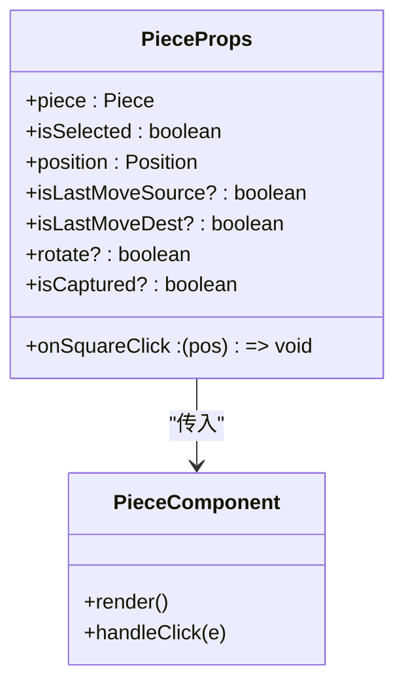
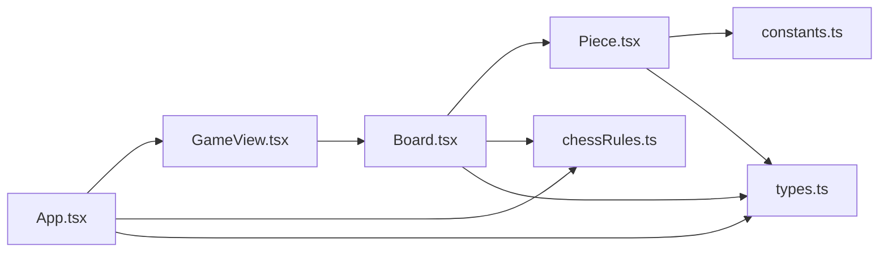

# 棋盘与棋子组件

<cite>
**本文引用的文件列表**
- [components/Board.tsx](file://components/Board.tsx)
- [components/Piece.tsx](file://components/Piece.tsx)
- [components/GameView.tsx](file://components/GameView.tsx)
- [api/chessRules.ts](file://api/chessRules.ts)
- [api/common/types.ts](file://api/common/types.ts)
- [api/common/constants.ts](file://api/common/constants.ts)
- [App.tsx](file://App.tsx)
- [index.html](file://index.html)
</cite>

## 目录
1. [简介](#简介)
2. [项目结构](#项目结构)
3. [核心组件](#核心组件)
4. [架构总览](#架构总览)
5. [组件详解](#组件详解)
6. [依赖关系分析](#依赖关系分析)
7. [性能考量](#性能考量)
8. [故障排查指南](#故障排查指南)
9. [结论](#结论)

## 简介
本文件聚焦于中国象棋棋盘与棋子两个核心UI组件：Board.tsx 与 Piece.tsx。我们将从系统架构、数据流、处理逻辑、集成方式、动画与交互、以及性能优化等方面进行深入解析，并结合 chessRules.ts 的合法走法计算，说明“合法走法高亮”的实现机制与注意事项。

## 项目结构
- 组件层
  - Board.tsx：渲染10×9棋盘网格，支持点击选择与合法走法高亮，承载吃子动画状态。
  - Piece.tsx：根据棋子类型与颜色渲染中文字符，结合 framer-motion 实现选中、吃子、移动过渡等动画。
  - GameView.tsx：承载棋盘与计时/控制模块，向 Board 注入状态与回调。
- 规则层
  - chessRules.ts：提供棋子走法规则、合法走法生成、将军判断、局面评估等。
- 类型与常量
  - common/types.ts：定义 Position、Piece、BoardState、Color、PieceType、GameStatus 等核心类型。
  - common/constants.ts：定义棋盘尺寸、初始棋子布局、棋子中文字符映射等。
- 应用入口
  - App.tsx：管理游戏状态、AI、音效与动画，将状态与回调传递给 GameView/Board/Piece。

图表来源
- [components/GameView.tsx](file://components/GameView.tsx#L1-L172)
- [components/Board.tsx](file://components/Board.tsx#L1-L194)
- [components/Piece.tsx](file://components/Piece.tsx#L1-L78)
- [api/chessRules.ts](file://api/chessRules.ts#L1-L390)
- [api/common/types.ts](file://api/common/types.ts#L1-L68)
- [api/common/constants.ts](file://api/common/constants.ts#L1-L91)
- [App.tsx](file://App.tsx#L280-L460)

章节来源
- [components/Board.tsx](file://components/Board.tsx#L1-L194)
- [components/Piece.tsx](file://components/Piece.tsx#L1-L78)
- [components/GameView.tsx](file://components/GameView.tsx#L1-L172)
- [api/chessRules.ts](file://api/chessRules.ts#L1-L390)
- [api/common/types.ts](file://api/common/types.ts#L1-L68)
- [api/common/constants.ts](file://api/common/constants.ts#L1-L91)
- [App.tsx](file://App.tsx#L280-L460)

## 核心组件
- Board.tsx
  - 接收棋盘状态、选中位置、合法走法、最后一步、旋转参数、吃子动画状态等 props。
  - 使用 CSS Grid 构建 10 行 9 列的交互网格；通过 SVG 渲染网格线、河界、宫格等视觉元素。
  - 为每个格子渲染 BoardCell，内部根据 isSelected、isValidMove、lastMove 状态决定高亮与指示器。
  - 将 onSquareClick 传入 BoardCell，由 BoardCell 内部调用，从而触发走法逻辑。
- Piece.tsx
  - 接收 piece、position、isSelected、isLastMoveSource/Dest、rotate、isCaptured 等 props。
  - 使用 framer-motion 的 layoutId 与动画配置，实现选中高亮、吃子爆炸/震动、移动缩放与透明度变化。
  - 通过 PIECE_CHARS 将 PieceType 与 Color 映射为中文字符，支持旋转以适配不同视角。
- GameView.tsx
  - 作为容器组件，将 App.tsx 中的状态与回调注入 Board，同时承载计时与AI模块。
- chessRules.ts
  - 提供 getValidMovesForPiece、getLegalMoves、isCheck、applyMove 等规则函数，支撑 Board 的合法走法高亮与 GameView 的走法执行。

章节来源
- [components/Board.tsx](file://components/Board.tsx#L1-L194)
- [components/Piece.tsx](file://components/Piece.tsx#L1-L78)
- [components/GameView.tsx](file://components/GameView.tsx#L1-L172)
- [api/chessRules.ts](file://api/chessRules.ts#L1-L390)

## 架构总览
下图展示从用户点击到走法执行与动画播放的端到端流程，包括 App.tsx 的稳定回调、GameView 的状态注入、Board 的网格与高亮、Piece 的动画，以及规则层的合法走法计算。

图表来源
- [components/GameView.tsx](file://components/GameView.tsx#L130-L171)
- [components/Board.tsx](file://components/Board.tsx#L1-L194)
- [components/Piece.tsx](file://components/Piece.tsx#L1-L78)
- [App.tsx](file://App.tsx#L291-L337)
- [api/chessRules.ts](file://api/chessRules.ts#L196-L205)

## 组件详解

### Board.tsx：10×9 棋盘与点击处理
- 数据结构与布局
  - 棋盘为 10 行（y 从 0 到 9）、9 列（x 从 0 到 8）的二维数组，BoardState 定义见 common/types.ts。
  - 使用 CSS Grid（grid-rows-10、grid-cols-9）构建交互层，叠加绝对定位的 SVG 网格背景（横线、竖线、宫格、河界文字与角标标记）。
- 点击处理
  - BoardCell 接收 onSquareClick 并在 div 上绑定 onClick，内部不阻止冒泡，确保点击事件能正确传递到 Board 层。
  - Board 将 onSquareClick 作为稳定回调（由 GameView 注入）传入 BoardCell，避免因 validMoves 变化导致 BoardCell 重渲染。
- 合法走法高亮
  - 通过 selectedPos 与 validMoves 计算每个格子的 isValidMove 状态，渲染绿色脉冲圆点或红色脉冲环（吃子时）。
  - lastMove 的起止位置分别标注蓝色环，便于回看历史走法。
- 吃子动画集成
  - 通过 captureAnimation 判断当前格子是否正在被吃子，若命中且 isAnimating 为真，则将 isCaptured 传给 Piece，触发动画。
- 主题与旋转
  - 支持 boardBgClass、boardBorderClass、gridColor、woodTexture 等主题参数；当 rotateBlack 为真且棋子为黑方时，Piece 会旋转 180° 以适配视角。

图表来源
- [components/Board.tsx](file://components/Board.tsx#L1-L194)
- [App.tsx](file://App.tsx#L291-L337)
- [api/chessRules.ts](file://api/chessRules.ts#L196-L205)

章节来源
- [components/Board.tsx](file://components/Board.tsx#L1-L194)
- [api/common/types.ts](file://api/common/types.ts#L16-L37)
- [api/common/constants.ts](file://api/common/constants.ts#L1-L91)
- [App.tsx](file://App.tsx#L291-L337)

### Piece.tsx：棋子渲染与动画
- 字符渲染
  - 通过 PIECE_CHARS 将 PieceType 与 Color 映射为中文字符（如“帥”、“將”、“車”等），并支持 rotate 参数以适配视角。
- 选中与历史高亮
  - 依据 isSelected、isLastMoveSource、isLastMoveDest 设置不同的边框、渐变背景与蓝色环，突出选中与最近一步。
- 动画与视觉
  - 使用 framer-motion 的 layoutId 与动画配置，实现：
    - 选中：阴影增强、轻微放大、持续时间较长。
    - 吃子：透明度归零、旋转、缩放至 0，配合 shake 动画。
    - 移动：弹簧动画（layout spring），平滑过渡棋子位置。
  - 额外的“木纹”叠加纹理提升质感。

图表来源
- [components/Piece.tsx](file://components/Piece.tsx#L1-L78)
- [api/common/types.ts](file://api/common/types.ts#L16-L37)
- [api/common/constants.ts](file://api/common/constants.ts#L16-L35)

章节来源
- [components/Piece.tsx](file://components/Piece.tsx#L1-L78)
- [api/common/constants.ts](file://api/common/constants.ts#L16-L35)
- [index.html](file://index.html#L1-L88)

### GameView.tsx：组件集成与主题注入
- 将 App.tsx 的状态（board、turn、selectedPos、validMoves、lastMove、captureAnimation、historyLength）与回调（onSquareClick、onUndo、onReset、onTimeOut、onNavigateHome、onToggleHistory）注入 Board。
- 提供桌面/移动端的布局组织，左侧为计时与AI模块，中心为棋盘区域。
- 主题参数（boardBgClass、boardBorderClass、gridColor、woodTexture）由 App.tsx 传入，Board 内部据此渲染背景与网格。

章节来源
- [components/GameView.tsx](file://components/GameView.tsx#L1-L172)
- [App.tsx](file://App.tsx#L395-L458)

### 合法走法高亮与规则联动
- App.tsx 中的 handleSquareClickStable 会调用 chessRules.getLegalMoves 计算当前选中棋子的合法走法，并在选中时更新 validMoves。
- Board.tsx 通过 validMoves 为每个格子计算 isValidMove，从而渲染高亮指示器。
- 当处于将军状态且玩家尝试非法走法时，播放无效音效，避免误操作带来的重渲染与状态抖动。

章节来源
- [App.tsx](file://App.tsx#L291-L337)
- [api/chessRules.ts](file://api/chessRules.ts#L196-L205)
- [components/Board.tsx](file://components/Board.tsx#L1-L194)

## 依赖关系分析
- 组件耦合
  - Board.tsx 与 Piece.tsx 通过 props 解耦：Board 负责布局与状态，Piece 负责渲染与动画。
  - GameView.tsx 仅负责状态注入与布局，不直接参与规则计算。
- 外部依赖
  - framer-motion：用于 Piece 的动画与布局过渡。
  - Tailwind CSS：用于主题色板、阴影、动画 keyframes 与类名。
  - importmap：在 index.html 中声明第三方库别名，确保运行时加载。

图表来源
- [components/Board.tsx](file://components/Board.tsx#L1-L194)
- [components/Piece.tsx](file://components/Piece.tsx#L1-L78)
- [components/GameView.tsx](file://components/GameView.tsx#L1-L172)
- [api/chessRules.ts](file://api/chessRules.ts#L1-L390)
- [api/common/types.ts](file://api/common/types.ts#L1-L68)
- [api/common/constants.ts](file://api/common/constants.ts#L1-L91)
- [App.tsx](file://App.tsx#L280-L460)
- [index.html](file://index.html#L1-L88)

章节来源
- [components/Board.tsx](file://components/Board.tsx#L1-L194)
- [components/Piece.tsx](file://components/Piece.tsx#L1-L78)
- [components/GameView.tsx](file://components/GameView.tsx#L1-L172)
- [api/chessRules.ts](file://api/chessRules.ts#L1-L390)
- [api/common/types.ts](file://api/common/types.ts#L1-L68)
- [api/common/constants.ts](file://api/common/constants.ts#L1-L91)
- [App.tsx](file://App.tsx#L280-L460)
- [index.html](file://index.html#L1-L88)

## 性能考量
- 避免不必要重渲染
  - BoardCell 与 PieceComponent 均使用 memo 包裹，减少 props 未变化时的渲染开销。
  - Board 将 onSquareClick 作为稳定回调（useCallback）注入，避免因 validMoves 变化导致 BoardCell 重渲染。
  - App.tsx 中 handleSquareClickStable 与 executeMoveStable 也采用稳定引用，降低副作用与重渲染频率。
- 动画与状态更新节奏
  - 吃子动画通过 captureAnimation 与 isAnimating 控制，App.tsx 在执行走法后短暂延迟再更新 board，确保动画播放完整。
  - Piece 的动画配置（layout spring、duration、ease）平衡了流畅性与性能。
- 合法走法计算
  - getLegalMoves 在选中棋子时才计算，避免全局扫描；同时通过 isValidPos 与边界检查减少无效遍历。
- 主题与网格
  - SVG 网格一次性绘制，Grid 层仅负责交互，避免重复计算。

章节来源
- [components/Board.tsx](file://components/Board.tsx#L1-L194)
- [components/Piece.tsx](file://components/Piece.tsx#L1-L78)
- [App.tsx](file://App.tsx#L280-L337)
- [api/chessRules.ts](file://api/chessRules.ts#L196-L205)

## 故障排查指南
- 点击无效或无法选中
  - 检查游戏状态是否为 Playing，AI 是否在思考，是否处于动画中；这些情况下 handleSquareClickStable 会直接返回。
  - 若处于将军状态且尝试非法走法，会播放无效音效并忽略点击。
- 合法走法不显示
  - 确认 selectedPos 已设置且有效；App.tsx 会在选中时调用 getLegalMoves 并更新 validMoves。
  - 确认 Board.tsx 的 validMoves 与 selectedPos 正确传入 BoardCell。
- 吃子动画不触发
  - 确认 App.tsx 在执行走法时设置了 captureAnimation，并在动画播放后重置。
  - 确认 Board.tsx 的 captureAnimation 与 isCaptured 逻辑匹配当前格子。
- 字符显示异常
  - 确认 PIECE_CHARS 映射正确，且 Piece 的 rotate 参数按需启用。
- 动画卡顿或闪烁
  - 检查 framer-motion 的动画配置与 layoutId 是否一致；确认没有频繁切换 isCaptured 导致状态抖动。

章节来源
- [App.tsx](file://App.tsx#L291-L337)
- [components/Board.tsx](file://components/Board.tsx#L1-L194)
- [components/Piece.tsx](file://components/Piece.tsx#L1-L78)
- [api/chessRules.ts](file://api/chessRules.ts#L196-L205)

## 结论
Board.tsx 与 Piece.tsx 通过清晰的职责划分与稳定的回调机制，实现了高性能、可交互、可动画的中国象棋棋盘体验。Board 负责网格布局与高亮，Piece 负责渲染与动画，App.tsx 与 GameView 负责状态注入与流程编排。chessRules.ts 提供了严谨的走法规则与合法走法计算，保障了用户体验与游戏公平性。通过 memo、稳定回调与动画节流等手段，系统在复杂交互场景下仍保持流畅与稳定。