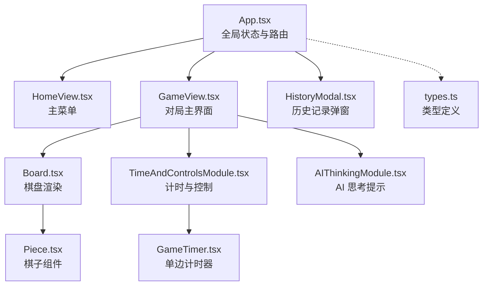
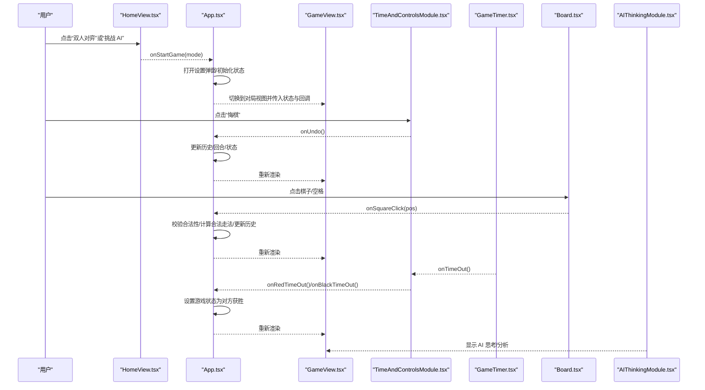
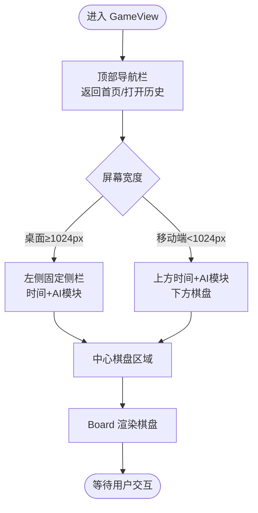
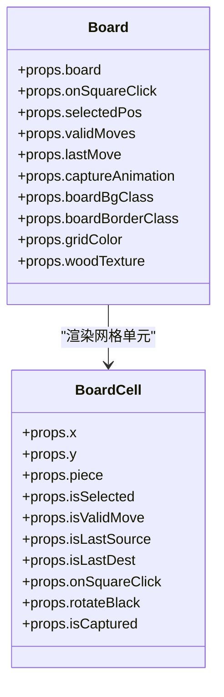
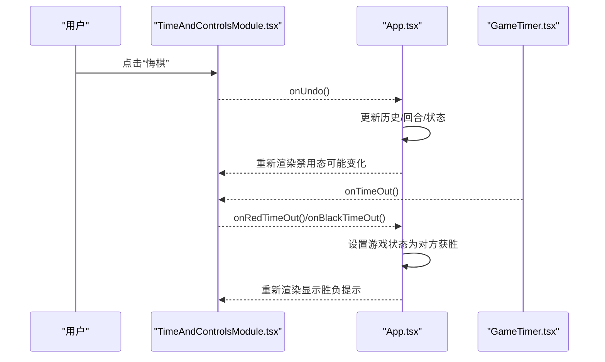
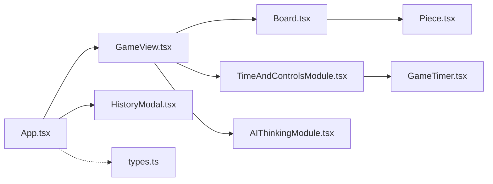

# 游戏视图组件

<cite>
**本文引用的文件**
- [App.tsx](file://App.tsx)
- [GameView.tsx](file://components/GameView.tsx)
- [HomeView.tsx](file://components/HomeView.tsx)
- [TimeAndControlsModule.tsx](file://components/TimeAndControlsModule.tsx)
- [GameTimer.tsx](file://components/GameTimer.tsx)
- [Board.tsx](file://components/Board.tsx)
- [Piece.tsx](file://components/Piece.tsx)
- [AIThinkingModule.tsx](file://components/AIThinkingModule.tsx)
- [HistoryModal.tsx](file://components/HistoryModal.tsx)
- [types.ts](file://api/common/types.ts)
- [package.json](file://package.json)
</cite>

## 目录
1. [简介](#简介)
2. [项目结构](#项目结构)
3. [核心组件](#核心组件)
4. [架构总览](#架构总览)
5. [详细组件分析](#详细组件分析)
6. [依赖关系分析](#依赖关系分析)
7. [性能考量](#性能考量)
8. [故障排查指南](#故障排查指南)
9. [结论](#结论)
10. [附录](#附录)

## 简介
本文件围绕国际象棋（中国象棋）游戏的核心界面与状态管理进行深入解析，重点覆盖：
- GameView.tsx 作为对弈主界面的布局结构与状态协调，如何整合 Board、GameTimer 和 TimeAndControlsModule 形成完整对局界面；
- HomeView.tsx 作为主菜单的导航功能，如何引导用户进入不同游戏模式；
- TimeAndControlsModule.tsx 提供的控制按钮（悔棋、重来、计时器）及其事件回调机制；
- 结合 App.tsx 的全局状态管理，说明各组件如何通过回调函数与全局状态同步；
- UI 布局的响应式设计策略，确保在移动端与桌面端均有良好体验；
- 使用 lucide-react 图标与 framer-motion 动画增强交互反馈的具体示例。

## 项目结构
本项目采用按功能模块组织的组件化结构，核心逻辑集中在 App.tsx 中，界面由多个可复用的子组件构成：
- 视图层：HomeView.tsx、GameView.tsx
- 对局区域：Board.tsx、Piece.tsx
- 时间与控制：GameTimer.tsx、TimeAndControlsModule.tsx、AIThinkingModule.tsx
- 辅助弹窗：HistoryModal.tsx
- 类型定义：api/common/types.ts
- 依赖：package.json 中声明了 react、framer-motion、lucide-react

图表来源
- [App.tsx](file://App.tsx#L395-L458)
- [GameView.tsx](file://components/GameView.tsx#L90-L171)
- [Board.tsx](file://components/Board.tsx#L69-L194)
- [Piece.tsx](file://components/Piece.tsx#L1-L78)
- [TimeAndControlsModule.tsx](file://components/TimeAndControlsModule.tsx#L1-L108)
- [GameTimer.tsx](file://components/GameTimer.tsx#L1-L61)
- [AIThinkingModule.tsx](file://components/AIThinkingModule.tsx#L1-L53)
- [HistoryModal.tsx](file://components/HistoryModal.tsx#L1-L58)
- [types.ts](file://api/common/types.ts#L1-L68)

章节来源
- [App.tsx](file://App.tsx#L395-L458)
- [package.json](file://package.json#L13-L29)

## 核心组件
- App.tsx：负责全局状态（棋盘、回合、历史、计时、AI、音效、视图切换）、事件处理（点击、悔棋、重置、超时）、以及向子组件传递状态与回调。
- GameView.tsx：对局主界面容器，组织顶部导航、左侧桌面侧栏（时间+AI思考）、中心棋盘区域，并在移动端将时间与AI模块置于上方。
- Board.tsx：渲染棋盘网格、棋子、选中高亮、合法落点指示、上一步轨迹与吃子动画。
- TimeAndControlsModule.tsx：展示红黑双方计时器、悔棋与重来按钮，根据游戏状态禁用按钮；在对局结束时显示胜负信息。
- GameTimer.tsx：单边计时器，支持主动/被动激活、倒计时、超时回调、无限时间模式。
- AIThinkingModule.tsx：在 AI 模式下显示“思考中”或 AI 分析文本。
- HomeView.tsx：主菜单，提供“双人对弈”和“挑战 AI”两种入口，触发设置弹窗后进入对局。
- HistoryModal.tsx：右侧抽屉式历史记录面板，自动滚动到最后一步，支持关闭。

章节来源
- [App.tsx](file://App.tsx#L395-L458)
- [GameView.tsx](file://components/GameView.tsx#L90-L171)
- [Board.tsx](file://components/Board.tsx#L69-L194)
- [TimeAndControlsModule.tsx](file://components/TimeAndControlsModule.tsx#L1-L108)
- [GameTimer.tsx](file://components/GameTimer.tsx#L1-L61)
- [AIThinkingModule.tsx](file://components/AIThinkingModule.tsx#L1-L53)
- [HomeView.tsx](file://components/HomeView.tsx#L1-L49)
- [HistoryModal.tsx](file://components/HistoryModal.tsx#L1-L58)

## 架构总览
整体采用自顶向下数据流与事件回传的设计：
- App.tsx 作为状态中枢，维护 board、turn、history、gameStatus、aiModel、initialTime 等全局状态；
- GameView.tsx 将状态与回调注入到 Board、TimeAndControlsModule、AIThinkingModule；
- Board.tsx 仅负责渲染，不持有业务逻辑，点击事件回传至 App.tsx；
- TimeAndControlsModule.tsx 负责控制按钮交互，按钮回调最终回到 App.tsx；
- GameTimer.tsx 仅负责计时与超时回调，不参与业务逻辑；
- HomeView.tsx 仅负责导航，确认设置后切换到对局视图。

图表来源
- [App.tsx](file://App.tsx#L111-L158)
- [App.tsx](file://App.tsx#L291-L371)
- [GameView.tsx](file://components/GameView.tsx#L90-L171)
- [TimeAndControlsModule.tsx](file://components/TimeAndControlsModule.tsx#L66-L86)
- [GameTimer.tsx](file://components/GameTimer.tsx#L13-L61)
- [Board.tsx](file://components/Board.tsx#L69-L194)
- [AIThinkingModule.tsx](file://components/AIThinkingModule.tsx#L1-L53)

## 详细组件分析

### GameView.tsx：对局主界面布局与状态协调
- 布局结构
  - 顶部导航栏：返回首页、标题、打开历史按钮；
  - 左侧桌面侧栏：TimeAndControlsModule + AIThinkingModule（桌面端固定）；
  - 中心棋盘区域：Board，支持移动端将时间与AI模块置于上方；
  - 主题参数：boardBgClass、boardBorderClass、gridColor、woodTexture 传递给 Board。
- 状态与回调
  - 接收来自 App.tsx 的 board、turn、selectedPos、validMoves、lastMove、gameStatus、captureAnimation、historyLength；
  - 接收计时器初始时间与重置键，用于强制刷新计时器；
  - 接收 onSquareClick、onTimeOut、onUndo、onReset、onNavigateHome、onToggleHistory、isHistoryOpen；
  - 将超时回调封装为 handleRedTimeOut/handleBlackTimeOut，便于传入两侧计时器。
- 响应式设计
  - lg:flex 控制桌面端左右布局；
  - lg:hidden 控制移动端将时间与AI模块置于上方；
  - 使用 max-w、gap、order 等实现灵活排列。

图表来源
- [GameView.tsx](file://components/GameView.tsx#L90-L171)

章节来源
- [GameView.tsx](file://components/GameView.tsx#L80-L171)

### Board.tsx：棋盘渲染与交互
- 渲染网格与坐标系统：使用 SVG 绘制横线、竖线、河界、宫格交叉、位置标记；
- 交互层：基于网格的点击区域，点击回调回传到父组件；
- 高亮与指示：
  - 选中棋子高亮；
  - 合法落点以脉冲点/红圈表示；
  - 上一步来源与目的地以蓝色环标识；
- 吃子动画：通过 captureAnimation 状态判断当前单元格是否处于被吃动画，配合 Piece.tsx 的动画类实现爆炸/抖动效果；
- 主题参数：背景色、边框色、网格颜色、纹理开关。

图表来源
- [Board.tsx](file://components/Board.tsx#L1-L194)

章节来源
- [Board.tsx](file://components/Board.tsx#L69-L194)
- [Piece.tsx](file://components/Piece.tsx#L1-L78)
- [types.ts](file://api/common/types.ts#L1-L68)

### TimeAndControlsModule.tsx：计时与控制按钮
- 计时器：两侧 GameTimer，分别绑定红/黑回合与超时回调；
- 控制按钮：
  - 悔棋：disabled 条件包括历史为空、AI 正在思考、非进行中状态；
  - 重来：无条件重置；
- 胜负提示：当游戏状态非进行中时，显示对应胜利信息并带轻微弹跳动画。

图表来源
- [TimeAndControlsModule.tsx](file://components/TimeAndControlsModule.tsx#L66-L86)
- [GameTimer.tsx](file://components/GameTimer.tsx#L13-L61)
- [App.tsx](file://App.tsx#L111-L158)

章节来源
- [TimeAndControlsModule.tsx](file://components/TimeAndControlsModule.tsx#L1-L108)
- [GameTimer.tsx](file://components/GameTimer.tsx#L1-L61)
- [App.tsx](file://App.tsx#L111-L158)

### GameTimer.tsx：单边计时器
- 状态：timeLeft、isActive、onTimeOut、label、colorClass、resetKey；
- 行为：当 isActive 且初始时间大于 0 时每秒递减，剩余小于等于 1 秒时清掉定时器并触发 onTimeOut；
- 格式化：分钟:秒，初始时间为 0 时显示“∞”。

章节来源
- [GameTimer.tsx](file://components/GameTimer.tsx#L1-L61)

### AIThinkingModule.tsx：AI 思考提示
- 当 aiModel 不为 None 时显示；
- aiThinking 为真时显示“思考中”的三球弹跳动画；
- aiReasoning 存在时显示 AI 分析文本；
- 否则显示“等待 AI 行动”。

章节来源
- [AIThinkingModule.tsx](file://components/AIThinkingModule.tsx#L1-L53)

### HomeView.tsx：主菜单导航
- 提供“双人对弈”和“挑战 AI”两个入口；
- 点击后通过 onStartGame 回调通知 App.tsx，随后打开设置弹窗；
- 使用 lucide-react 的 Users/Bot 图标与动画类实现视觉反馈。

章节来源
- [HomeView.tsx](file://components/HomeView.tsx#L1-L49)
- [App.tsx](file://App.tsx#L116-L145)

### HistoryModal.tsx：历史记录弹窗
- 右侧抽屉式面板，自动滚动到最后一条记录；
- 支持关闭与点击遮罩关闭；
- 展示步数、颜色交替、最后一步高亮。

章节来源
- [HistoryModal.tsx](file://components/HistoryModal.tsx#L1-L58)
- [App.tsx](file://App.tsx#L436-L440)

## 依赖关系分析
- 外部依赖：framer-motion 用于动画，lucide-react 用于图标；
- 内部依赖：GameView.tsx 依赖 Board、TimeAndControlsModule、AIThinkingModule；TimeAndControlsModule 依赖 GameTimer；Board 依赖 Piece；App.tsx 依赖所有组件并提供全局状态与回调。

图表来源
- [App.tsx](file://App.tsx#L395-L458)
- [GameView.tsx](file://components/GameView.tsx#L90-L171)
- [Board.tsx](file://components/Board.tsx#L69-L194)
- [Piece.tsx](file://components/Piece.tsx#L1-L78)
- [TimeAndControlsModule.tsx](file://components/TimeAndControlsModule.tsx#L1-L108)
- [GameTimer.tsx](file://components/GameTimer.tsx#L1-L61)
- [AIThinkingModule.tsx](file://components/AIThinkingModule.tsx#L1-L53)
- [HistoryModal.tsx](file://components/HistoryModal.tsx#L1-L58)
- [types.ts](file://api/common/types.ts#L1-L68)

章节来源
- [package.json](file://package.json#L13-L29)
- [App.tsx](file://App.tsx#L395-L458)

## 性能考量
- 组件记忆化：Board 与 BoardCell、PieceComponent 使用 memo，减少不必要的重渲染；
- 稳定回调：App.tsx 使用 useRef 包裹 gameState，在 handleSquareClickStable 中读取最新状态，避免闭包陷阱导致的频繁重渲染；
- 动画与音效：捕获动画与音效在执行移动时分阶段触发，避免阻塞主线程；
- 计时器重置：通过 gameResetKey 强制刷新计时器，避免旧定时器残留；
- 响应式布局：使用 Tailwind 的断点与 flex 布局，减少复杂计算与重排。

章节来源
- [Board.tsx](file://components/Board.tsx#L69-L194)
- [Piece.tsx](file://components/Piece.tsx#L1-L78)
- [App.tsx](file://App.tsx#L291-L371)
- [App.tsx](file://App.tsx#L147-L158)
- [GameTimer.tsx](file://components/GameTimer.tsx#L13-L61)

## 故障排查指南
- 悔棋按钮不可用
  - 检查 history 是否为空、aiThinking 是否为真、gameStatus 是否为进行中；
  - 确认 onUndo 回调已正确传入 App.tsx 的 undo 实现。
- 计时器不工作
  - 确认 isActive 与 initialTime 的组合是否正确；
  - 检查 resetKey 是否随游戏重置而递增；
  - 确保 onTimeOut 回调能正确设置 gameStatus。
- AI 模式不响应
  - 检查 aiModel、turn、view、isAnimating 等条件是否满足；
  - 确认 AI 服务返回的 move 是否存在，必要时检查错误日志。
- 棋盘点击无效
  - 确认 handleSquareClickStable 的 gameStateRef 是否包含最新状态；
  - 检查 selectedPos/validMoves 的更新逻辑与 isCheck 的处理分支。
- 历史面板不显示
  - 确认 isHistoryOpen 与 moveList 是否正确传入；
  - 检查抽屉式面板的点击遮罩是否阻止冒泡。

章节来源
- [TimeAndControlsModule.tsx](file://components/TimeAndControlsModule.tsx#L66-L86)
- [GameTimer.tsx](file://components/GameTimer.tsx#L13-L61)
- [App.tsx](file://App.tsx#L111-L158)
- [App.tsx](file://App.tsx#L291-L371)
- [HistoryModal.tsx](file://components/HistoryModal.tsx#L1-L58)

## 结论
本项目通过清晰的组件边界与稳定的回调机制，实现了从主菜单到对局界面的顺畅流转。GameView.tsx 作为对局主界面，有效整合了计时、控制与棋盘渲染，并通过响应式布局适配多端体验。App.tsx 作为状态中枢，将全局状态与事件处理集中管理，配合 memo 与稳定回调优化性能。借助 lucide-react 图标与 framer-motion 动画，交互反馈直观自然，提升了整体用户体验。

## 附录
- 使用 lucide-react 图标
  - GameView.tsx：ChevronLeft、Home、History；
  - TimeAndControlsModule.tsx：Undo2、RotateCcw；
  - GameTimer.tsx：Clock；
  - HomeView.tsx：Users、Bot；
  - AIThinkingModule.tsx：Sparkles；
  - HistoryModal.tsx：X、ScrollText。
- 使用 framer-motion 动画
  - Piece.tsx：棋子布局动画、阴影与缩放过渡、被吃时的爆炸/抖动；
  - AIThinkingModule.tsx：思考中的三球弹跳；
  - GameTimer.tsx：低时间时的脉冲动画；
  - HomeView.tsx：页面级淡入动画类；
  - HistoryModal.tsx：抽屉式进入与自动滚动。

章节来源
- [Piece.tsx](file://components/Piece.tsx#L1-L78)
- [AIThinkingModule.tsx](file://components/AIThinkingModule.tsx#L1-L53)
- [GameTimer.tsx](file://components/GameTimer.tsx#L13-L61)
- [HomeView.tsx](file://components/HomeView.tsx#L1-L49)
- [HistoryModal.tsx](file://components/HistoryModal.tsx#L1-L58)
- [package.json](file://package.json#L13-L29)