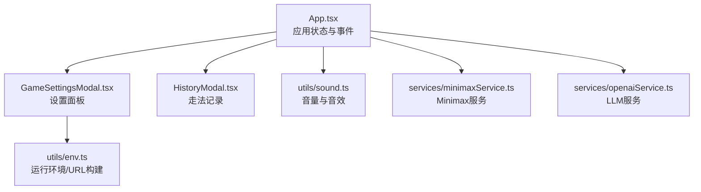
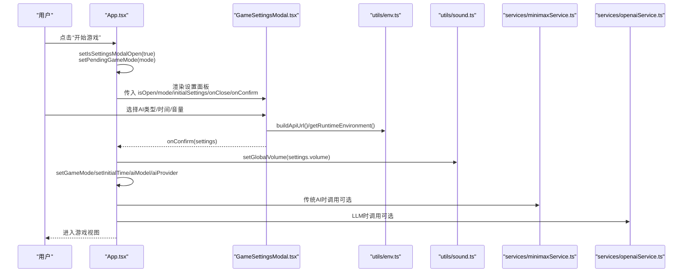
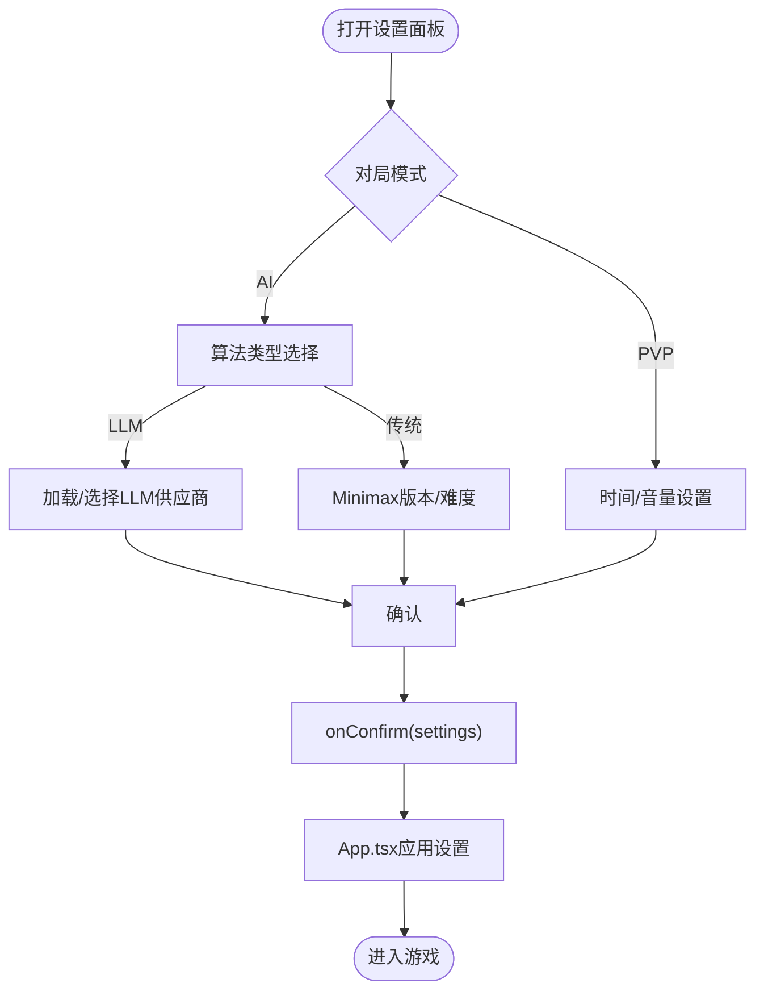
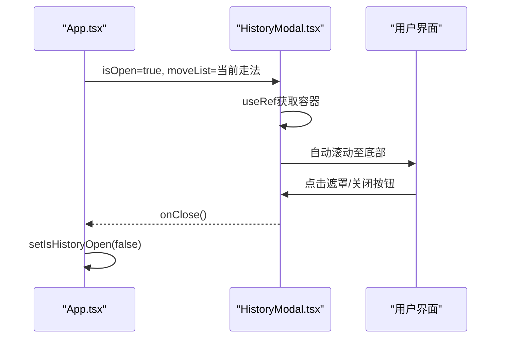
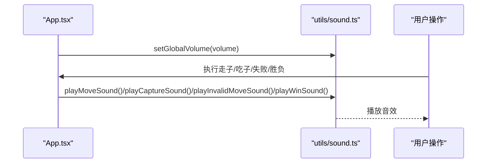
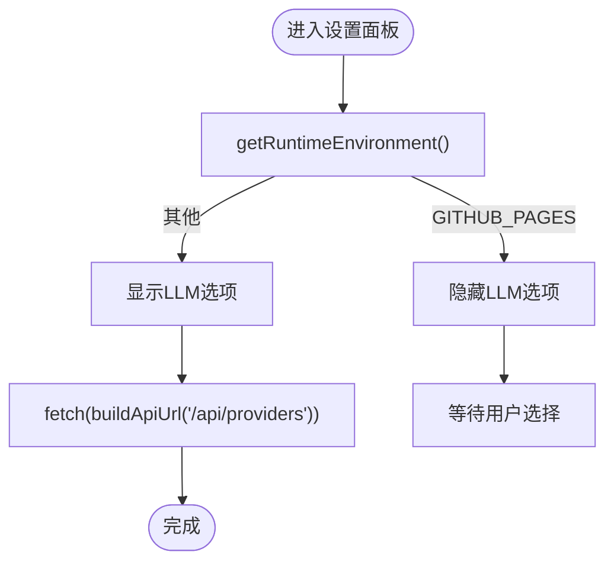
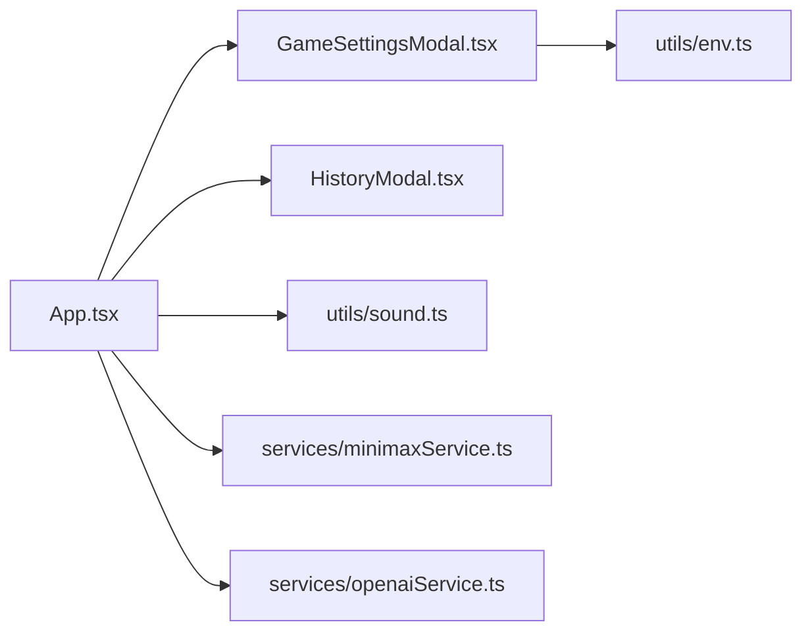

# 设置与模态框

<cite>
**本文引用的文件列表**
- [App.tsx](file://App.tsx)
- [GameSettingsModal.tsx](file://components/GameSettingsModal.tsx)
- [HistoryModal.tsx](file://components/HistoryModal.tsx)
- [sound.ts](file://utils/sound.ts)
- [env.ts](file://utils/env.ts)
- [minimaxService.ts](file://services/minimaxService.ts)
- [openaiService.ts](file://services/openaiService.ts)
- [index.html](file://index.html)
</cite>

## 目录
1. [简介](#简介)
2. [项目结构](#项目结构)
3. [核心组件](#核心组件)
4. [架构总览](#架构总览)
5. [组件详解](#组件详解)
6. [依赖关系分析](#依赖关系分析)
7. [性能考量](#性能考量)
8. [故障排查指南](#故障排查指南)
9. [结论](#结论)

## 简介
本文件围绕两个模态框组件进行系统化文档化：GameSettingsModal.tsx 与 HistoryModal.tsx。前者负责在开始游戏前收集用户设置（对局模式、AI类型、时间控制、音量等），并通过回调将配置传递给 App.tsx；后者用于展示棋局走法记录，支持自动滚动与高亮最新一步。文档同时说明两者与 utils/sound.ts 的联动、环境配置（utils/env.ts）的集成、以及遮罩层、z-index 和 CSS 动画的实现细节。

## 项目结构
- 组件层：GameSettingsModal.tsx、HistoryModal.tsx 位于 components 目录
- 应用入口：App.tsx 负责状态管理、模态框开关、音量应用与事件分发
- 工具层：utils/sound.ts 提供 Web Audio API 音效合成；utils/env.ts 提供运行环境判断与 API URL 构建
- 服务层：services/minimaxService.ts 与 services/openaiService.ts 分别封装 Minimax 与 LLM 的调用

图表来源
- [App.tsx](file://App.tsx#L436-L456)
- [GameSettingsModal.tsx](file://components/GameSettingsModal.tsx#L1-L337)
- [HistoryModal.tsx](file://components/HistoryModal.tsx#L1-L58)
- [sound.ts](file://utils/sound.ts#L1-L158)
- [env.ts](file://utils/env.ts#L1-L51)
- [minimaxService.ts](file://services/minimaxService.ts#L1-L66)
- [openaiService.ts](file://services/openaiService.ts#L1-L37)

章节来源
- [App.tsx](file://App.tsx#L436-L456)
- [GameSettingsModal.tsx](file://components/GameSettingsModal.tsx#L1-L337)
- [HistoryModal.tsx](file://components/HistoryModal.tsx#L1-L58)
- [sound.ts](file://utils/sound.ts#L1-L158)
- [env.ts](file://utils/env.ts#L1-L51)
- [minimaxService.ts](file://services/minimaxService.ts#L1-L66)
- [openaiService.ts](file://services/openaiService.ts#L1-L37)

## 核心组件
- GameSettingsModal.tsx：提供对局模式（PVP/AI）、AI类型（传统/LLM）、Minimax 版本与难度、LLM 供应商、时间控制（无限/10/20 分钟）、音量调节，并通过 onConfirm 回调返回完整 GameSettings 结构
- HistoryModal.tsx：展示 moveList，自动滚动至最新一步，高亮最后一步，支持点击关闭

章节来源
- [GameSettingsModal.tsx](file://components/GameSettingsModal.tsx#L1-L337)
- [HistoryModal.tsx](file://components/HistoryModal.tsx#L1-L58)

## 架构总览
下图展示了从 App.tsx 打开设置面板、用户输入配置、确认后应用到全局状态与 AI/音效的整体流程。

图表来源
- [App.tsx](file://App.tsx#L116-L145)
- [GameSettingsModal.tsx](file://components/GameSettingsModal.tsx#L1-L337)
- [env.ts](file://utils/env.ts#L1-L51)
- [sound.ts](file://utils/sound.ts#L1-L158)
- [minimaxService.ts](file://services/minimaxService.ts#L1-L66)
- [openaiService.ts](file://services/openaiService.ts#L1-L37)

## 组件详解

### GameSettingsModal.tsx 设计与实现
- 状态与初始化
  - 内部维护 gameTime、volume、algorithmType、minimaxVersion、difficulty、llmProvider、providers、loadingProviders 等状态
  - 通过 initialSettings 接收 App.tsx 传入的初始值（如初始时间、音量、AI参数）
- AI 类型与供应商
  - 支持“传统算法”和“大语言模型”两种算法类型
  - 当 algorithmType 为 LLM 且 mode 为 ai 时，会在模态框打开时拉取可用供应商列表（通过 buildApiUrl('/api/providers')）
  - 在 GitHub Pages 环境下隐藏“LLM”选项
- 时间与音量
  - 时间选项包含“无限/10分钟/20分钟”，对应不同数值
  - 音量使用范围输入条，支持静音切换，百分比显示
- 打开/关闭与遮罩层
  - 通过 isOpen 控制渲染；未开启时返回 null
  - 外层容器使用固定定位、z-index 较高、背景半透明与模糊，点击遮罩触发 onClose
- 确认与回调
  - handleConfirm 组装 GameSettings 并调用 onConfirm
  - App.tsx 的 handleSettingsConfirm 负责写入全局状态（gameMode、initialTime、volume、aiModel、aiProvider、minimaxVersion、difficulty）

图表来源
- [GameSettingsModal.tsx](file://components/GameSettingsModal.tsx#L1-L337)
- [App.tsx](file://App.tsx#L116-L145)

章节来源
- [GameSettingsModal.tsx](file://components/GameSettingsModal.tsx#L1-L337)
- [App.tsx](file://App.tsx#L116-L145)

### HistoryModal.tsx 设计与实现
- 数据展示
  - 接收 moveList 数组，逐条渲染步数编号、颜色（红/黑）、走法文本
  - 最新一步高亮，其余项悬停高亮
- 自动滚动
  - 通过 useRef 获取容器，监听 isOpen 与 moveList 变化，若内容溢出则平滑滚动到底部
- 打开/关闭与遮罩层
  - 通过 isOpen 控制渲染；未开启时返回 null
  - 容器使用固定定位、z-index 较高、背景半透明与模糊，点击右侧区域阻止冒泡，点击遮罩关闭
- 无障碍与交互
  - 关闭按钮使用简洁图标，便于识别
  - 列表项具备基本的视觉层级与对比度

图表来源
- [HistoryModal.tsx](file://components/HistoryModal.tsx#L1-L58)
- [App.tsx](file://App.tsx#L436-L440)

章节来源
- [HistoryModal.tsx](file://components/HistoryModal.tsx#L1-L58)
- [App.tsx](file://App.tsx#L436-L440)

### 与 utils/sound.ts 的联动机制
- 全局音量
  - App.tsx 在每次 volume 变化时调用 setGlobalVolume，影响所有音效播放
- 音效触发点
  - 走子：playMoveSound
  - 吃子：playCaptureSound
  - 无效走法：playInvalidMoveSound
  - 胜负：playWinSound
- 音效合成
  - 使用 Web Audio API 创建振荡器、增益与滤波器，按需组合形成不同音色与包络

图表来源
- [App.tsx](file://App.tsx#L99-L109)
- [sound.ts](file://utils/sound.ts#L1-L158)

章节来源
- [App.tsx](file://App.tsx#L99-L109)
- [sound.ts](file://utils/sound.ts#L1-L158)

### 与环境配置（utils/env.ts）的联动
- 运行环境判断
  - getRuntimeEnvironment 用于区分 Vercel、GitHub Pages、Local 环境
  - 在 GitHub Pages 环境下隐藏“LLM”选项
- API URL 构建
  - buildApiUrl 依据 API_BASE_URL 与路径拼接完整 URL，用于拉取供应商列表与调用 AI 服务

图表来源
- [GameSettingsModal.tsx](file://components/GameSettingsModal.tsx#L37-L83)
- [env.ts](file://utils/env.ts#L1-L51)

章节来源
- [GameSettingsModal.tsx](file://components/GameSettingsModal.tsx#L37-L83)
- [env.ts](file://utils/env.ts#L1-L51)

### 打开/关闭逻辑与遮罩层
- 打开
  - App.tsx 通过 isSettingsModalOpen/isHistoryOpen 控制模态框渲染
  - GameSettingsModal.tsx 与 HistoryModal.tsx 均在 isOpen 为真时渲染
- 关闭
  - 点击遮罩层触发 onClose，由父组件重置对应状态
- 遮罩层
  - 使用 fixed 定位、半透明背景、backdrop-blur 模糊、z-index 较高，保证层级覆盖
- 动画
  - 外层容器使用 animate-fade-in 实现淡入效果
  - HistoryModal 采用从右侧滑入的布局（flex justify-end），配合遮罩层统一动画体验

章节来源
- [GameSettingsModal.tsx](file://components/GameSettingsModal.tsx#L113-L118)
- [HistoryModal.tsx](file://components/HistoryModal.tsx#L29-L39)
- [index.html](file://index.html#L15-L66)

### 无障碍访问（a11y）考虑
- 按钮语义
  - 关闭按钮使用简洁图标，建议在实际项目中添加 aria-label 或 title 属性以提升可访问性
- 焦点管理
  - 模态框打开时应将焦点移至模态框内首个可交互元素，便于键盘导航
- 对比度与可读性
  - 文字与背景色满足对比度要求，避免仅依赖颜色传达信息
- 屏幕阅读器
  - 重要提示（如“暂无可用供应商”）应提供可读文本，避免仅依赖图标

[本节为通用指导，不直接分析具体文件，故无章节来源]

## 依赖关系分析
- 组件耦合
  - GameSettingsModal.tsx 与 App.tsx 通过 props/onConfirm 强耦合；与 utils/env.ts、utils/sound.ts 存在功能级依赖
  - HistoryModal.tsx 与 App.tsx 通过 props/moveList 弱耦合，仅依赖渲染数据
- 外部依赖
  - lucide-react 图标库
  - Tailwind CSS 动画与样式类（animate-fade-in、backdrop-blur、z-50 等）
- 循环依赖
  - 未发现循环依赖；各模块职责清晰

图表来源
- [App.tsx](file://App.tsx#L436-L456)
- [GameSettingsModal.tsx](file://components/GameSettingsModal.tsx#L1-L337)
- [HistoryModal.tsx](file://components/HistoryModal.tsx#L1-L58)
- [env.ts](file://utils/env.ts#L1-L51)
- [sound.ts](file://utils/sound.ts#L1-L158)
- [minimaxService.ts](file://services/minimaxService.ts#L1-L66)
- [openaiService.ts](file://services/openaiService.ts#L1-L37)

章节来源
- [App.tsx](file://App.tsx#L436-L456)
- [GameSettingsModal.tsx](file://components/GameSettingsModal.tsx#L1-L337)
- [HistoryModal.tsx](file://components/HistoryModal.tsx#L1-L58)
- [env.ts](file://utils/env.ts#L1-L51)
- [sound.ts](file://utils/sound.ts#L1-L158)
- [minimaxService.ts](file://services/minimaxService.ts#L1-L66)
- [openaiService.ts](file://services/openaiService.ts#L1-L37)

## 性能考量
- 模态框渲染
  - isOpen 为假时返回 null，避免不必要的 DOM 节点与事件绑定
- 动画与模糊
  - backdrop-blur 与动画在现代浏览器中通常由 GPU 加速，注意在低端设备上的性能表现
- 请求与状态
  - LLM 供应商列表仅在需要时拉取，避免重复请求
- 音效
  - Web Audio API 播放音效，避免外部资源加载带来的阻塞

[本节为通用指导，不直接分析具体文件，故无章节来源]

## 故障排查指南
- 无法加载 LLM 供应商
  - 检查 buildApiUrl 返回的 URL 是否正确
  - 确认 /api/providers 接口返回格式与可用字段
- GitHub Pages 下看不到“LLM”选项
  - 运行环境被识别为 GITHUB_PAGES，组件会隐藏该选项
- 音量设置无效
  - 确认 App.tsx 中 setGlobalVolume 已被调用
  - 检查音效函数是否被调用（走子/吃子/失败/胜负）
- 走法记录不滚动
  - 确认 isOpen 为真且 moveList 发生变化
  - 检查容器高度与 scrollHeight/clientHeight 的关系

章节来源
- [GameSettingsModal.tsx](file://components/GameSettingsModal.tsx#L64-L83)
- [env.ts](file://utils/env.ts#L35-L51)
- [App.tsx](file://App.tsx#L99-L109)
- [HistoryModal.tsx](file://components/HistoryModal.tsx#L17-L25)

## 结论
GameSettingsModal.tsx 与 HistoryModal.tsx 通过清晰的 props 与回调机制与 App.tsx 协作，前者负责收集并应用全局配置（含 AI 与音效），后者负责展示走法记录并提供良好交互体验。二者均采用固定定位、遮罩层与 CSS 动画实现一致的视觉与交互风格；与 utils/sound.ts、utils/env.ts 的集成使音量与环境适配更加灵活。建议后续增强无障碍属性与焦点管理，进一步提升可访问性。