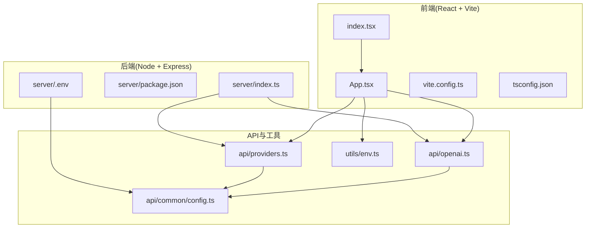
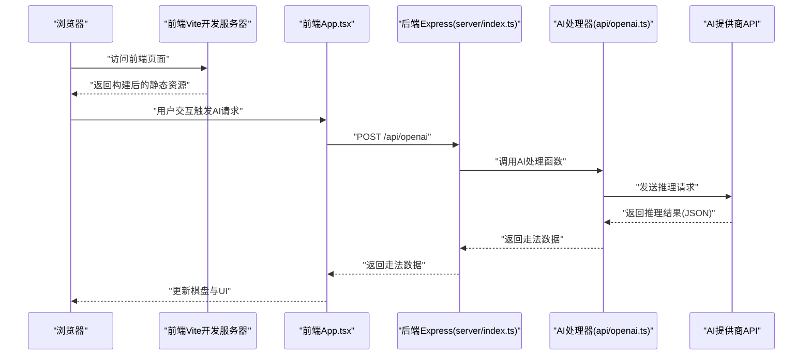
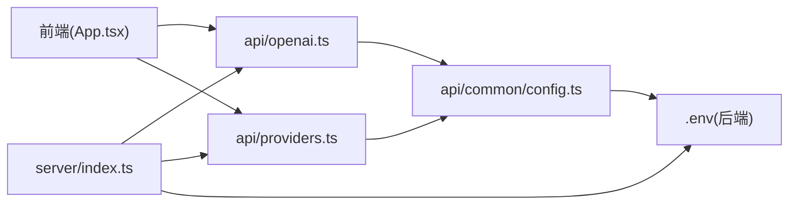

# 快速开始

<cite>
**本文引用的文件**
- [README.md](file://README.md)
- [package.json](file://package.json)
- [vite.config.ts](file://vite.config.ts)
- [vercel.json](file://vercel.json)
- [server/package.json](file://server/package.json)
- [server/index.ts](file://server/index.ts)
- [server/.env](file://server/.env)
- [utils/env.ts](file://utils/env.ts)
- [api/common/config.ts](file://api/common/config.ts)
- [api/openai.ts](file://api/openai.ts)
- [api/providers.ts](file://api/providers.ts)
- [index.tsx](file://index.tsx)
- [App.tsx](file://App.tsx)
- [tsconfig.json](file://tsconfig.json)
</cite>

## 目录
1. [简介](#简介)
2. [项目结构](#项目结构)
3. [核心组件](#核心组件)
4. [架构总览](#架构总览)
5. [详细组件分析](#详细组件分析)
6. [依赖关系分析](#依赖关系分析)
7. [性能与构建建议](#性能与构建建议)
8. [故障排查指南](#故障排查指南)
9. [结论](#结论)
10. [附录](#附录)

## 简介
本指南面向希望在本地快速部署并运行 zen_chess 的开发者，提供从零开始的分步操作：克隆仓库、安装依赖、配置环境变量、启动开发服务器（前端 Vite 与后端 Node 服务），并解释 vercel.json 与 vite.config.ts 在构建与部署中的作用。同时，针对 README 中提及的 GitHub Pages 部署限制，给出明确说明与替代方案，帮助你在约 10 分钟内完成本地启动。

## 项目结构
项目采用前后端分离架构：
- 前端：React + Vite，位于项目根目录，使用 TypeScript 编译与开发。
- 后端：Node.js + Express，位于 server 目录，提供 AI 决策 API 与健康检查端点。
- API 层：位于 api 目录，封装 AI 提供商配置、规则与提示词构建。
- 工具层：utils 目录包含运行环境判断与 API 基础地址拼接工具。
- 配置：根目录 vite.config.ts 控制前端开发服务器、插件与构建行为；vercel.json 控制 Vercel 部署流程；server/.env 与根目录 .env.local（README 指示）用于后端与前端环境变量。

图表来源
- [index.tsx](file://index.tsx#L1-L15)
- [App.tsx](file://App.tsx#L1-L460)
- [vite.config.ts](file://vite.config.ts#L1-L35)
- [tsconfig.json](file://tsconfig.json#L1-L31)
- [server/index.ts](file://server/index.ts#L1-L64)
- [server/package.json](file://server/package.json#L1-L26)
- [server/.env](file://server/.env#L1-L4)
- [api/common/config.ts](file://api/common/config.ts#L1-L49)
- [api/openai.ts](file://api/openai.ts#L1-L367)
- [api/providers.ts](file://api/providers.ts#L1-L41)
- [utils/env.ts](file://utils/env.ts#L1-L51)

章节来源
- [README.md](file://README.md#L1-L82)
- [package.json](file://package.json#L1-L30)
- [vite.config.ts](file://vite.config.ts#L1-L35)
- [server/package.json](file://server/package.json#L1-L26)
- [server/index.ts](file://server/index.ts#L1-L64)
- [server/.env](file://server/.env#L1-L4)
- [api/common/config.ts](file://api/common/config.ts#L1-L49)
- [api/openai.ts](file://api/openai.ts#L1-L367)
- [api/providers.ts](file://api/providers.ts#L1-L41)
- [utils/env.ts](file://utils/env.ts#L1-L51)
- [index.tsx](file://index.tsx#L1-L15)
- [App.tsx](file://App.tsx#L1-L460)
- [tsconfig.json](file://tsconfig.json#L1-L31)

## 核心组件
- 前端入口与渲染：index.tsx 负责挂载 React 根节点；App.tsx 是应用主组件，管理游戏状态、AI 模式切换与调用 API。
- 构建与开发服务器：vite.config.ts 配置开发服务器端口、插件顺序、worker 插件、base 路径以及环境变量注入。
- 后端服务：server/index.ts 提供 /api/openai 与 /api/providers 的路由，加载 .env 并启用 CORS。
- AI 提供商配置：api/common/config.ts 从环境变量读取各提供商的 API Key、模型与请求地址。
- 运行环境判断：utils/env.ts 提供运行环境枚举与 API 基础地址拼接工具，支持 Vercel、GitHub Pages 与本地三种环境。

章节来源
- [index.tsx](file://index.tsx#L1-L15)
- [App.tsx](file://App.tsx#L1-L460)
- [vite.config.ts](file://vite.config.ts#L1-L35)
- [server/index.ts](file://server/index.ts#L1-L64)
- [api/common/config.ts](file://api/common/config.ts#L1-L49)
- [utils/env.ts](file://utils/env.ts#L1-L51)

## 架构总览
下图展示了本地开发时的请求链路：浏览器发起请求到前端 Vite 开发服务器，前端通过 fetch 调用后端 Express 服务，后端再转发到各 AI 提供商的 API，最终返回 AI 决策结果。

图表来源
- [App.tsx](file://App.tsx#L1-L460)
- [server/index.ts](file://server/index.ts#L1-L64)
- [api/openai.ts](file://api/openai.ts#L1-L367)

## 详细组件分析

### 前端开发与构建
- 开发服务器：vite.config.ts 将开发服务器端口设为 3000，默认监听 0.0.0.0，便于宿主机访问；base 设为 "./"，有利于在子路径部署时正确解析静态资源。
- 插件顺序：vite-plugin-comlink 必须放在首位，以便同时处理主进程与 Web Worker 的打包；@vitejs/plugin-react 提供 React HMR。
- 环境变量注入：通过 define 注入 process.env.API_BASE_URL、process.env.GITHUB_PAGES、process.env.VERCEL，便于在构建时注入运行时配置。
- TypeScript：tsconfig.json 指定 ES2022 目标、ESNext 模块系统与 paths 别名，确保路径解析与模块检测策略一致。

章节来源
- [vite.config.ts](file://vite.config.ts#L1-L35)
- [tsconfig.json](file://tsconfig.json#L1-L31)

### 后端服务与路由
- 启动脚本：server/package.json 提供 dev 与 start 脚本，分别用于开发与生产构建后运行。
- 路由定义：server/index.ts 提供 /api/openai（POST）与 /api/providers（GET），并暴露 /health 健康检查端点。
- CORS 与中间件：启用 CORS 与 JSON 解析，保证跨域请求与数据解析。
- 环境变量：dotenv 在启动早期加载 .env，使配置项可在运行时生效。

章节来源
- [server/package.json](file://server/package.json#L1-L26)
- [server/index.ts](file://server/index.ts#L1-L64)
- [server/.env](file://server/.env#L1-L4)

### AI 提供商配置与调用
- 配置来源：api/common/config.ts 从环境变量读取各提供商的 API Key、模型与请求地址，支持 openai、gemini、deepseek、qianwen。
- 处理流程：api/openai.ts 构建 Prompt、调用提供商 API、解析返回并兜底处理；api/providers.ts 返回可用提供商列表及其可用性。
- 运行环境：utils/env.ts 提供运行环境判断与 API 基础地址拼接，支持在不同部署环境间切换。

章节来源
- [api/common/config.ts](file://api/common/config.ts#L1-L49)
- [api/openai.ts](file://api/openai.ts#L1-L367)
- [api/providers.ts](file://api/providers.ts#L1-L41)
- [utils/env.ts](file://utils/env.ts#L1-L51)

### 部署配置与限制说明
- Vercel 配置：vercel.json 指定构建命令与输出目录，便于一键部署。
- GitHub Pages 限制：vite.config.ts 将 base 设为 "./"，有助于子路径部署；但 README 明确指出 GitHub Pages 不支持后端 API，因此无法通过 GitHub Pages 托管后端路由与 AI 调用。建议使用 Vercel 或自建服务器进行完整部署。

章节来源
- [vercel.json](file://vercel.json#L1-L4)
- [vite.config.ts](file://vite.config.ts#L1-L35)
- [README.md](file://README.md#L1-L82)

## 依赖关系分析
- 前端对后端的依赖：前端通过 fetch 调用后端 /api/openai 与 /api/providers，后端路由转发至 api/openai.ts 与 api/providers.ts。
- 后端对 API 的依赖：server/index.ts 引入 api/openai.js 与 api/providers.js，实际处理逻辑在对应 TS 文件中。
- 配置依赖：api/common/config.ts 从环境变量读取各提供商配置，server/.env 与 README 指示的 .env.local 为关键输入。

图表来源
- [App.tsx](file://App.tsx#L1-L460)
- [api/openai.ts](file://api/openai.ts#L1-L367)
- [api/providers.ts](file://api/providers.ts#L1-L41)
- [api/common/config.ts](file://api/common/config.ts#L1-L49)
- [server/index.ts](file://server/index.ts#L1-L64)
- [server/.env](file://server/.env#L1-L4)

章节来源
- [App.tsx](file://App.tsx#L1-L460)
- [api/openai.ts](file://api/openai.ts#L1-L367)
- [api/providers.ts](file://api/providers.ts#L1-L41)
- [api/common/config.ts](file://api/common/config.ts#L1-L49)
- [server/index.ts](file://server/index.ts#L1-L64)
- [server/.env](file://server/.env#L1-L4)

## 性能与构建建议
- 开发阶段：使用 Vite 的 HMR 与 React 插件提升热更新效率；确保 vite.config.ts 中插件顺序正确，避免打包异常。
- 生产构建：保持 base 为 "./" 以适配子路径部署；如需静态托管，建议配合 Vercel 或自建服务器。
- 环境变量：在本地开发时，README 指示在根目录创建 .env.local 并添加各提供商的 API Key；后端也可使用 server/.env。
- 类型与路径：tsconfig.json 统一模块解析与目标版本，减少编译差异导致的问题。

章节来源
- [vite.config.ts](file://vite.config.ts#L1-L35)
- [tsconfig.json](file://tsconfig.json#L1-L31)
- [README.md](file://README.md#L1-L82)
- [server/.env](file://server/.env#L1-L4)

## 故障排查指南
- 端口冲突：若本地 3000 端口被占用，可在 vite.config.ts 中修改 server.port。
- CORS 错误：确认后端已启用 CORS，且前端请求的域名与端口与后端一致。
- 环境变量缺失：若 AI 调用失败，请检查 .env.local（根目录）与 server/.env 是否包含正确的 API Key 与模型配置。
- 路由 404：确认后端已启动并监听端口，且前端请求的 API 地址与后端路由匹配。
- GitHub Pages 无法使用后端：README 明确指出 GitHub Pages 不支持后端 API，无法实现 AI 调用；请改用 Vercel 或自建服务器。

章节来源
- [server/index.ts](file://server/index.ts#L1-L64)
- [README.md](file://README.md#L1-L82)
- [server/.env](file://server/.env#L1-L4)

## 结论
通过本指南，你可以在本地快速完成 zen_chess 的部署与运行：安装依赖、配置环境变量、分别启动前端与后端开发服务器，并理解 vercel.json 与 vite.config.ts 在构建与部署中的作用。针对 GitHub Pages 的限制，README 已明确说明无法托管后端 API，建议使用 Vercel 或自建服务器以获得完整功能体验。

## 附录

### 本地部署与运行步骤
- 克隆仓库并进入目录
- 安装依赖
  - 根目录安装前端依赖
  - 进入 server 目录安装后端依赖
- 配置环境变量
  - 在根目录创建 .env.local，添加各 AI 提供商的 API Key、模型与请求地址
  - 后端也可使用 server/.env
- 启动开发服务器
  - 在根目录启动前端开发服务器
  - 在 server 目录启动后端开发服务器
- 访问应用
  - 浏览器打开前端开发服务器地址，开始游戏并选择 AI 模式

章节来源
- [README.md](file://README.md#L1-L82)
- [package.json](file://package.json#L1-L30)
- [server/package.json](file://server/package.json#L1-L26)
- [server/.env](file://server/.env#L1-L4)

### vercel.json 与 vite.config.ts 的作用
- vercel.json
  - 指定构建命令与输出目录，便于一键部署到 Vercel
- vite.config.ts
  - 配置开发服务器端口与主机、插件顺序、worker 插件、base 路径与环境变量注入
  - base 设为 "./" 以支持子路径部署

章节来源
- [vercel.json](file://vercel.json#L1-L4)
- [vite.config.ts](file://vite.config.ts#L1-L35)

### GitHub Pages 部署限制说明
- README 明确指出 GitHub Pages 不支持后端 API，因此无法托管后端路由与 AI 调用
- 建议使用 Vercel 或自建服务器进行完整部署

章节来源
- [README.md](file://README.md#L1-L82)