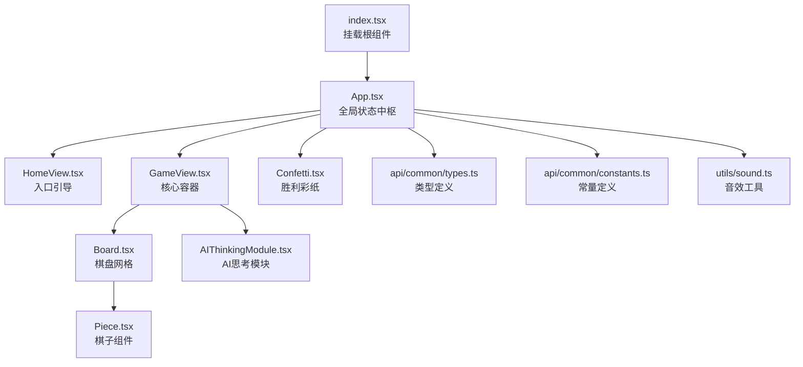
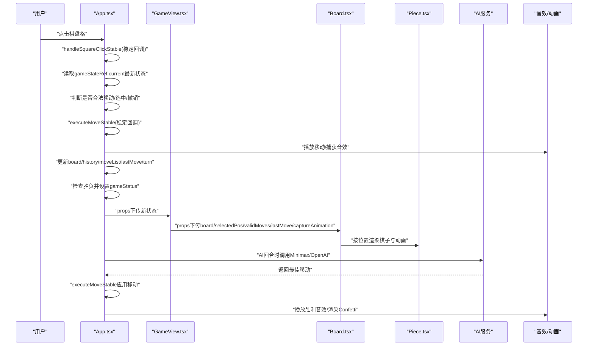
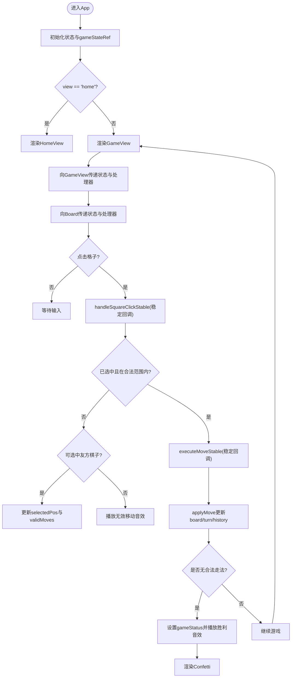
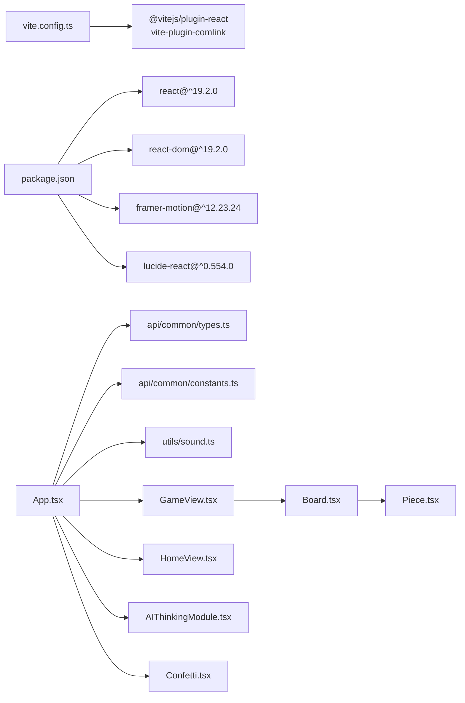

# 前端架构

<cite>
**本文引用的文件**
- [App.tsx](file://App.tsx)
- [HomeView.tsx](file://components/HomeView.tsx)
- [GameView.tsx](file://components/GameView.tsx)
- [Board.tsx](file://components/Board.tsx)
- [Piece.tsx](file://components/Piece.tsx)
- [Confetti.tsx](file://components/Confetti.tsx)
- [AIThinkingModule.tsx](file://components/AIThinkingModule.tsx)
- [index.tsx](file://index.tsx)
- [vite.config.ts](file://vite.config.ts)
- [package.json](file://package.json)
- [api/common/types.ts](file://api/common/types.ts)
- [api/common/constants.ts](file://api/common/constants.ts)
- [utils/sound.ts](file://utils/sound.ts)
</cite>

## 目录
1. [引言](#引言)
2. [项目结构](#项目结构)
3. [核心组件](#核心组件)
4. [架构总览](#架构总览)
5. [详细组件分析](#详细组件分析)
6. [依赖关系分析](#依赖关系分析)
7. [性能考量](#性能考量)
8. [故障排查指南](#故障排查指南)
9. [结论](#结论)

## 引言
本文件面向zen_chess的前端架构，聚焦于React 19与Vite构建的响应式UI体系。重点阐述App.tsx作为全局状态中枢的设计，包括其使用useRef实现稳定回调以解决闭包陷阱的高级模式；组件层次结构：HomeView作为入口引导，GameView作为核心容器协调Board、Piece、AIThinkingModule等子组件；UI状态管理策略，如selectedPos、validMoves、captureAnimation等状态的流转机制；以及在handleSquareClickStable中通过gameStateRef访问最新状态，避免因闭包导致的状态滞后问题。同时说明framer-motion在Confetti与吃子动画中的应用，lucide-react图标库的集成方式，并给出组件通信模式的最佳实践与性能优化建议。

## 项目结构
- 入口与运行时
  - index.tsx负责挂载根组件App
  - vite.config.ts配置开发服务器、插件与别名，支持Comlink Worker与相对路径部署
  - package.json声明React 19、Vite、framer-motion、lucide-react等依赖
- 视图层
  - App.tsx：全局状态中枢，协调视图切换、游戏逻辑、AI与音效
  - HomeView.tsx：首页入口，提供PVP与AI两种模式选择
  - GameView.tsx：游戏主界面容器，承载计时器、控制模块、AI思考模块与棋盘
  - Board.tsx：棋盘网格与交互层，绘制坐标线、可选/合法落点指示、最后一步高亮与捕获动画
  - Piece.tsx：棋子组件，基于framer-motion实现布局动画、选中高亮、捕获爆炸等
  - AIThinkingModule.tsx：AI思考状态与推理展示模块
  - Confetti.tsx：全屏彩纸粒子动画，用于胜利时刻
- 工具与规则
  - api/common/types.ts：类型定义（棋盘、棋子、颜色、枚举、移动、状态）
  - api/common/constants.ts：常量定义（初始棋盘、棋子字符映射、列序号与方向）
  - utils/sound.ts：Web Audio API合成音效（移动、捕获、胜利、无效移动）

图表来源
- [index.tsx](file://index.tsx#L1-L15)
- [App.tsx](file://App.tsx#L395-L458)
- [HomeView.tsx](file://components/HomeView.tsx#L1-L49)
- [GameView.tsx](file://components/GameView.tsx#L1-L172)
- [Board.tsx](file://components/Board.tsx#L1-L194)
- [Piece.tsx](file://components/Piece.tsx#L1-L78)
- [AIThinkingModule.tsx](file://components/AIThinkingModule.tsx#L1-L53)
- [Confetti.tsx](file://components/Confetti.tsx#L1-L92)
- [api/common/types.ts](file://api/common/types.ts#L1-L68)
- [api/common/constants.ts](file://api/common/constants.ts#L1-L91)
- [utils/sound.ts](file://utils/sound.ts#L1-L158)

章节来源
- [index.tsx](file://index.tsx#L1-L15)
- [vite.config.ts](file://vite.config.ts#L1-L35)
- [package.json](file://package.json#L1-L30)

## 核心组件
- App.tsx（全局状态中枢）
  - 视图状态：view（home/game）
  - 游戏状态：board、turn、selectedPos、validMoves、history、moveList、lastMove、gameStatus、isAnimating、captureAnimation
  - 计时器状态：initialTime、gameResetKey
  - AI状态：aiModel、aiProvider、aiThinking、aiReasoning、minimaxDepth、minimaxVersion、gameMode
  - UI状态：isHistoryOpen、volume、isSettingsModalOpen、pendingGameMode
  - 稳定回调：gameStateRef同步最新状态，handleSquareClickStable与executeMoveStable避免闭包陷阱
  - 音效：setGlobalVolume与多种音效播放
  - 视图渲染：根据view切换HomeView或GameView，并在游戏结束时渲染Confetti
- HomeView.tsx（入口引导）
  - 提供PVP与AI两种模式按钮，触发App的startGame流程
- GameView.tsx（核心容器）
  - 接收来自App的游戏状态与事件处理器，向下传递给Board、TimeAndControlsModule、AIThinkingModule
  - 在桌面端与移动端分别组织侧边栏与顶部导航
- Board.tsx（棋盘网格）
  - 使用memo优化渲染，绘制SVG网格与交互格子
  - 根据selectedPos、validMoves、lastMove与captureAnimation渲染选中高亮、合法落点指示、最后一步高亮与捕获动画
- Piece.tsx（棋子组件）
  - 基于framer-motion实现layoutId布局动画、选中阴影与缩放、捕获时的爆炸与抖动
- AIThinkingModule.tsx（AI思考模块）
  - 展示AI思考中的点阵动画或推理文本
- Confetti.tsx（胜利彩纸）
  - Canvas粒子系统，全屏覆盖，随窗口尺寸自适应

章节来源
- [App.tsx](file://App.tsx#L32-L458)
- [HomeView.tsx](file://components/HomeView.tsx#L1-L49)
- [GameView.tsx](file://components/GameView.tsx#L1-L172)
- [Board.tsx](file://components/Board.tsx#L1-L194)
- [Piece.tsx](file://components/Piece.tsx#L1-L78)
- [AIThinkingModule.tsx](file://components/AIThinkingModule.tsx#L1-L53)
- [Confetti.tsx](file://components/Confetti.tsx#L1-L92)

## 架构总览
App.tsx作为全局状态中枢，承担以下职责：
- 状态聚合：集中管理棋盘、回合、选中与合法走法、历史、计时器、AI与UI状态
- 稳定回调：通过gameStateRef在回调中读取最新状态，避免闭包陷阱
- 业务编排：处理用户点击、AI决策、撤销、计时器超时、音效与动画
- 视图切换：根据view在HomeView与GameView之间切换
- 渲染分发：向GameView传递所有必要状态与事件处理器，再由GameView向下分发至Board、Piece、AIThinkingModule等

图表来源
- [App.tsx](file://App.tsx#L291-L371)
- [GameView.tsx](file://components/GameView.tsx#L110-L167)
- [Board.tsx](file://components/Board.tsx#L153-L166)
- [Piece.tsx](file://components/Piece.tsx#L17-L76)
- [utils/sound.ts](file://utils/sound.ts#L1-L158)
- [Confetti.tsx](file://components/Confetti.tsx#L1-L92)

## 详细组件分析

### App.tsx：全局状态中枢与稳定回调
- 状态设计
  - 游戏状态：board、turn、selectedPos、validMoves、history、moveList、lastMove、gameStatus、isAnimating、captureAnimation
  - 计时器状态：initialTime、gameResetKey
  - AI状态：aiModel、aiProvider、aiThinking、aiReasoning、minimaxDepth、minimaxVersion、gameMode
  - UI状态：isHistoryOpen、volume、isSettingsModalOpen、pendingGameMode
- 稳定回调模式
  - 使用useRef维护gameStateRef，每次渲染同步最新状态，回调内部从ref读取，避免闭包陷阱
  - handleSquareClickStable与executeMoveStable均依赖此模式，确保回调内读取到最新状态
- 事件与业务流
  - 用户点击：handleSquareClickStable判定选中/合法移动/撤销/无效移动，播放音效
  - 移动执行：executeMoveStable应用移动、记录历史、更新回合、检查胜负、播放音效与动画
  - AI回合：useEffect监听轮次与AI模型，调用Minimax或OpenAI服务，得到移动后再次executeMoveStable
  - 计时器超时：handleTimeOut根据超时方改变gameStatus
  - 音效：setGlobalVolume与playMoveSound/playCaptureSound/playWinSound/playInvalidMoveSound
- 视图渲染
  - 根据view切换HomeView或GameView
  - 游戏结束时渲染Confetti

图表来源
- [App.tsx](file://App.tsx#L111-L159)
- [App.tsx](file://App.tsx#L211-L289)
- [App.tsx](file://App.tsx#L291-L371)
- [utils/sound.ts](file://utils/sound.ts#L1-L158)
- [Confetti.tsx](file://components/Confetti.tsx#L1-L92)

章节来源
- [App.tsx](file://App.tsx#L32-L458)

### HomeView.tsx：入口引导
- 提供“双人对弈”与“挑战AI”两种模式按钮
- 通过onStartGame回调通知App进入设置流程

章节来源
- [HomeView.tsx](file://components/HomeView.tsx#L1-L49)

### GameView.tsx：核心容器
- 顶部导航：返回首页、标题与历史按钮
- 左侧侧边栏（桌面端）：TimeAndControlsModule与AIThinkingModule
- 中央区域：Board组件
- 通过props向下传递所有状态与事件处理器，保持单向数据流

章节来源
- [GameView.tsx](file://components/GameView.tsx#L1-L172)

### Board.tsx：棋盘网格与交互层
- 使用memo优化渲染，避免父级状态变化导致的重复渲染
- 绘制SVG网格线、宫格、河界与位置标记
- 交互层采用9×10网格，每个格子渲染BoardCell
- 根据selectedPos、validMoves、lastMove与captureAnimation渲染：
  - 合法落点指示（空地为圆点、敌方为红圈）
  - 最后一步来源与目的地高亮
  - 捕获动画：命中位置棋子闪烁与透明度变化

章节来源
- [Board.tsx](file://components/Board.tsx#L1-L194)

### Piece.tsx：棋子组件与动画
- 基于framer-motion实现：
  - layoutId布局动画，保证棋子移动时的平滑过渡
  - 选中态阴影与缩放增强视觉反馈
  - 捕获时的爆炸与抖动动画，配合透明度归零
- 通过props接收位置、选中状态、最后一步标识与旋转参数

章节来源
- [Piece.tsx](file://components/Piece.tsx#L1-L78)

### AIThinkingModule.tsx：AI思考模块
- 当aiModel不为None时显示
- aiThinking：显示三点跳动动画
- aiReasoning：展示AI推理文本（最多5行）
- 无推理时显示提示文案

章节来源
- [AIThinkingModule.tsx](file://components/AIThinkingModule.tsx#L1-L53)

### Confetti.tsx：胜利彩纸动画
- Canvas粒子系统，随机生成彩色矩形与圆形粒子
- 监听窗口resize调整画布尺寸
- 使用requestAnimationFrame循环渲染，实现持续飘落效果

章节来源
- [Confetti.tsx](file://components/Confetti.tsx#L1-L92)

## 依赖关系分析
- 运行时与构建
  - React 19与Vite构成基础运行时与打包工具链
  - vite.config.ts启用@vitejs/plugin-react与vite-plugin-comlink，配置worker与别名@指向仓库根目录
- 图标与动画
  - lucide-react提供图标（Users、Bot、Sparkles、History等）
  - framer-motion提供布局动画与过渡效果
- 类型与常量
  - api/common/types.ts定义棋盘、棋子、颜色、枚举、移动、状态与捕获动画接口
  - api/common/constants.ts定义初始棋盘、棋子字符映射、列序号与方向
- 音效
  - utils/sound.ts基于Web Audio API合成音效，统一音量控制

图表来源
- [vite.config.ts](file://vite.config.ts#L1-L35)
- [package.json](file://package.json#L1-L30)
- [App.tsx](file://App.tsx#L1-L14)
- [api/common/types.ts](file://api/common/types.ts#L1-L68)
- [api/common/constants.ts](file://api/common/constants.ts#L1-L91)
- [utils/sound.ts](file://utils/sound.ts#L1-L158)
- [GameView.tsx](file://components/GameView.tsx#L1-L172)
- [Board.tsx](file://components/Board.tsx#L1-L194)
- [Piece.tsx](file://components/Piece.tsx#L1-L78)
- [AIThinkingModule.tsx](file://components/AIThinkingModule.tsx#L1-L53)
- [Confetti.tsx](file://components/Confetti.tsx#L1-L92)

章节来源
- [vite.config.ts](file://vite.config.ts#L1-L35)
- [package.json](file://package.json#L1-L30)

## 性能考量
- 稳定回调与闭包陷阱
  - 在App.tsx中，通过useRef维护gameStateRef并在每次渲染同步最新状态，回调内部从ref读取，避免闭包陷阱导致的状态滞后
  - handleSquareClickStable与executeMoveStable均依赖此模式，确保回调内读取到最新状态
- 组件渲染优化
  - Board与Piece均使用memo，减少父级状态变化引发的重复渲染
  - Board内部BoardCell也使用memo，进一步降低渲染成本
- 回调稳定性
  - useCallback包裹handleSquareClickStable与executeMoveStable，确保回调引用稳定，避免子组件不必要的重渲染
- 动画与音效
  - 使用framer-motion进行布局动画，减少手动DOM操作
  - 音效通过Web Audio API合成，避免外部音频资源带来的网络开销
- 计时器与重置
  - 通过key强制重置计时器，避免状态残留导致的异常行为

章节来源
- [App.tsx](file://App.tsx#L291-L371)
- [Board.tsx](file://components/Board.tsx#L1-L194)
- [Piece.tsx](file://components/Piece.tsx#L1-L78)

## 故障排查指南
- 点击无效或状态不同步
  - 检查handleSquareClickStable是否依赖稳定回调，确认gameStateRef是否同步最新状态
  - 确认validMoves是否正确计算，避免误判合法移动
- 吃子动画未显示或提前消失
  - 检查captureAnimation状态更新与清理时机，确保在动画播放完成后才清空
  - 确认Board中对isCaptured的匹配逻辑与Piece的捕获动画条件一致
- AI不响应或卡顿
  - 检查aiThinking与isAnimating标志位，避免在动画期间触发AI
  - 确认Minimax或OpenAI服务返回的移动格式正确
- 音效无声
  - 检查setGlobalVolume与音量设置，确认浏览器自动播放限制
  - 确认Web Audio上下文已初始化且未被暂停
- 彩纸动画不显示
  - 检查Canvas尺寸与窗口resize事件绑定，确认requestAnimationFrame循环正常运行

章节来源
- [App.tsx](file://App.tsx#L211-L289)
- [Board.tsx](file://components/Board.tsx#L153-L169)
- [Piece.tsx](file://components/Piece.tsx#L17-L76)
- [utils/sound.ts](file://utils/sound.ts#L1-L158)
- [Confetti.tsx](file://components/Confetti.tsx#L1-L92)

## 结论
zen_chess前端以App.tsx为核心，采用useRef稳定回调模式有效规避闭包陷阱，结合memo化组件与useCallback回调稳定化，实现了高性能的响应式UI。GameView作为容器协调Board、Piece与AI模块，形成清晰的单向数据流与职责分离。动画与音效通过framer-motion与Web Audio API自然融入，提升用户体验。整体架构在可维护性、可扩展性与性能之间取得良好平衡。