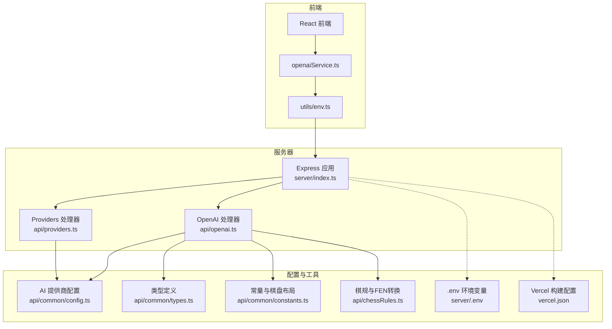
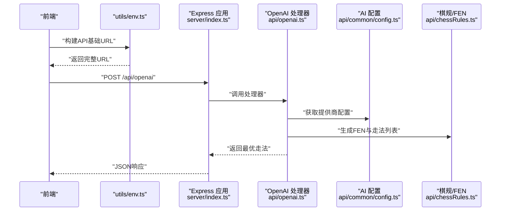
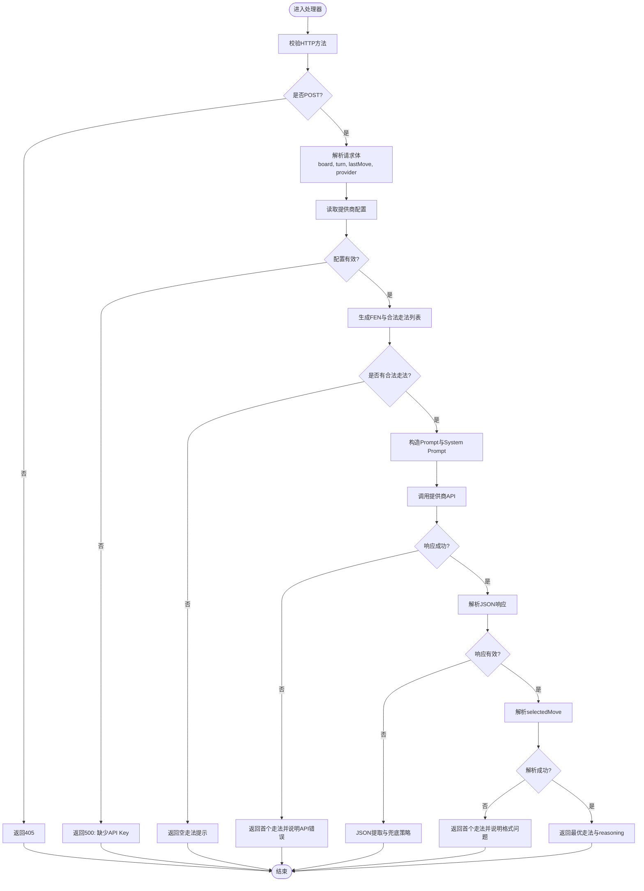
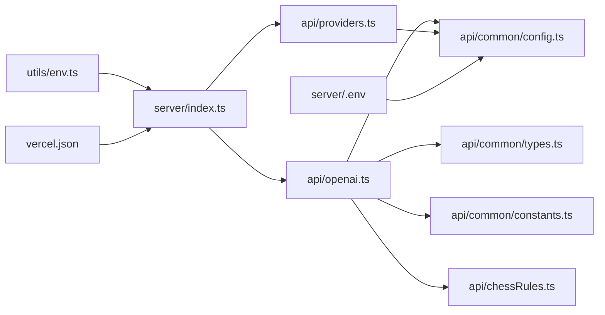

# 后端架构

<cite>
**本文引用的文件**
- [server/index.ts](file://server/index.ts)
- [api/openai.ts](file://api/openai.ts)
- [api/providers.ts](file://api/providers.ts)
- [api/common/config.ts](file://api/common/config.ts)
- [api/common/types.ts](file://api/common/types.ts)
- [api/common/constants.ts](file://api/common/constants.ts)
- [api/chessRules.ts](file://api/chessRules.ts)
- [services/openaiService.ts](file://services/openaiService.ts)
- [utils/env.ts](file://utils/env.ts)
- [server/.env](file://server/.env)
- [vercel.json](file://vercel.json)
- [server/package.json](file://server/package.json)
- [package.json](file://package.json)
</cite>

## 目录
1. [简介](#简介)
2. [项目结构](#项目结构)
3. [核心组件](#核心组件)
4. [架构总览](#架构总览)
5. [详细组件分析](#详细组件分析)
6. [依赖关系分析](#依赖关系分析)
7. [性能考量](#性能考量)
8. [故障排查指南](#故障排查指南)
9. [结论](#结论)
10. [附录](#附录)

## 简介
本文件面向zen_chess的后端架构，聚焦于基于Express的轻量级API服务设计与Vercel函数处理器集成。文档说明服务器如何通过server/index.ts暴露/api/openai和/api/providers两个核心端点，以及如何通过Vercel函数处理器实现跨平台部署兼容性。重点解析/api/openai端点的请求处理流程：接收棋盘状态与AI提供商参数，调用api/openai.ts中的LLM服务逻辑，支持OpenAI、Gemini、DeepSeek、Qwen等多模型；阐述/api/providers端点如何返回可用AI提供商列表，支持前端动态配置。同时说明CORS中间件、JSON解析、错误处理和健康检查（/health）的实现，并强调环境变量（.env）在安全存储API密钥中的作用。最后给出API安全性建议，如输入验证和速率限制的潜在扩展点。

## 项目结构
后端服务位于server目录，采用Express框架构建HTTP服务，路由层负责将请求转发至对应的Vercel函数处理器。核心API包括：
- /api/openai：接收棋盘状态与AI提供商参数，调用LLM推理并返回最优走法
- /api/providers：返回可用AI提供商列表，供前端动态配置
- /health：健康检查端点

前端通过services/openaiService.ts调用/api/openai，utils/env.ts负责在不同运行环境下构建正确的API基础URL。

图表来源
- [server/index.ts](file://server/index.ts#L1-L64)
- [api/openai.ts](file://api/openai.ts#L1-L127)
- [api/providers.ts](file://api/providers.ts#L1-L41)
- [api/common/config.ts](file://api/common/config.ts#L1-L49)
- [api/common/types.ts](file://api/common/types.ts#L1-L68)
- [api/common/constants.ts](file://api/common/constants.ts#L1-L91)
- [api/chessRules.ts](file://api/chessRules.ts#L1-L390)
- [services/openaiService.ts](file://services/openaiService.ts#L1-L37)
- [utils/env.ts](file://utils/env.ts#L1-L51)
- [server/.env](file://server/.env#L1-L4)
- [vercel.json](file://vercel.json#L1-L4)

章节来源
- [server/index.ts](file://server/index.ts#L1-L64)
- [vercel.json](file://vercel.json#L1-L4)

## 核心组件
- Express应用与中间件
  - 加载环境变量，启用CORS与JSON解析，注册路由与全局错误处理
- Vercel函数处理器
  - /api/openai：接收棋盘状态与AI提供商参数，调用LLM推理并返回最优走法
  - /api/providers：返回可用AI提供商列表，支持前端动态配置
- 配置与工具
  - AI提供商配置集中管理，支持多模型
  - 类型与常量定义，棋规与FEN转换工具
  - 前端环境判断与API基础URL构建

章节来源
- [server/index.ts](file://server/index.ts#L1-L64)
- [api/openai.ts](file://api/openai.ts#L1-L127)
- [api/providers.ts](file://api/providers.ts#L1-L41)
- [api/common/config.ts](file://api/common/config.ts#L1-L49)
- [api/common/types.ts](file://api/common/types.ts#L1-L68)
- [api/common/constants.ts](file://api/common/constants.ts#L1-L91)
- [api/chessRules.ts](file://api/chessRules.ts#L1-L390)
- [utils/env.ts](file://utils/env.ts#L1-L51)

## 架构总览
后端采用“路由层 + Vercel函数处理器”的分层设计：
- 路由层（server/index.ts）负责HTTP请求的接入、CORS、JSON解析、健康检查与全局错误处理
- 处理器层（api/openai.ts、api/providers.ts）封装业务逻辑，调用配置与工具模块
- 配置与工具层（api/common/*、api/chessRules.ts、utils/env.ts）提供统一的数据结构、常量、棋规与环境适配

图表来源
- [server/index.ts](file://server/index.ts#L22-L41)
- [api/openai.ts](file://api/openai.ts#L10-L127)
- [api/common/config.ts](file://api/common/config.ts#L13-L49)
- [api/chessRules.ts](file://api/chessRules.ts#L195-L247)
- [utils/env.ts](file://utils/env.ts#L31-L51)

## 详细组件分析

### 路由与中间件（server/index.ts）
- 环境变量加载：尽早加载dotenv，确保后续读取到OPENAI/Gemini/DeepSeek/Qwen等环境变量
- 中间件：
  - CORS：允许跨域访问
  - JSON解析：解析请求体为JSON
- 路由：
  - POST /api/openai：转发至Vercel函数处理器
  - GET /api/providers：返回可用提供商列表
  - GET /health：健康检查
- 错误处理：
  - 全局错误处理器：捕获未处理异常
  - 404处理器：未匹配路由统一返回404

章节来源
- [server/index.ts](file://server/index.ts#L1-L64)

### OpenAI处理器（api/openai.ts）
- CORS与方法校验：显式设置CORS头，处理OPTIONS预检；仅接受POST
- 请求参数：board、turn、lastMove、provider（默认openai）
- 配置读取：通过getAIProviderConfig(provider)获取对应提供商的API Key、模型与URL
- 棋局上下文：
  - 生成FEN字符串
  - 计算所有合法走法（含吃子、风险评估、价值排序）
- Prompt构建：
  - 构造可视化棋盘与走法列表
  - 使用systemPrompt与用户Prompt指导LLM输出
- LLM调用：
  - 组装请求体（model、messages、temperature、response_format）
  - 发起HTTP请求到提供商API
  - 解析JSON响应，提取selectedMove与reasoning
- 容错与兜底：
  - API错误时返回首个合法走法并附加reason
  - 响应为空或格式不符时进行JSON提取尝试与兜底策略
  - 最终无法解析时返回首个安全走法

图表来源
- [api/openai.ts](file://api/openai.ts#L10-L127)

章节来源
- [api/openai.ts](file://api/openai.ts#L1-L127)

### Providers处理器（api/providers.ts）
- CORS与方法校验：显式设置CORS头，处理OPTIONS预检；仅接受GET
- 读取配置：调用getAIProviders()获取所有提供商
- 可用性判断：检查各提供商apiKey是否存在，生成{id, name, available}列表
- 返回：200 OK与providers数组

章节来源
- [api/providers.ts](file://api/providers.ts#L1-L41)
- [api/common/config.ts](file://api/common/config.ts#L13-L49)

### 配置与工具模块
- AI提供商配置（api/common/config.ts）
  - 支持OpenAI、Gemini、DeepSeek、Qwen
  - 从环境变量读取模型名、API URL与API Key
  - 提供getAIProviders与getAIProviderConfig
- 类型与常量（api/common/types.ts、api/common/constants.ts）
  - 定义棋子类型、颜色、棋盘尺寸、初始布局等
- 棋规与FEN（api/chessRules.ts）
  - 合法走法计算、将帅照面、FEN生成、坐标转换、局面评估等
- 前端环境与URL构建（utils/env.ts）
  - 判断运行环境（Vercel、GitHub Pages、Local）
  - 构建API基础URL，支持相对路径与绝对路径

章节来源
- [api/common/config.ts](file://api/common/config.ts#L1-L49)
- [api/common/types.ts](file://api/common/types.ts#L1-L68)
- [api/common/constants.ts](file://api/common/constants.ts#L1-L91)
- [api/chessRules.ts](file://api/chessRules.ts#L1-L390)
- [utils/env.ts](file://utils/env.ts#L1-L51)

### 前端调用链（services/openaiService.ts）
- 通过buildApiUrl('/api/openai')构建URL
- 发起POST请求，携带board、turn、provider、lastMove
- 解析响应，返回from、to与reason

章节来源
- [services/openaiService.ts](file://services/openaiService.ts#L1-L37)
- [utils/env.ts](file://utils/env.ts#L31-L51)

## 依赖关系分析
- server/index.ts依赖：
  - api/openai.ts与api/providers.ts作为Vercel函数处理器
  - dotenv加载环境变量
- api/openai.ts依赖：
  - api/common/config.ts（提供商配置）
  - api/common/types.ts（类型定义）
  - api/common/constants.ts（常量）
  - api/chessRules.ts（棋规与FEN）
- api/providers.ts依赖：
  - api/common/config.ts（提供商配置）
- utils/env.ts依赖：
  - process.env（运行时环境变量）
- server/.env与vercel.json：
  - server/.env提供DeepSeek相关配置
  - vercel.json定义构建命令与输出目录

图表来源
- [server/index.ts](file://server/index.ts#L1-L64)
- [api/openai.ts](file://api/openai.ts#L1-L127)
- [api/providers.ts](file://api/providers.ts#L1-L41)
- [api/common/config.ts](file://api/common/config.ts#L1-L49)
- [api/common/types.ts](file://api/common/types.ts#L1-L68)
- [api/common/constants.ts](file://api/common/constants.ts#L1-L91)
- [api/chessRules.ts](file://api/chessRules.ts#L1-L390)
- [utils/env.ts](file://utils/env.ts#L1-L51)
- [server/.env](file://server/.env#L1-L4)
- [vercel.json](file://vercel.json#L1-L4)

章节来源
- [server/index.ts](file://server/index.ts#L1-L64)
- [api/openai.ts](file://api/openai.ts#L1-L127)
- [api/providers.ts](file://api/providers.ts#L1-L41)
- [api/common/config.ts](file://api/common/config.ts#L1-L49)
- [api/common/types.ts](file://api/common/types.ts#L1-L68)
- [api/common/constants.ts](file://api/common/constants.ts#L1-L91)
- [api/chessRules.ts](file://api/chessRules.ts#L1-L390)
- [utils/env.ts](file://utils/env.ts#L1-L51)
- [server/.env](file://server/.env#L1-L4)
- [vercel.json](file://vercel.json#L1-L4)

## 性能考量
- 处理器内部已对合法走法进行排序与价值评估，减少LLM输出解析成本
- Prompt中明确要求JSON格式与reasoning字段，有助于稳定解析
- 建议在生产环境中：
  - 引入缓存：对相同FEN或相似局面的结果进行短期缓存
  - 并发控制：限制同一会话内并发调用数量
  - 超时与重试：为外部API调用设置超时与指数退避重试
  - 日志与监控：记录关键指标（响应时间、错误率、提供商可用性）

## 故障排查指南
- 常见错误与定位
  - 405 Method Not Allowed：确认请求方法为POST（/api/openai）或GET（/api/providers）
  - 500 Internal Server Error：检查环境变量是否正确加载，尤其是提供商API Key
  - 404 Not Found：确认路由拼写与部署路径一致
  - /health不可用：检查服务器监听端口与健康检查路由
- 环境变量与密钥
  - server/.env中包含DeepSeek示例配置，实际部署需补充各提供商的OPENAI/GEMINI/DEEPSEEK/QIANWEN的API Key与URL
- CORS问题
  - 处理器与路由均已设置CORS头，若仍出现跨域，请检查前端构建与部署域名
- 错误处理
  - 路由层与处理器均包含try-catch与错误返回，便于快速定位问题

章节来源
- [server/index.ts](file://server/index.ts#L22-L64)
- [api/openai.ts](file://api/openai.ts#L10-L127)
- [api/providers.ts](file://api/providers.ts#L1-L41)
- [server/.env](file://server/.env#L1-L4)

## 结论
zen_chess后端以Express为核心，结合Vercel函数处理器实现了轻量、可扩展的API服务。通过集中配置与工具模块，系统支持多AI提供商并具备良好的跨平台部署能力。/api/openai与/api/providers分别承担推理与配置下发职责，配合CORS、JSON解析、健康检查与全局错误处理，形成完整的后端服务闭环。建议在生产环境中进一步完善输入验证、速率限制与可观测性，以提升安全性与稳定性。

## 附录
- 环境变量与部署
  - server/.env用于本地开发与示例配置
  - vercel.json定义构建命令与输出目录，便于在Vercel上一键部署
- 包管理与脚本
  - 顶层package.json与server/package.json分别管理前端与后端依赖与脚本
- API安全性建议
  - 输入验证：对board、turn、provider等字段进行白名单与格式校验
  - 速率限制：基于IP或会话维度限制/api/openai调用频率
  - 访问控制：在网关或中间件层增加鉴权与来源校验
  - 审计日志：记录关键操作与错误，便于追踪与分析

章节来源
- [vercel.json](file://vercel.json#L1-L4)
- [server/package.json](file://server/package.json#L1-L26)
- [package.json](file://package.json#L1-L30)