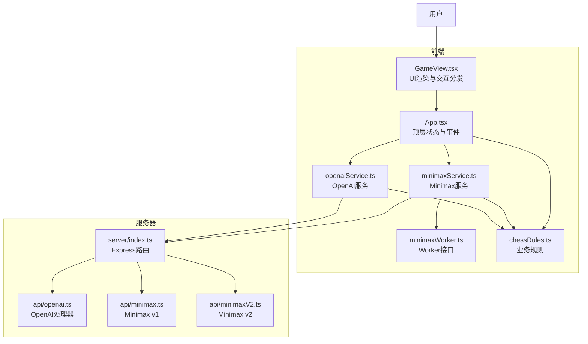
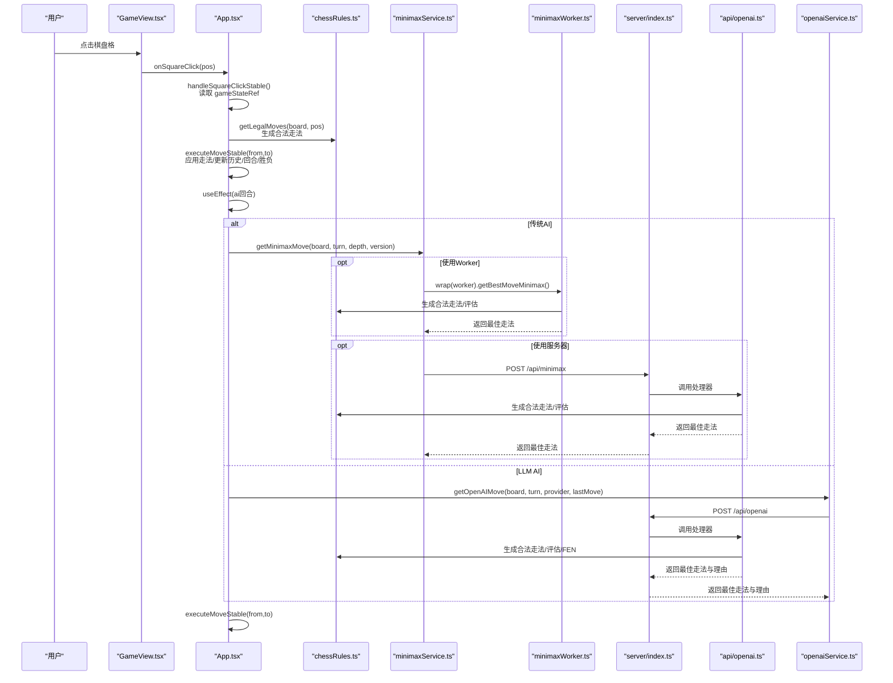
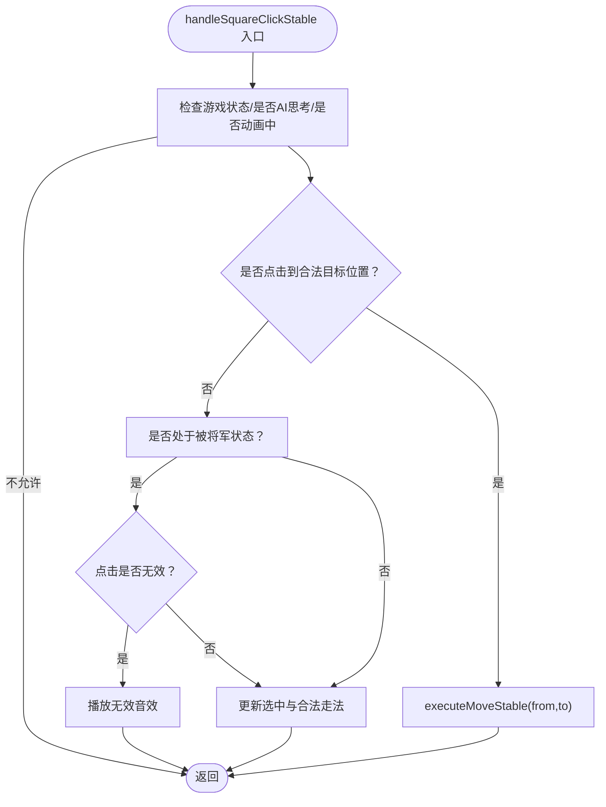
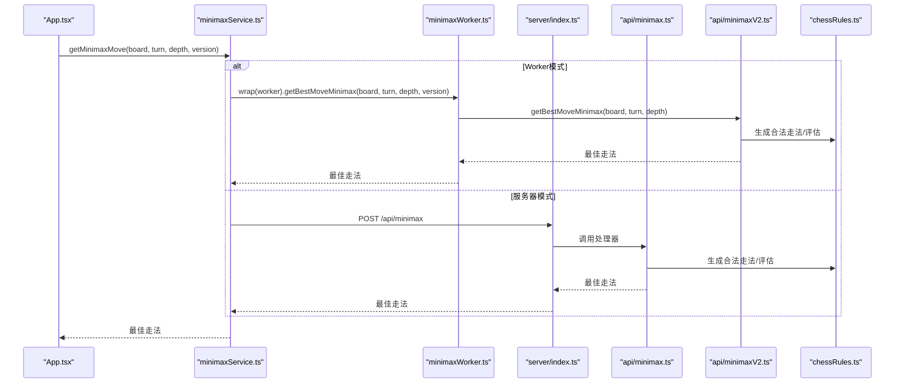
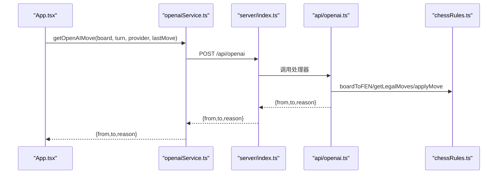
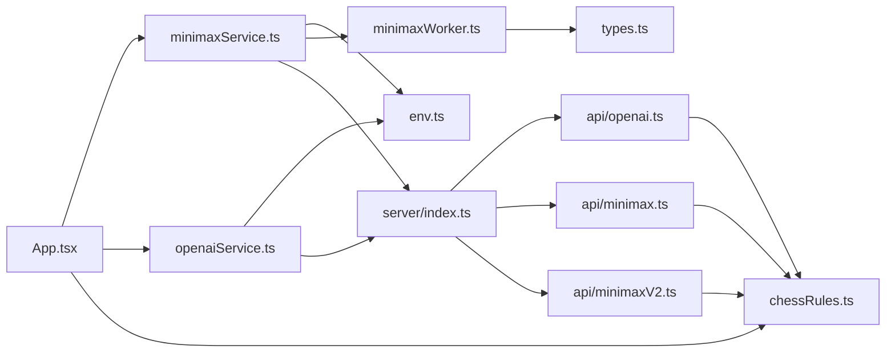

# 数据流与通信

<cite>
**本文引用的文件**
- [App.tsx](file://App.tsx)
- [GameView.tsx](file://components/GameView.tsx)
- [minimaxService.ts](file://services/minimaxService.ts)
- [minimaxWorker.ts](file://services/minimaxWorker.ts)
- [openaiService.ts](file://services/openaiService.ts)
- [chessRules.ts](file://api/chessRules.ts)
- [minimax.ts](file://api/minimax.ts)
- [minimaxV2.ts](file://api/minimaxV2.ts)
- [openai.ts](file://api/openai.ts)
- [server/index.ts](file://server/index.ts)
- [env.ts](file://utils/env.ts)
- [types.ts](file://api/common/types.ts)
</cite>

## 目录
1. [简介](#简介)
2. [项目结构](#项目结构)
3. [核心组件](#核心组件)
4. [架构总览](#架构总览)
5. [详细组件分析](#详细组件分析)
6. [依赖关系分析](#依赖关系分析)
7. [性能考量](#性能考量)
8. [故障排查指南](#故障排查指南)
9. [结论](#结论)

## 简介
本文件聚焦 zen_chess 的“数据流与通信”主题，系统梳理从用户点击到AI响应的完整流程，重点说明：
- 用户交互入口 handleSquareClickStable 如何驱动状态更新与走法执行；
- AI回合由 useEffect 触发，依据 aiModel 类型分别调用传统 Minimax 或 LLM OpenAI；
- Minimax 服务通过 Web Worker 与 comlink 通信，或回退到服务器端 /api/minimax；
- OpenAI 服务封装对 /api/openai 的 POST 请求，携带棋盘状态与提供商信息；
- 棋类规则 chessRules.ts 作为业务核心，为 AI 与 UI 提供合法走法与局面评估；
- gameStateRef 在跨异步操作中维持状态一致性。

## 项目结构
- 前端核心：App.tsx 作为顶层容器，管理游戏状态与事件回调；GameView.tsx 负责渲染与交互分发。
- AI 服务：minimaxService.ts、openaiService.ts 分别封装 Minimax 与 LLM 调用；minimaxWorker.ts 通过 comlink 暴露 Minimax 接口。
- 业务规则：api/chessRules.ts 提供合法走法、局面评估、FEN 转换等。
- 服务器端：server/index.ts 提供 /api/openai 与 /api/providers；api/minimax.ts 与 api/minimaxV2.ts 实现 Minimax 计算。
- 环境工具：utils/env.ts 提供构建 API URL 的能力。

图表来源
- [App.tsx](file://App.tsx#L1-L460)
- [GameView.tsx](file://components/GameView.tsx#L1-L172)
- [minimaxService.ts](file://services/minimaxService.ts#L1-L66)
- [minimaxWorker.ts](file://services/minimaxWorker.ts#L1-L19)
- [openaiService.ts](file://services/openaiService.ts#L1-L37)
- [chessRules.ts](file://api/chessRules.ts#L1-L390)
- [server/index.ts](file://server/index.ts#L1-L64)
- [openai.ts](file://api/openai.ts#L1-L367)
- [minimax.ts](file://api/minimax.ts#L1-L125)
- [minimaxV2.ts](file://api/minimaxV2.ts#L1-L487)

章节来源
- [App.tsx](file://App.tsx#L1-L460)
- [GameView.tsx](file://components/GameView.tsx#L1-L172)

## 核心组件
- App.tsx
  - 维护 board、turn、selectedPos、validMoves、history、moveList、lastMove、gameStatus、captureAnimation 等状态。
  - 使用 gameStateRef 同步最新状态，避免闭包捕获陈旧值。
  - handleSquareClickStable：基于 gameStateRef 的稳定引用，判定选子、合法走法、无效走法音效、动画与历史记录。
  - executeMoveStable：应用走法、播放音效与动画、更新历史与回合、检查胜负。
  - useEffect：AI回合逻辑，依据 aiModel 调用 getMinimaxMove 或 getOpenAIMove，再调用 executeMoveStable。
- GameView.tsx：将 App.tsx 的状态与回调注入到 Board、计时器与控制模块。
- services：
  - minimaxService.ts：封装 /api/minimax 与 Web Worker 路径；支持 v1/v2 版本切换。
  - openaiService.ts：封装 /api/openai 的 POST 请求，传递 board、turn、provider、lastMove。
  - minimaxWorker.ts：通过 comlink 暴露 getBestMoveMinimax，内部调用 api/minimaxV2。
- api/chessRules.ts：合法走法生成、局面评估、FEN 转换、走法应用、重复局面检测等。
- server/index.ts：/api/openai 与 /api/providers 路由，调用对应处理器。
- utils/env.ts：根据运行环境构建 API 基础 URL。

章节来源
- [App.tsx](file://App.tsx#L1-L460)
- [GameView.tsx](file://components/GameView.tsx#L1-L172)
- [minimaxService.ts](file://services/minimaxService.ts#L1-L66)
- [openaiService.ts](file://services/openaiService.ts#L1-L37)
- [minimaxWorker.ts](file://services/minimaxWorker.ts#L1-L19)
- [chessRules.ts](file://api/chessRules.ts#L1-L390)
- [server/index.ts](file://server/index.ts#L1-L64)
- [env.ts](file://utils/env.ts#L1-L51)

## 架构总览
从用户点击到AI响应的关键数据流如下：

图表来源
- [App.tsx](file://App.tsx#L291-L371)
- [minimaxService.ts](file://services/minimaxService.ts#L1-L66)
- [minimaxWorker.ts](file://services/minimaxWorker.ts#L1-L19)
- [openaiService.ts](file://services/openaiService.ts#L1-L37)
- [chessRules.ts](file://api/chessRules.ts#L1-L390)
- [server/index.ts](file://server/index.ts#L1-L64)
- [openai.ts](file://api/openai.ts#L1-L367)

## 详细组件分析

### 用户交互与走法执行（App.tsx）
- handleSquareClickStable
  - 从 gameStateRef 读取当前 board、turn、selectedPos、validMoves、aiModel、aiProvider、gameStatus、isAnimating。
  - 若处于非Playing、AI思考或动画中则直接返回。
  - 若为AI回合且轮到黑方则阻断人类操作。
  - 若点击的是合法目标位置，则调用 executeMoveStable 执行走法。
  - 若处于“被将军”状态且点击无效，则播放无效音效。
  - 否则作为选子逻辑：若点击友方棋子则更新 selectedPos 与 validMoves。
  - 若点击空地或敌方棋子且非有效走法，则取消选中。
- executeMoveStable
  - 播放音效与设置 captureAnimation（若吃子）。
  - 记录走法符号到 moveList，设置 lastMove。
  - 短暂延时后应用走法，更新历史与回合；随后检查是否有下一步合法走法，若无则判定胜负。
  - 动画结束后重置 isAnimating 与 captureAnimation。

图表来源
- [App.tsx](file://App.tsx#L291-L337)

章节来源
- [App.tsx](file://App.tsx#L291-L337)

### AI回合与Minimax服务（minimaxService.ts 与 minimaxWorker.ts）
- getMinimaxMove（导出自 getMinimaxMoveWorker）
  - 支持两种路径：
    - Worker 路径：new Worker + comlink.wrap，调用 minimaxWorkerAPI.getBestMoveMinimax。
    - 服务器路径：fetch(buildApiUrl('/api/minimax'))，POST { board, turn, depth }。
- minimaxWorker.ts
  - 暴露 getBestMoveMinimax，内部根据 version 调用 api/minimaxV2 或 api/minimax。
- 服务器端
  - server/index.ts 暴露 /api/minimax，调用 api/minimax.ts 的处理器。
  - api/minimax.ts 生成所有合法走法，遍历并调用 minimax/alpha-beta 评估，返回最佳走法。
  - api/minimaxV2.ts 提供更完善的搜索策略（置换表、杀手走法、历史表、PVS、LMR、静态搜索等）。

图表来源
- [minimaxService.ts](file://services/minimaxService.ts#L1-L66)
- [minimaxWorker.ts](file://services/minimaxWorker.ts#L1-L19)
- [server/index.ts](file://server/index.ts#L1-L64)
- [minimax.ts](file://api/minimax.ts#L1-L125)
- [minimaxV2.ts](file://api/minimaxV2.ts#L1-L487)
- [chessRules.ts](file://api/chessRules.ts#L1-L390)

章节来源
- [minimaxService.ts](file://services/minimaxService.ts#L1-L66)
- [minimaxWorker.ts](file://services/minimaxWorker.ts#L1-L19)
- [minimax.ts](file://api/minimax.ts#L1-L125)
- [minimaxV2.ts](file://api/minimaxV2.ts#L1-L487)

### LLM AI 服务（openaiService.ts 与 openai.ts）
- getOpenAIMove
  - fetch(buildApiUrl('/api/openai'))，POST { board, turn, provider, lastMove }。
- server/index.ts
  - /api/openai 路由，调用 api/openai.ts 的处理器。
- api/openai.ts
  - 生成 FEN 与所有合法走法，构造三维坐标 Prompt，调用外部 LLM API，解析 JSON 结果，返回最佳走法与理由。
  - 若解析失败，回退到安全吃子或首个合法走法，并附带理由。

图表来源
- [openaiService.ts](file://services/openaiService.ts#L1-L37)
- [server/index.ts](file://server/index.ts#L1-L64)
- [openai.ts](file://api/openai.ts#L1-L367)
- [chessRules.ts](file://api/chessRules.ts#L1-L390)

章节来源
- [openaiService.ts](file://services/openaiService.ts#L1-L37)
- [openai.ts](file://api/openai.ts#L1-L367)

### 棋类规则与局面评估（chessRules.ts）
- 合法走法生成：getLegalMoves 基于 getValidMovesForPiece 并排除会导致自身被将军的走法。
- 局面评估：evaluateBoard 用于 Minimax 评估；minimaxV2.ts 提供更复杂的评估与搜索策略。
- FEN 转换：boardToFEN 与 fenToMoveString 用于 LLM 输入与输出。
- 走法应用：applyMove/applyMoveEx 与 undoMove 用于模拟走法与撤销。

章节来源
- [chessRules.ts](file://api/chessRules.ts#L1-L390)

## 依赖关系分析
- App.tsx 依赖：
  - chessRules.ts：合法走法与局面评估。
  - minimaxService.ts / openaiService.ts：AI 计算入口。
  - GameView.tsx：UI 渲染与交互分发。
- services：
  - minimaxService.ts 依赖 env.ts 构建 API URL，可选择 Worker 或服务器路径。
  - openaiService.ts 依赖 env.ts 构建 API URL。
  - minimaxWorker.ts 依赖 types.ts 定义的 Worker API。
- server/index.ts：
  - /api/openai -> api/openai.ts
  - /api/providers -> api/providers.js（未在本文展开）
- api/openai.ts：
  - 依赖 chessRules.ts 与 providers 配置。
- api/minimax.ts / api/minimaxV2.ts：
  - 依赖 chessRules.ts。

图表来源
- [App.tsx](file://App.tsx#L1-L460)
- [minimaxService.ts](file://services/minimaxService.ts#L1-L66)
- [openaiService.ts](file://services/openaiService.ts#L1-L37)
- [minimaxWorker.ts](file://services/minimaxWorker.ts#L1-L19)
- [types.ts](file://services/types.ts#L1-L5)
- [env.ts](file://utils/env.ts#L1-L51)
- [server/index.ts](file://server/index.ts#L1-L64)
- [openai.ts](file://api/openai.ts#L1-L367)
- [minimax.ts](file://api/minimax.ts#L1-L125)
- [minimaxV2.ts](file://api/minimaxV2.ts#L1-L487)
- [chessRules.ts](file://api/chessRules.ts#L1-L390)

章节来源
- [App.tsx](file://App.tsx#L1-L460)
- [server/index.ts](file://server/index.ts#L1-L64)

## 性能考量
- Minimax Worker 与 Comlink
  - 使用 Worker 避免 UI 阻塞；comlink 提供跨线程调用封装。
  - v2 版本引入置换表、杀手走法、历史表、PVS、LMR、静态搜索等，显著提升搜索效率与稳定性。
- 服务器端 Minimax
  - 通过 /api/minimax 降低前端资源占用，适合复杂度较高场景。
- LLM AI
  - 通过构造 Prompt 与 FEN，结合合法走法列表与风险评估，提高输出可靠性。
  - 若 LLM 输出异常，自动回退到安全吃子或首个合法走法，保障体验连续性。
- 状态一致性
  - gameStateRef 在每次渲染同步最新状态，避免闭包捕获陈旧值，确保跨异步调用（如 useEffect 中的 AI 计算）仍能读取最新 board/turn 等。

[本节为通用性能建议，无需具体文件分析]

## 故障排查指南
- Minimax Worker 启动失败
  - 检查 Worker 构造 URL 与 comlink 包装是否正确；确认 minimaxWorker.ts 的 expose 是否暴露 getBestMoveMinimax。
  - 参考路径：[minimaxService.ts](file://services/minimaxService.ts#L47-L66)、[minimaxWorker.ts](file://services/minimaxWorker.ts#L1-L19)、[types.ts](file://services/types.ts#L1-L5)
- 服务器端 /api/minimax 500
  - 检查 server/index.ts 路由与 api/minimax.ts 处理器；确认请求体字段与返回格式。
  - 参考路径：[server/index.ts](file://server/index.ts#L1-L64)、[minimax.ts](file://api/minimax.ts#L1-L125)
- LLM AI 返回为空或格式错误
  - 检查 api/openai.ts 的 Prompt 构造与 JSON 解析；确认 providers 配置与 API Key。
  - 参考路径：[openai.ts](file://api/openai.ts#L1-L367)
- 网络请求失败
  - 检查 utils/env.ts 的 buildApiUrl 与运行环境；确认 API 基础 URL 配置。
  - 参考路径：[env.ts](file://utils/env.ts#L1-L51)
- 走法无效或被将军
  - 检查 chessRules.ts 的合法走法生成与 isCheck/isInCheck 逻辑。
  - 参考路径：[chessRules.ts](file://api/chessRules.ts#L1-L390)

章节来源
- [minimaxService.ts](file://services/minimaxService.ts#L1-L66)
- [minimaxWorker.ts](file://services/minimaxWorker.ts#L1-L19)
- [server/index.ts](file://server/index.ts#L1-L64)
- [minimax.ts](file://api/minimax.ts#L1-L125)
- [openai.ts](file://api/openai.ts#L1-L367)
- [env.ts](file://utils/env.ts#L1-L51)
- [chessRules.ts](file://api/chessRules.ts#L1-L390)

## 结论
zen_chess 的数据流以 App.tsx 为核心，围绕 gameStateRef 串联用户交互、规则校验与 AI 计算。传统 Minimax 通过 Worker 或服务器端实现高性能搜索；LLM AI 通过 Prompt 与合法走法列表提升决策质量。chessRules.ts 作为业务核心，为前后端提供一致的规则与评估能力。整体设计在性能、可维护性与用户体验之间取得平衡。