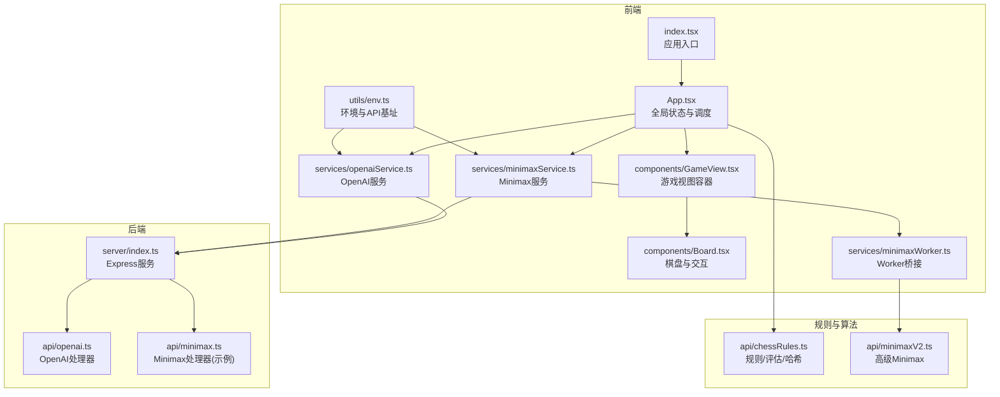
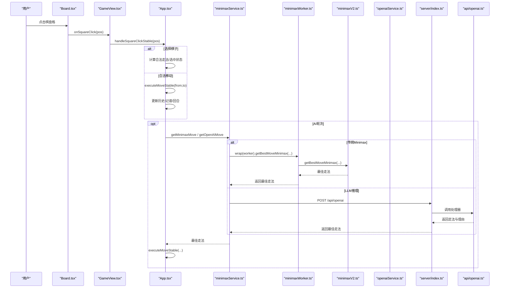
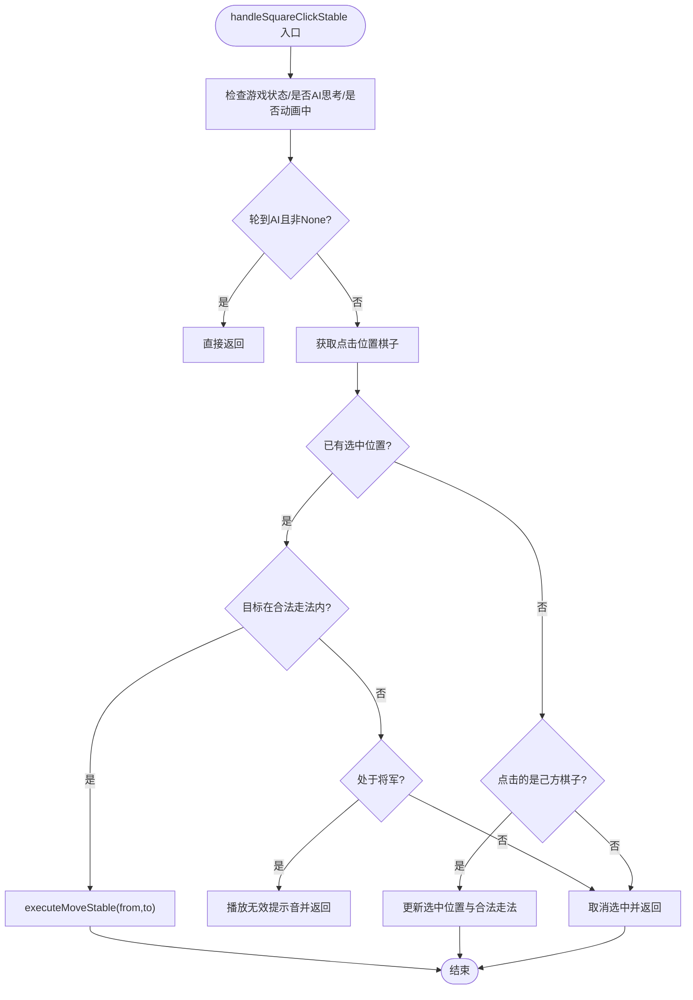
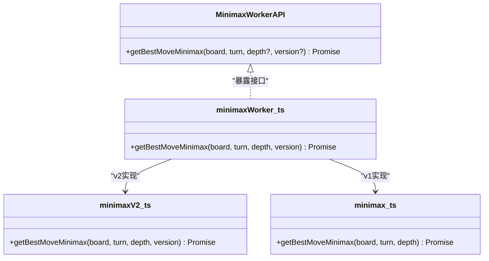
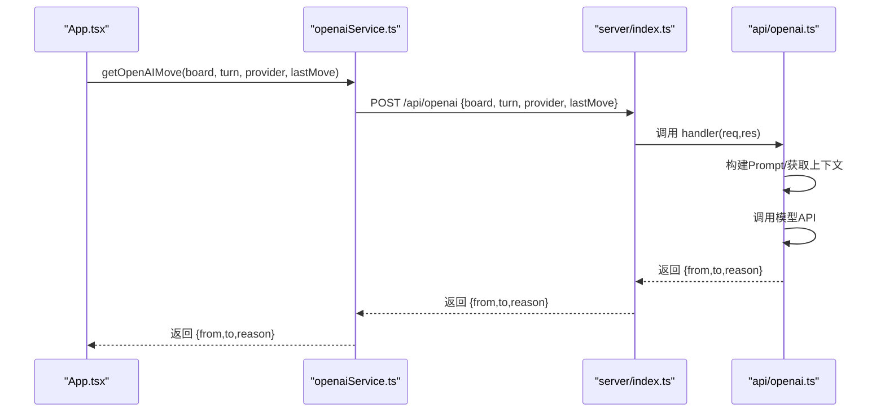
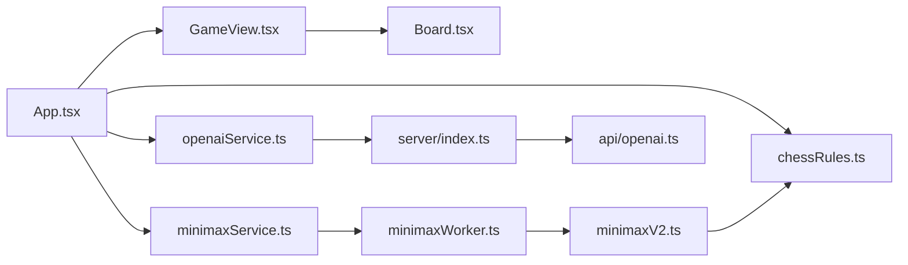

# 架构设计

<cite>
**本文引用的文件**
- [App.tsx](file://App.tsx)
- [GameView.tsx](file://components/GameView.tsx)
- [Board.tsx](file://components/Board.tsx)
- [chessRules.ts](file://api/chessRules.ts)
- [minimax.ts](file://api/minimax.ts)
- [minimaxV2.ts](file://api/minimaxV2.ts)
- [openai.ts](file://api/openai.ts)
- [minimaxService.ts](file://services/minimaxService.ts)
- [minimaxWorker.ts](file://services/minimaxWorker.ts)
- [openaiService.ts](file://services/openaiService.ts)
- [types.ts](file://services/types.ts)
- [index.tsx](file://index.tsx)
- [vite.config.ts](file://vite.config.ts)
- [server/index.ts](file://server/index.ts)
- [types.ts](file://api/common/types.ts)
- [constants.ts](file://api/common/constants.ts)
- [env.ts](file://utils/env.ts)
- [package.json](file://package.json)
</cite>

## 目录
1. [简介](#简介)
2. [项目结构](#项目结构)
3. [核心组件](#核心组件)
4. [架构总览](#架构总览)
5. [详细组件分析](#详细组件分析)
6. [依赖关系分析](#依赖关系分析)
7. [性能考量](#性能考量)
8. [故障排查指南](#故障排查指南)
9. [结论](#结论)
10. [附录](#附录)

## 简介
本架构文档面向“zen_chess”项目，系统化阐述其前后端分离的全栈设计。前端采用 React 19 与 Vite 构建响应式用户界面，后端基于 Express 提供 API 服务。核心全局状态管理由 App.tsx 承担，UI 层通过 GameView、Board 等组件组织视图与交互。业务逻辑分层清晰：api/ 目录承载核心规则与算法，services/ 目录封装 API 调用与 Web Worker 通信。数据流自用户交互 handleSquareClickStable 触发，经状态更新，最终调用 minimaxService 或 openaiService 与后端或 Worker 交互，形成稳定、可扩展的架构。

## 项目结构
项目采用“功能域+分层”的组织方式：
- 前端入口与全局状态：index.tsx、App.tsx
- UI 组件：components/ 下的 GameView、Board 等
- 业务规则与算法：api/ 下的 chessRules.ts、minimax.ts、minimaxV2.ts、openai.ts、common/types.ts、common/constants.ts
- 服务封装与 Worker：services/ 下的 minimaxService.ts、minimaxWorker.ts、openaiService.ts、types.ts
- 工具与环境：utils/env.ts
- 后端服务：server/index.ts（Express）
- 构建与依赖：vite.config.ts、package.json

图表来源
- [index.tsx](file://index.tsx#L1-L15)
- [App.tsx](file://App.tsx#L1-L460)
- [GameView.tsx](file://components/GameView.tsx#L1-L172)
- [Board.tsx](file://components/Board.tsx#L1-L194)
- [minimaxService.ts](file://services/minimaxService.ts#L1-L66)
- [openaiService.ts](file://services/openaiService.ts#L1-L37)
- [minimaxWorker.ts](file://services/minimaxWorker.ts#L1-L19)
- [env.ts](file://utils/env.ts#L1-L51)
- [server/index.ts](file://server/index.ts#L1-L64)
- [openai.ts](file://api/openai.ts#L1-L367)
- [minimax.ts](file://api/minimax.ts#L1-L125)
- [chessRules.ts](file://api/chessRules.ts#L1-L390)
- [minimaxV2.ts](file://api/minimaxV2.ts#L1-L487)

章节来源
- [index.tsx](file://index.tsx#L1-L15)
- [vite.config.ts](file://vite.config.ts#L1-L35)
- [package.json](file://package.json#L1-L30)

## 核心组件
- App.tsx：全局状态中枢，负责游戏状态、AI 模式、音效、计时器、历史记录、撤销、走法记谱与动画控制；提供稳定的事件回调 handleSquareClickStable 与 executeMoveStable；在 AI 轮次自动发起 minimaxService 或 openaiService 调用。
- GameView.tsx：布局容器，整合时间控制模块、AI 思考模块与棋盘，负责将 App.tsx 的状态与回调传递给 Board。
- Board.tsx：渲染棋盘网格、坐标与指示器，封装点击事件并传递给父组件；支持吃子动画与最后一步高亮。
- chessRules.ts：象棋规则实现，包括合法走法、将军判定、棋盘复制、FEN 转换、Zobrist 哈希、局面重复检测等。
- minimaxService.ts：封装与后端 /api/minimax 的交互，或通过 Worker 调用 minimaxV2.ts。
- openaiService.ts：封装与后端 /api/openai 的交互，携带 provider 与 lastMove 上下文。
- minimaxWorker.ts：通过 Comlink 暴露 Minimax 接口，支持 v1/v2 版本切换。
- server/index.ts：Express 服务，提供 /api/openai 与 /api/providers，并统一跨域与错误处理。

章节来源
- [App.tsx](file://App.tsx#L1-L460)
- [GameView.tsx](file://components/GameView.tsx#L1-L172)
- [Board.tsx](file://components/Board.tsx#L1-L194)
- [chessRules.ts](file://api/chessRules.ts#L1-L390)
- [minimaxService.ts](file://services/minimaxService.ts#L1-L66)
- [openaiService.ts](file://services/openaiService.ts#L1-L37)
- [minimaxWorker.ts](file://services/minimaxWorker.ts#L1-L19)
- [server/index.ts](file://server/index.ts#L1-L64)

## 架构总览
整体采用“前端 React + 后端 Express + Web Worker”的分层设计：
- 前端负责 UI、状态与交互；通过服务封装调用后端或 Worker。
- 后端提供 OpenAI 等推理服务的 HTTP 接口；Minimax 示例处理器位于 api/minimax.ts。
- Web Worker 通过 Comlink 与主线程通信，承载高性能计算（如 minimaxV2）。

图表来源
- [Board.tsx](file://components/Board.tsx#L1-L194)
- [GameView.tsx](file://components/GameView.tsx#L1-L172)
- [App.tsx](file://App.tsx#L290-L371)
- [minimaxService.ts](file://services/minimaxService.ts#L1-L66)
- [minimaxWorker.ts](file://services/minimaxWorker.ts#L1-L19)
- [minimaxV2.ts](file://api/minimaxV2.ts#L432-L487)
- [openaiService.ts](file://services/openaiService.ts#L1-L37)
- [server/index.ts](file://server/index.ts#L1-L64)
- [openai.ts](file://api/openai.ts#L1-L127)

## 详细组件分析

### App.tsx：全局状态与调度中枢
- 状态管理：维护棋盘、回合、选中位置、合法走法、历史、走法列表、最后一步、胜负状态、动画状态、计时器键、AI 模型与提供商、难度版本、游戏模式、音量等。
- 稳定回调：通过 useRef(gameStateRef) 与 useEffect 同步最新状态，避免闭包陷阱；handleSquareClickStable 与 executeMoveStable 保持引用稳定，降低重渲染。
- 交互流程：handleSquareClickStable 根据当前状态与规则判断选中/取消/移动；executeMoveStable 执行移动、记录记谱、历史、回合切换，并进行胜负检查与动画控制。
- AI 流程：useEffect 监听回合与模式，若为 AI 轮次则调用 minimaxService 或 openaiService，得到最佳走法后执行移动；支持 aiThinking 与 aiReasoning。
- 历史与撤销：undo 支持人类对战与人机对战的步数差异；changeTimeControl 动态调整计时器。
- 主题与渲染：将主题与事件回调传递给 GameView/Board。

图表来源
- [App.tsx](file://App.tsx#L290-L371)

章节来源
- [App.tsx](file://App.tsx#L1-L460)

### GameView.tsx：视图容器与布局
- 负责顶部导航、桌面端左右布局（时间控制与 AI 思考模块在左侧，移动端折叠至上方）、中心棋盘区域。
- 将 App.tsx 的状态与回调透传给 Board，同时提供 onTimeOut/onUndo/onReset 等控制能力。
- 通过 isHistoryOpen 控制历史面板开关。

章节来源
- [GameView.tsx](file://components/GameView.tsx#L1-L172)

### Board.tsx：棋盘渲染与交互
- 使用 memo 包装 Cell 与 Board，减少不必要的重渲染。
- 渲染网格线、坐标与“平/进/退/吃”等视觉提示；支持最后一步高亮与吃子动画。
- 将点击事件委托给父组件，支持旋转视角（黑方视角）与捕获动画状态。

章节来源
- [Board.tsx](file://components/Board.tsx#L1-L194)

### 业务规则与算法：chessRules.ts
- 合法走法：针对不同子力（将、士、象、马、车、炮、兵）实现规则，含将帅对脸、象眼、蹩马腿、炮架屏等。
- 将军判定：遍历敌方棋子，检查其是否能攻击己方将。
- 棋盘操作：cloneBoard、applyMove、undoMove、boardToFEN/fenToMoveString。
- 评估与哈希：evaluateBoard、computeHash（Zobrist）、重复局面检测（REP_TABLE）。
- 扩展 applyMoveEx：返回被吃子与哈希增量，便于迭代加深与置换表。

章节来源
- [chessRules.ts](file://api/chessRules.ts#L1-L390)

### Minimax 服务与 Worker：minimaxService.ts、minimaxWorker.ts、minimaxV2.ts
- minimaxService.ts：提供 getMinimaxMoveWorker，内部创建 Worker 并通过 Comlink 调用 minimaxWorker.ts 暴露的 API；也可调用 /api/minimax（示例处理器）。
- minimaxWorker.ts：通过 expose 暴露 getBestMoveMinimax，内部根据版本选择 v1 或 v2。
- minimaxV2.ts：实现高级 Minimax，包含置换表、杀手走法、历史表、空步裁剪、迭代加深、静态搜索（Q-search）、PVS、将/闲延伸、时间控制等，适合在 Worker 中运行。

图表来源
- [types.ts](file://services/types.ts#L1-L5)
- [minimaxWorker.ts](file://services/minimaxWorker.ts#L1-L19)
- [minimaxV2.ts](file://api/minimaxV2.ts#L432-L487)
- [minimax.ts](file://api/minimax.ts#L1-L125)

章节来源
- [minimaxService.ts](file://services/minimaxService.ts#L1-L66)
- [minimaxWorker.ts](file://services/minimaxWorker.ts#L1-L19)
- [minimaxV2.ts](file://api/minimaxV2.ts#L1-L487)
- [minimax.ts](file://api/minimax.ts#L1-L125)
- [types.ts](file://services/types.ts#L1-L5)

### OpenAI 服务：openaiService.ts、server/index.ts、api/openai.ts
- openaiService.ts：向 /api/openai 发起 POST 请求，携带 board、turn、provider、lastMove。
- server/index.ts：Express 路由 /api/openai 调用 api/openai.ts 的 handler。
- api/openai.ts：构建 Prompt（含棋盘可视化、上一步信息、可选走法列表），调用第三方模型，解析 JSON 输出，兜底策略与风险评估。

图表来源
- [openaiService.ts](file://services/openaiService.ts#L1-L37)
- [server/index.ts](file://server/index.ts#L1-L64)
- [openai.ts](file://api/openai.ts#L1-L127)

章节来源
- [openaiService.ts](file://services/openaiService.ts#L1-L37)
- [server/index.ts](file://server/index.ts#L1-L64)
- [openai.ts](file://api/openai.ts#L1-L367)

### 数据模型与常量：api/common/types.ts、api/common/constants.ts
- 类型定义：PieceType、Color、Position、Piece、BoardState、Move、GameStatus、AIModel、CaptureAnimationState 等。
- 常量：棋盘尺寸、棋子字符映射、列号与方向文本、初始棋盘布局。

章节来源
- [types.ts](file://api/common/types.ts#L1-L68)
- [constants.ts](file://api/common/constants.ts#L1-L91)

### 构建与运行：vite.config.ts、package.json、utils/env.ts
- Vite 配置：启用 @vitejs/plugin-react、vite-plugin-comlink、worker 插件、别名 @ 指向根目录、define 注入环境变量。
- 依赖：React 19、Lucide、Framer Motion、@google/genai、@vercel/node 等。
- 环境工具：根据运行环境（Vercel/GitHub Pages/Local）决定 API 基址，提供 buildApiUrl 辅助。

章节来源
- [vite.config.ts](file://vite.config.ts#L1-L35)
- [package.json](file://package.json#L1-L30)
- [env.ts](file://utils/env.ts#L1-L51)

## 依赖关系分析
- 组件耦合：
  - App.tsx 与 GameView/Board 强耦合，通过 props 传递状态与回调。
  - GameView/Board 仅依赖类型与回调，低耦合。
- 服务封装：
  - minimaxService 与 openaiService 分别封装网络调用，隔离 UI 与后端细节。
  - minimaxWorker 通过 Comlink 与主线程通信，避免阻塞 UI。
- 规则与算法：
  - chessRules.ts 为纯函数集合，被 UI 与 AI 服务共同依赖。
  - minimaxV2.ts 依赖 chessRules.ts 的评估与走法生成。
- 后端集成：
  - server/index.ts 仅作为路由转发，具体逻辑在 api/openai.ts 与 api/minimax.ts（示例）中实现。

图表来源
- [App.tsx](file://App.tsx#L1-L460)
- [GameView.tsx](file://components/GameView.tsx#L1-L172)
- [Board.tsx](file://components/Board.tsx#L1-L194)
- [minimaxService.ts](file://services/minimaxService.ts#L1-L66)
- [minimaxWorker.ts](file://services/minimaxWorker.ts#L1-L19)
- [minimaxV2.ts](file://api/minimaxV2.ts#L1-L487)
- [openaiService.ts](file://services/openaiService.ts#L1-L37)
- [server/index.ts](file://server/index.ts#L1-L64)
- [openai.ts](file://api/openai.ts#L1-L367)
- [chessRules.ts](file://api/chessRules.ts#L1-L390)

## 性能考量
- UI 性能：
  - Board/BoardCell 使用 memo，减少重渲染；仅在必要 props 变化时更新。
  - App.tsx 使用 gameStateRef 与稳定回调，避免因状态频繁变化导致的闭包重绑。
- 计算性能：
  - 将高性能 Minimax 放入 Web Worker，避免阻塞主线程；通过 Comlink 实现跨线程通信。
  - minimaxV2.ts 引入置换表、杀手走法、历史表、空步裁剪、迭代加深、PVS 等优化，显著提升搜索效率。
- 网络性能：
  - openaiService 与 minimaxService 均具备错误兜底与返回空值处理，避免 UI 卡死。
- 构建优化：
  - Vite 与 Comlink 插件配合，Worker 与主进程共享插件链，减少打包与运行时开销。

[本节为通用指导，无需列出具体文件来源]

## 故障排查指南
- Minimax 无响应或卡顿
  - 检查 minimaxService 是否正确创建 Worker 并调用 Comlink；确认 minimaxWorker.ts 是否正确暴露 API。
  - 若使用 /api/minimax，请确认 server/index.ts 路由已注册，且 minimax.ts 处理器未抛出异常。
- OpenAI 无法返回走法
  - 检查 openaiService 的请求体字段（board、turn、provider、lastMove）是否完整。
  - 确认 server/index.ts 的 /api/openai 路由已调用 api/openai.ts 的 handler。
  - 检查 api/openai.ts 的 Prompt 构建与模型返回格式，确保能解析 JSON。
- Worker 通信失败
  - 确认 vite.config.ts 中已启用 comlink 插件，且 worker 插件链正确配置。
  - 检查 minimaxWorker.ts 的 expose 与 types.ts 的 MinimaxWorkerAPI 定义一致。
- 环境变量与 API 基址
  - 使用 utils/env.ts 的 buildApiUrl，确保在不同运行环境（Vercel/GitHub Pages/Local）下 API 地址正确。

章节来源
- [minimaxService.ts](file://services/minimaxService.ts#L1-L66)
- [minimaxWorker.ts](file://services/minimaxWorker.ts#L1-L19)
- [openaiService.ts](file://services/openaiService.ts#L1-L37)
- [server/index.ts](file://server/index.ts#L1-L64)
- [openai.ts](file://api/openai.ts#L1-L127)
- [env.ts](file://utils/env.ts#L1-L51)
- [vite.config.ts](file://vite.config.ts#L1-L35)

## 结论
zen_chess 采用清晰的前后端分离架构：前端以 React 19/Vite 构建响应式 UI，全局状态集中在 App.tsx；业务规则与算法置于 api/，服务封装与 Worker 通信置于 services/；后端以 Express 提供 OpenAI 等推理接口。数据流自用户交互出发，经状态更新与 AI 推理，最终回到 UI 更新，形成闭环。通过 Web Worker 与多种优化策略，系统在性能与可维护性之间取得良好平衡。

[本节为总结性内容，无需列出具体文件来源]

## 附录
- 关键流程路径参考
  - 用户点击棋盘：[Board.tsx](file://components/Board.tsx#L1-L194)
  - 选择/移动逻辑：[App.tsx](file://App.tsx#L290-L371)
  - 执行移动与动画：[App.tsx](file://App.tsx#L211-L289)
  - AI 轮次与推理：[App.tsx](file://App.tsx#L340-L371)
  - Minimax 服务与 Worker：[minimaxService.ts](file://services/minimaxService.ts#L1-L66)、[minimaxWorker.ts](file://services/minimaxWorker.ts#L1-L19)
  - OpenAI 服务与后端：[openaiService.ts](file://services/openaiService.ts#L1-L37)、[server/index.ts](file://server/index.ts#L1-L64)、[openai.ts](file://api/openai.ts#L1-L127)
  - 规则与评估：[chessRules.ts](file://api/chessRules.ts#L1-L390)、[minimaxV2.ts](file://api/minimaxV2.ts#L1-L487)
  - 构建与环境：[vite.config.ts](file://vite.config.ts#L1-L35)、[env.ts](file://utils/env.ts#L1-L51)