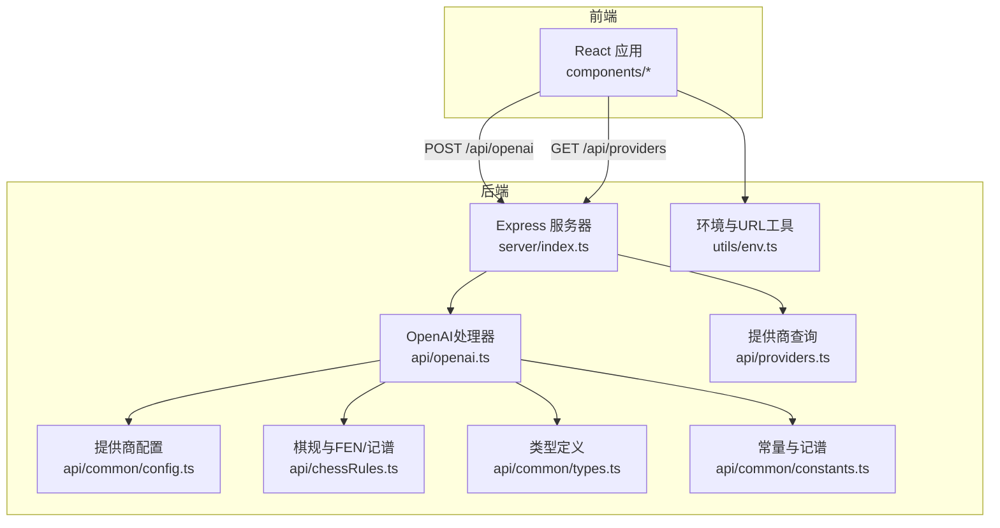
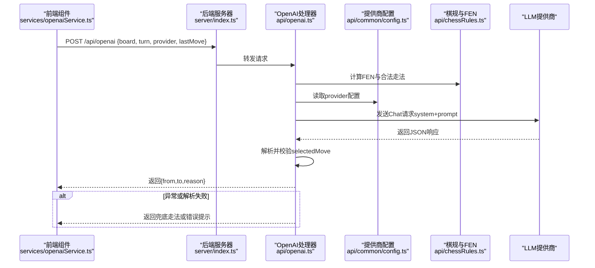
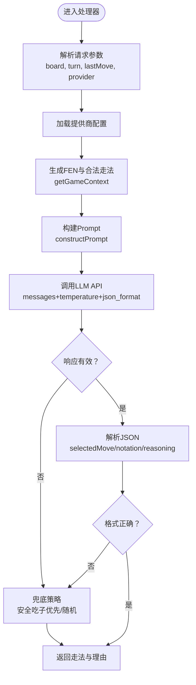
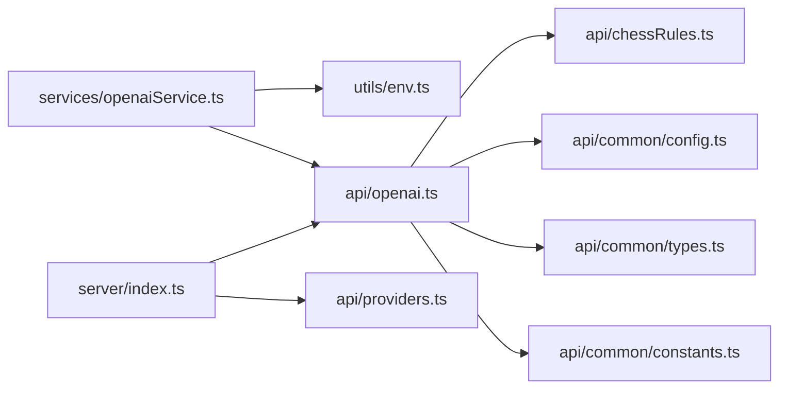

# LLM AI集成

<cite>
**本文引用的文件**
- [api/openai.ts](file://api/openai.ts)
- [services/openaiService.ts](file://services/openaiService.ts)
- [api/providers.ts](file://api/providers.ts)
- [api/chessRules.ts](file://api/chessRules.ts)
- [api/common/types.ts](file://api/common/types.ts)
- [api/common/config.ts](file://api/common/config.ts)
- [api/common/constants.ts](file://api/common/constants.ts)
- [utils/env.ts](file://utils/env.ts)
- [server/index.ts](file://server/index.ts)
- [components/AIThinkingModule.tsx](file://components/AIThinkingModule.tsx)
- [README.md](file://README.md)
</cite>

## 目录
1. [简介](#简介)
2. [项目结构](#项目结构)
3. [核心组件](#核心组件)
4. [架构总览](#架构总览)
5. [详细组件分析](#详细组件分析)
6. [依赖关系分析](#依赖关系分析)
7. [性能考量](#性能考量)
8. [故障排查指南](#故障排查指南)
9. [结论](#结论)
10. [附录](#附录)

## 简介
本文件系统性文档化了中国象棋游戏中LLM AI的集成机制，重点围绕以下目标展开：
- 如何在后端通过结构化Prompt将10×9棋盘转换为三维坐标系描述，并注入战术分析指令（如“优先保护将帅”、“控制河界”），以引导大语言模型生成高质量走法；
- 如何在后端整合当前局面、历史走法与AI提供商特性；
- 前端如何通过POST /api/openai端点与后端通信；
- 支持的多家LLM提供商（OpenAI、Gemini、DeepSeek、Qwen）及其配置方式；
- 错误处理、超时重试与响应解析的实战示例；
- 新增LLM提供商的扩展方法。

## 项目结构
该仓库采用前后端分离与模块化组织，核心AI集成位于后端API层与服务层，前端通过HTTP调用后端接口获取AI走法。

图表来源
- [server/index.ts](file://server/index.ts#L1-L64)
- [api/openai.ts](file://api/openai.ts#L1-L127)
- [api/providers.ts](file://api/providers.ts#L1-L41)
- [api/chessRules.ts](file://api/chessRules.ts#L1-L390)
- [api/common/config.ts](file://api/common/config.ts#L1-L49)
- [api/common/types.ts](file://api/common/types.ts#L1-L68)
- [api/common/constants.ts](file://api/common/constants.ts#L1-L91)
- [utils/env.ts](file://utils/env.ts#L1-L51)

章节来源
- [README.md](file://README.md#L1-L82)
- [server/index.ts](file://server/index.ts#L1-L64)

## 核心组件
- 后端OpenAI处理器：负责接收请求、构建Prompt、调用LLM、解析响应并返回走法。
- 棋规与记谱：提供FEN生成、合法走法计算、坐标到记谱转换等能力。
- 提供商配置：集中管理各LLM提供商的名称、模型、API地址与密钥。
- 前端服务封装：统一发起POST /api/openai请求，处理错误与网络异常。
- 服务器路由：在本地开发环境下暴露REST端点，便于调试与联调。

章节来源
- [api/openai.ts](file://api/openai.ts#L1-L127)
- [api/chessRules.ts](file://api/chessRules.ts#L1-L390)
- [api/common/config.ts](file://api/common/config.ts#L1-L49)
- [services/openaiService.ts](file://services/openaiService.ts#L1-L37)
- [server/index.ts](file://server/index.ts#L1-L64)

## 架构总览
下面的序列图展示了从前端到后端再到LLM提供商的整体流程，以及错误兜底策略。

图表来源
- [services/openaiService.ts](file://services/openaiService.ts#L1-L37)
- [server/index.ts](file://server/index.ts#L1-L64)
- [api/openai.ts](file://api/openai.ts#L1-L127)
- [api/common/config.ts](file://api/common/config.ts#L1-L49)
- [api/chessRules.ts](file://api/chessRules.ts#L1-L390)

## 详细组件分析

### 后端OpenAI处理器（api/openai.ts）
职责与流程
- CORS与方法校验：允许跨域并限制POST方法。
- 参数解析：接收board、turn、lastMove、provider。
- 配置加载：通过provider键读取对应提供商配置（模型、API地址、密钥）。
- 局面与走法：调用棋规模块生成FEN与合法走法列表，并进行价值与风险评估排序。
- Prompt构建：将10×9棋盘映射为三维坐标系描述，同时提供红/黑双方记谱对照与“河界”标注，附加战术指令（如“优先保护将帅”、“控制河界”）。
- 请求LLM：构造messages（system+user），设置temperature与response_format=json_object。
- 响应解析：提取choices[0].message.content，尝试JSON解析；若失败则尝试提取JSON片段；兜底策略：优先安全吃子，否则随机。
- 错误处理：API返回非2xx、空内容、无效格式均返回兜底走法并携带reason。

关键函数与作用
- 处理器入口：接收请求并执行上述流程。
- getGameContext：生成FEN与合法走法列表，评估价值与风险，按价值排序。
- constructPrompt：构建包含坐标系、记谱对照、河界标注、上一步信息与候选走法的Prompt。
- systemPrompt：内置战术指令与输出格式约束，确保模型输出结构化JSON。

图表来源
- [api/openai.ts](file://api/openai.ts#L1-L127)
- [api/chessRules.ts](file://api/chessRules.ts#L1-L390)

章节来源
- [api/openai.ts](file://api/openai.ts#L1-L127)
- [api/chessRules.ts](file://api/chessRules.ts#L1-L390)

### 棋规与记谱（api/chessRules.ts）
- 合法走法：基于棋子类型与规则生成Position列表，过滤自将死（isCheck）。
- FEN生成：将board与turn转为简化的FEN字符串，便于LLM理解局面。
- 记谱与坐标：提供坐标到记谱（getXiangqiNotation）与坐标字符串（fenToMoveString/parseMoveString）转换，满足不同场景需求。
- 其他辅助：cloneBoard、applyMove、evaluateBoard、undoMove、Zobrist哈希等，支撑AI算法与局面评估。

章节来源
- [api/chessRules.ts](file://api/chessRules.ts#L1-L390)
- [api/common/types.ts](file://api/common/types.ts#L1-L68)
- [api/common/constants.ts](file://api/common/constants.ts#L1-L91)

### 提供商配置（api/common/config.ts）
- 统一配置结构：name、model、apiUrl、apiKey。
- 默认值：从环境变量读取，未设置时使用默认值。
- 支持提供商：OpenAI、Gemini、DeepSeek、Qwen。
- 配置读取：getAIProviders与getAIProviderConfig。

章节来源
- [api/common/config.ts](file://api/common/config.ts#L1-L49)
- [README.md](file://README.md#L1-L82)

### 前端服务封装（services/openaiService.ts）
- 统一封装：通过buildApiUrl拼接后端API地址，发送POST请求，传入board、turn、provider、lastMove。
- 错误处理：response.ok判断、错误字段检查、网络异常捕获，返回null或具体数据。
- 与UI联动：AIThinkingModule展示AI思考状态与reasoning。

章节来源
- [services/openaiService.ts](file://services/openaiService.ts#L1-L37)
- [utils/env.ts](file://utils/env.ts#L1-L51)
- [components/AIThinkingModule.tsx](file://components/AIThinkingModule.tsx#L1-L53)

### 服务器路由（server/index.ts）
- 本地开发：Express路由转发至Vercel风格的函数处理器，便于在本地调试。
- 健康检查：/health端点。
- 全局错误处理与404处理。

章节来源
- [server/index.ts](file://server/index.ts#L1-L64)

## 依赖关系分析

图表来源
- [api/openai.ts](file://api/openai.ts#L1-L127)
- [api/chessRules.ts](file://api/chessRules.ts#L1-L390)
- [api/common/config.ts](file://api/common/config.ts#L1-L49)
- [api/common/types.ts](file://api/common/types.ts#L1-L68)
- [api/common/constants.ts](file://api/common/constants.ts#L1-L91)
- [services/openaiService.ts](file://services/openaiService.ts#L1-L37)
- [utils/env.ts](file://utils/env.ts#L1-L51)
- [server/index.ts](file://server/index.ts#L1-L64)
- [api/providers.ts](file://api/providers.ts#L1-L41)

章节来源
- [api/openai.ts](file://api/openai.ts#L1-L127)
- [services/openaiService.ts](file://services/openaiService.ts#L1-L37)
- [server/index.ts](file://server/index.ts#L1-L64)

## 性能考量
- Prompt规模控制：合法走法列表按价值排序，减少LLM输出负担；仅在必要时提供完整列表。
- 温度与格式：temperature设为较低值以提升确定性；response_format=json_object降低解析成本。
- 本地评估：在节点端预先计算FEN与合法走法，避免重复网络往返。
- 兜底策略：当LLM响应异常时快速返回安全走法，保障用户体验。

[本节为通用建议，无需列出具体文件来源]

## 故障排查指南
常见问题与处理
- API密钥缺失：后端会在缺少provider密钥时返回错误信息，需检查环境变量配置。
- API返回非2xx：记录错误文本并返回兜底走法，便于定位上游问题。
- 响应为空或格式不符：尝试提取JSON片段或返回兜底走法；可在前端日志中查看reason。
- 网络异常：前端服务封装会捕获异常并返回null，建议重试或提示用户稍后再试。
- 记谱不一致：确认红/黑双方记谱对照与坐标映射逻辑，避免因方向差异导致误解。

章节来源
- [api/openai.ts](file://api/openai.ts#L1-L127)
- [services/openaiService.ts](file://services/openaiService.ts#L1-L37)
- [api/common/config.ts](file://api/common/config.ts#L1-L49)
- [README.md](file://README.md#L1-L82)

## 结论
该系统通过严谨的棋规与结构化Prompt设计，将10×9棋盘映射为三维坐标系描述，并注入战术指令，显著提升了LLM在象棋场景下的稳定性与质量。后端以模块化方式整合提供商配置与棋规逻辑，前端通过统一的服务封装与错误兜底策略，实现了可靠的AI对弈体验。新增LLM提供商只需扩展配置与少量适配逻辑，即可快速接入。

[本节为总结性内容，无需列出具体文件来源]

## 附录

### Prompt构建要点与战术指令
- 三维坐标系：明确X轴范围（0-8）、红/黑记谱对照与“河界/底线”标注，帮助模型理解坐标与方位。
- 战术指令：包括“拒绝送子”“大局观”“进攻性”“预判”“坐标注意事项”等，确保模型输出符合象棋逻辑。
- 输出格式：要求返回JSON，包含selectedMove、notation与reasoning，便于解析与展示。

章节来源
- [api/openai.ts](file://api/openai.ts#L286-L367)

### 前端调用流程（POST /api/openai）
- 通过services/openaiService.ts封装请求，传入board、turn、provider、lastMove。
- 后端在server/index.ts中接收并转发至api/openai.ts处理。
- 返回的reason字段可用于AIThinkingModule展示AI推理过程。

章节来源
- [services/openaiService.ts](file://services/openaiService.ts#L1-L37)
- [server/index.ts](file://server/index.ts#L1-L64)
- [components/AIThinkingModule.tsx](file://components/AIThinkingModule.tsx#L1-L53)

### 新增LLM提供商步骤
- 在配置模块中添加新提供商条目，设置name、model、apiUrl、apiKey。
- 在README中补充环境变量与说明。
- 若LLM提供商API格式与现有实现不一致，可在api/openai.ts中增加分支或适配逻辑（如消息结构、响应格式）。
- 在前端调用时通过provider参数选择新提供商。

章节来源
- [api/common/config.ts](file://api/common/config.ts#L1-L49)
- [README.md](file://README.md#L1-L82)
- [api/openai.ts](file://api/openai.ts#L1-L127)