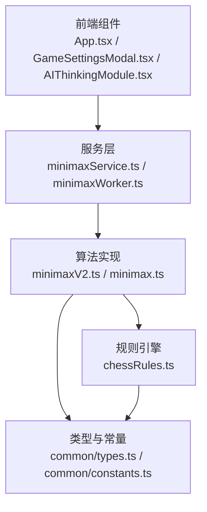
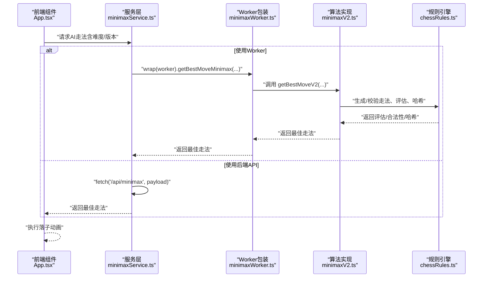
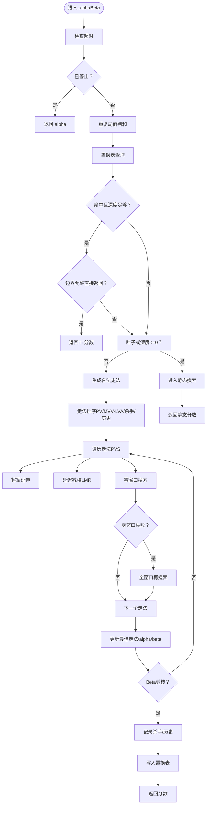
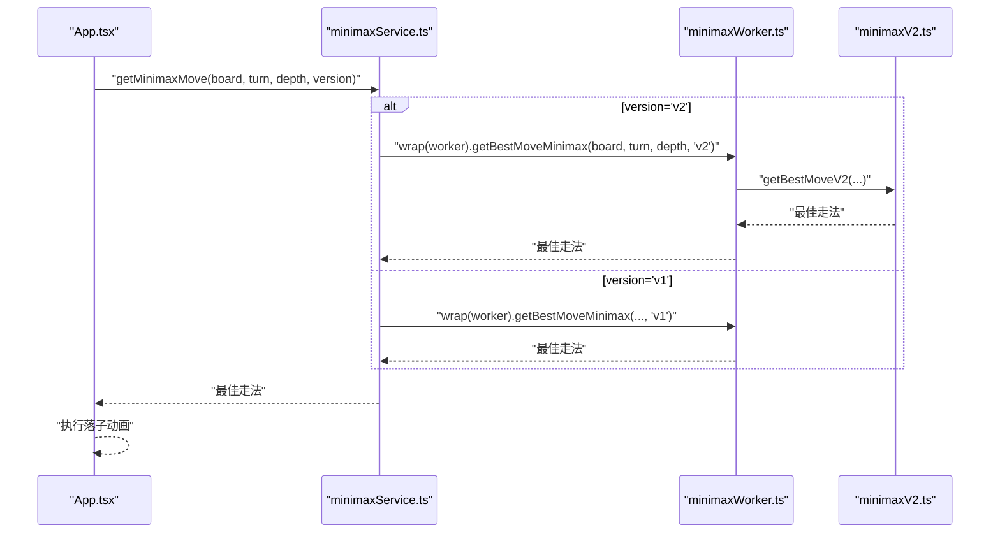
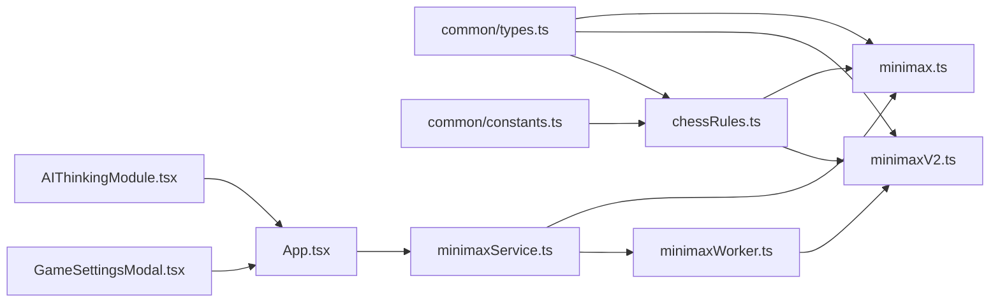

# Minimax AI算法

<cite>
**本文引用的文件列表**
- [api/minimaxV2.ts](file://api/minimaxV2.ts)
- [api/chessRules.ts](file://api/chessRules.ts)
- [api/common/types.ts](file://api/common/types.ts)
- [api/common/constants.ts](file://api/common/constants.ts)
- [services/minimaxService.ts](file://services/minimaxService.ts)
- [services/minimaxWorker.ts](file://services/minimaxWorker.ts)
- [services/types.ts](file://services/types.ts)
- [App.tsx](file://App.tsx)
- [components/GameSettingsModal.tsx](file://components/GameSettingsModal.tsx)
- [components/AIThinkingModule.tsx](file://components/AIThinkingModule.tsx)
- [api/minimax.ts](file://api/minimax.ts)
</cite>

## 目录
1. [简介](#简介)
2. [项目结构](#项目结构)
3. [核心组件](#核心组件)
4. [架构总览](#架构总览)
5. [详细组件分析](#详细组件分析)
6. [依赖关系分析](#依赖关系分析)
7. [性能考量](#性能考量)
8. [故障排查指南](#故障排查指南)
9. [结论](#结论)
10. [附录](#附录)

## 简介
本文件系统性解析中国象棋AI中的高性能Minimax算法实现，重点覆盖以下方面：
- Alpha-Beta剪枝、迭代加深搜索（Iterative Deepening）、置换表（Transposition Table）、杀手走法（Killer Moves）与Zobrist哈希等优化技术的工作原理与代码映射
- search（alphaBeta）与quiescenceSearch（静态搜索）的递归结构与剪枝条件
- 如何通过Web Worker（comlink）或后端API异步调用算法，避免阻塞UI线程
- 搜索深度、时间控制与评估函数（evaluatePosition）的设计思路
- 如何调整AI难度参数（难度等级、算法版本）以及调试建议（启用日志、监控搜索节点数）

## 项目结构
本项目采用“前端组件 + 服务层 + 算法实现”的分层组织方式：
- 前端组件负责用户交互与渲染，包括设置面板、思考模块等
- 服务层负责与算法实现进行桥接，支持Web Worker与后端API两种调用路径
- 算法实现位于api目录，包含规则引擎与Minimax V2实现



图表来源
- [App.tsx](file://App.tsx#L50-L161)
- [services/minimaxService.ts](file://services/minimaxService.ts#L1-L66)
- [services/minimaxWorker.ts](file://services/minimaxWorker.ts#L1-L19)
- [api/minimaxV2.ts](file://api/minimaxV2.ts#L1-L120)
- [api/minimax.ts](file://api/minimax.ts#L1-L125)
- [api/chessRules.ts](file://api/chessRules.ts#L1-L120)
- [api/common/types.ts](file://api/common/types.ts#L1-L68)
- [api/common/constants.ts](file://api/common/constants.ts#L1-L91)

章节来源
- [App.tsx](file://App.tsx#L50-L161)
- [services/minimaxService.ts](file://services/minimaxService.ts#L1-L66)
- [services/minimaxWorker.ts](file://services/minimaxWorker.ts#L1-L19)
- [api/minimaxV2.ts](file://api/minimaxV2.ts#L1-L120)
- [api/minimax.ts](file://api/minimax.ts#L1-L125)
- [api/chessRules.ts](file://api/chessRules.ts#L1-L120)
- [api/common/types.ts](file://api/common/types.ts#L1-L68)
- [api/common/constants.ts](file://api/common/constants.ts#L1-L91)

## 核心组件
- 置换表（TT）：键为Zobrist哈希，存储局面的分数、边界标志（精确/上限/下限）与最佳走法，用于缓存与剪枝
- 杀手走法（Killer Moves）：按层次记录最有效的两条走法，优先排序
- 历史表（History Heuristic）：记录非吃子走法的历史得分，用于排序
- Zobrist哈希：对棋盘状态进行快速散列，支持撤销与增量更新
- 评估函数（evaluate）：基于子力价值与位置权重表（PST）进行快速评估
- 静态搜索（Quiescence Search）：仅考虑吃子分支，消除“水平线效应”
- 主搜索（alphaBeta）：Negamax + Principal Variation Search（PVS），结合空步裁剪、延迟减枝、将军延伸等

章节来源
- [api/minimaxV2.ts](file://api/minimaxV2.ts#L1-L120)
- [api/chessRules.ts](file://api/chessRules.ts#L293-L390)

## 架构总览
Minimax V2通过“迭代加深 + 时间控制”在有限时间内选择最佳走法；通过comlink将算法封装为Worker，避免阻塞主线程；也可通过后端API进行异步调用。



图表来源
- [services/minimaxService.ts](file://services/minimaxService.ts#L1-L66)
- [services/minimaxWorker.ts](file://services/minimaxWorker.ts#L1-L19)
- [api/minimaxV2.ts](file://api/minimaxV2.ts#L432-L487)
- [api/chessRules.ts](file://api/chessRules.ts#L185-L206)

章节来源
- [services/minimaxService.ts](file://services/minimaxService.ts#L1-L66)
- [services/minimaxWorker.ts](file://services/minimaxWorker.ts#L1-L19)
- [api/minimaxV2.ts](file://api/minimaxV2.ts#L432-L487)
- [App.tsx](file://App.tsx#L348-L392)

## 详细组件分析

### Minimax V2算法实现（高性能）
- 配置参数
  - 置换表容量、空步裁剪深度、渴望窗口、将军延伸等
- 全局状态
  - 置换表、搜索节点计数、起始时间、时间限制、停止标志
  - 杀手走法数组、历史表
- 评估函数（evaluate）
  - 基于子力价值与位置权重表（PST），区分红/黑视角
- 走法排序（scoreMove）
  - PV Move（来自置换表）、MVV-LVA吃子、杀手走法、历史启发
- 静态搜索（quiescenceSearch）
  - 仅生成吃子走法，避免“水平线效应”，在被将军时仍需检查合法性
- 主搜索（alphaBeta）
  - Negamax + PVS，结合空步裁剪、延迟减枝、将军延伸、重复局面判和
  - 置换表查询与写入，Beta剪枝与杀手/历史启发记录
- 迭代加深（Iterative Deepening）
  - 逐层加深，时间控制策略：超过一半时间则提前结束
- 异步接口（getBestMoveV2）
  - 支持自定义时间限制，输出每层分数、最佳走法与节点数



图表来源
- [api/minimaxV2.ts](file://api/minimaxV2.ts#L268-L431)

章节来源
- [api/minimaxV2.ts](file://api/minimaxV2.ts#L1-L120)
- [api/minimaxV2.ts](file://api/minimaxV2.ts#L120-L267)
- [api/minimaxV2.ts](file://api/minimaxV2.ts#L268-L431)
- [api/minimaxV2.ts](file://api/minimaxV2.ts#L432-L487)

### 规则引擎与Zobrist哈希
- 走法生成
  - getValidMovesForPiece：生成伪合法走法
  - getLegalMoves：过滤出严格合法走法（排除导致自将的局面）
- Zobrist哈希
  - computeHash：棋盘状态的32位哈希
  - applyMoveEx：执行走法并返回被吃子与哈希增量，便于TT与REP_TABLE使用
- 重复局面检测
  - REP_TABLE：记录局面哈希出现次数，用于判和
- 将军检测
  - isInCheck：检查某颜色是否被将军

```mermaid
classDiagram
class Rules {
+getValidMovesForPiece(board,pos) Position[]
+getLegalMoves(board,pos) Position[]
+computeHash(board) number
+applyMoveEx(board,from,to) {captured, hashDelta}
+isInCheck(board,color) boolean
+RESET_REP() void
}
class MinimaxV2 {
+alphaBeta(...)
+quiescence(...)
+evaluate(...)
+scoreMove(...)
}
MinimaxV2 --> Rules : "生成/校验走法、评估、哈希"
```

图表来源
- [api/chessRules.ts](file://api/chessRules.ts#L1-L206)
- [api/chessRules.ts](file://api/chessRules.ts#L293-L390)
- [api/minimaxV2.ts](file://api/minimaxV2.ts#L268-L431)

章节来源
- [api/chessRules.ts](file://api/chessRules.ts#L1-L206)
- [api/chessRules.ts](file://api/chessRules.ts#L293-L390)

### 评估函数（evaluatePosition）
- 子力价值与位置权重表（PST）：分别针对红方与黑方视角进行镜像查表
- 评估方向：红方视角下正向，黑方视角下反向
- 可扩展点：在Root或浅层加入更复杂的机动性因子（注释提示）

章节来源
- [api/minimaxV2.ts](file://api/minimaxV2.ts#L124-L167)

### 走法排序与启发式
- PV Move：来自置换表的最佳走法，最高优先级
- MVV-LVA：吃子价值差分，优先吃子
- 杀手走法：按层次记录两条最佳走法
- 历史启发：非吃子走法的历史得分，用于排序

章节来源
- [api/minimaxV2.ts](file://api/minimaxV2.ts#L168-L205)

### 静态搜索（Quiescence Search）
- 仅生成吃子走法，避免“水平线效应”
- 在被将军时仍需检查合法性（避免非法走法）
- 递归返回alpha（或beta）剪枝

章节来源
- [api/minimaxV2.ts](file://api/minimaxV2.ts#L206-L267)

### 主搜索（alphaBeta + PVS）
- Negamax形式，PVS减少无效搜索
- 空步裁剪（Null Move Pruning）：在合适条件下放弃一步，若对手仍无法改善其局面则当前局面优势很大
- 延迟减枝（Late Move Reduction, LMR）：对非PV、非将军、非吃子的后续走法降低搜索深度
- 将军延伸（Check Extension）：当走法导致对方被将军时增加深度
- Beta剪枝：alpha >= beta时提前终止
- 置换表写入：根据边界标志（精确/下界/上界）写入

章节来源
- [api/minimaxV2.ts](file://api/minimaxV2.ts#L268-L431)

### 迭代加深与时间控制
- 逐层加深，直到达到理论最大深度或超时
- 时间控制策略：超过一半时间则提前结束，避免下一层指数增长的耗时

章节来源
- [api/minimaxV2.ts](file://api/minimaxV2.ts#L432-L487)

### 异步调用与UI解耦
- Web Worker（comlink）
  - minimaxWorker.ts暴露API，内部根据版本选择V1或V2
  - minimaxService.ts通过wrap(worker)调用
- 后端API
  - minimaxService.ts支持直接fetch后端接口
- 前端集成
  - App.tsx在AI回合触发时调用getMinimaxMove，避免阻塞UI



图表来源
- [services/minimaxService.ts](file://services/minimaxService.ts#L47-L66)
- [services/minimaxWorker.ts](file://services/minimaxWorker.ts#L1-L19)
- [api/minimaxV2.ts](file://api/minimaxV2.ts#L432-L487)
- [App.tsx](file://App.tsx#L348-L392)

章节来源
- [services/minimaxService.ts](file://services/minimaxService.ts#L1-L66)
- [services/minimaxWorker.ts](file://services/minimaxWorker.ts#L1-L19)
- [App.tsx](file://App.tsx#L348-L392)

## 依赖关系分析
- 类型与常量
  - common/types.ts定义棋盘、棋子、颜色、枚举等
  - common/constants.ts定义棋盘尺寸、初始布局等
- 规则引擎
  - chessRules.ts提供走法生成、评估、哈希、重复局面检测、将帅检查等
- 算法实现
  - minimaxV2.ts依赖规则引擎与类型定义，实现高性能搜索
  - minimax.ts提供简化版Minimax（演示用途）
- 服务层
  - minimaxService.ts与minimaxWorker.ts负责与算法实现的桥接
- 前端
  - App.tsx与GameSettingsModal.tsx负责难度与版本选择，AIThinkingModule.tsx显示思考状态



图表来源
- [api/common/types.ts](file://api/common/types.ts#L1-L68)
- [api/common/constants.ts](file://api/common/constants.ts#L1-L91)
- [api/chessRules.ts](file://api/chessRules.ts#L1-L206)
- [api/minimaxV2.ts](file://api/minimaxV2.ts#L1-L120)
- [api/minimax.ts](file://api/minimax.ts#L1-L125)
- [services/minimaxService.ts](file://services/minimaxService.ts#L1-L66)
- [services/minimaxWorker.ts](file://services/minimaxWorker.ts#L1-L19)
- [App.tsx](file://App.tsx#L50-L161)
- [components/GameSettingsModal.tsx](file://components/GameSettingsModal.tsx#L1-L111)
- [components/AIThinkingModule.tsx](file://components/AIThinkingModule.tsx#L1-L53)

章节来源
- [api/common/types.ts](file://api/common/types.ts#L1-L68)
- [api/common/constants.ts](file://api/common/constants.ts#L1-L91)
- [api/chessRules.ts](file://api/chessRules.ts#L1-L206)
- [api/minimaxV2.ts](file://api/minimaxV2.ts#L1-L120)
- [api/minimax.ts](file://api/minimax.ts#L1-L125)
- [services/minimaxService.ts](file://services/minimaxService.ts#L1-L66)
- [services/minimaxWorker.ts](file://services/minimaxWorker.ts#L1-L19)
- [App.tsx](file://App.tsx#L50-L161)
- [components/GameSettingsModal.tsx](file://components/GameSettingsModal.tsx#L1-L111)
- [components/AIThinkingModule.tsx](file://components/AIThinkingModule.tsx#L1-L53)

## 性能考量
- 置换表
  - 使用Map存储，生产环境可替换为定长数组以提升缓存局部性
  - 写入时根据边界标志决定覆盖策略
- 杀手走法与历史表
  - 通过数组与增量更新，减少无效搜索
- Zobrist哈希
  - 通过applyMoveEx返回哈希增量，避免全表重算
- 剪枝与减枝
  - 空步裁剪、延迟减枝、Beta剪枝、PVS显著降低搜索空间
- 时间控制
  - 每2048个节点检查一次，超时立即停止
  - 迭代加深中超过一半时间提前结束，平衡深度与时间

章节来源
- [api/minimaxV2.ts](file://api/minimaxV2.ts#L1-L120)
- [api/minimaxV2.ts](file://api/minimaxV2.ts#L104-L149)
- [api/minimaxV2.ts](file://api/minimaxV2.ts#L268-L431)
- [api/minimaxV2.ts](file://api/minimaxV2.ts#L432-L487)

## 故障排查指南
- 日志与统计
  - 每层输出分数、最佳走法与节点数，便于观察搜索质量与时长
  - 节点计数与超时检查有助于定位性能瓶颈
- 常见问题
  - 走法非法：静态搜索中若导致己方被将军则忽略该走法
  - 置换表误判：边界标志与深度匹配需严格遵循
  - 时间不足：适当降低时间限制或减少迭代加深层数
- 调试建议
  - 启用日志：观察每层输出，确认迭代加深与时间控制生效
  - 监控节点数：评估剪枝效果与搜索效率
  - 逐步关闭优化：验证空步裁剪、LMR、杀手走法等对性能的影响

章节来源
- [api/minimaxV2.ts](file://api/minimaxV2.ts#L104-L149)
- [api/minimaxV2.ts](file://api/minimaxV2.ts#L206-L267)
- [api/minimaxV2.ts](file://api/minimaxV2.ts#L268-L431)
- [api/minimaxV2.ts](file://api/minimaxV2.ts#L432-L487)

## 结论
Minimax V2通过多项经典优化技术实现了高效、稳定的中国象棋AI：Alpha-Beta剪枝、PVS、空步裁剪、延迟减枝、置换表、杀手走法与历史启发、Zobrist哈希与静态搜索。结合迭代加深与时间控制，能够在有限时间内给出高质量走法。通过Web Worker与后端API两种异步调用方式，有效避免阻塞UI线程。开发者可通过难度等级与算法版本灵活调整AI强度，并借助日志与节点统计进行调试与优化。

## 附录

### AI难度参数与调优
- 难度等级（3/4/5）
  - 通过设置面板选择，影响搜索深度或时间分配
- 算法版本（V1/V2）
  - V1为简化Minimax（演示用途），V2为高性能实现
- 实际调参建议
  - 简单：降低时间限制或深度，减少LMR幅度
  - 中等：默认配置
  - 困难：提高时间限制，启用更多优化（LMR、杀手、历史）

章节来源
- [components/GameSettingsModal.tsx](file://components/GameSettingsModal.tsx#L1-L111)
- [components/GameSettingsModal.tsx](file://components/GameSettingsModal.tsx#L206-L229)
- [App.tsx](file://App.tsx#L116-L161)
- [App.tsx](file://App.tsx#L53-L81)

### 关键实现路径参考
- 置换表与Zobrist哈希
  - [TT定义与写入](file://api/minimaxV2.ts#L15-L21)
  - [TT查询与边界判断](file://api/minimaxV2.ts#L288-L298)
  - [computeHash](file://api/chessRules.ts#L321-L330)
  - [applyMoveEx](file://api/chessRules.ts#L371-L389)
- 评估函数
  - [evaluate](file://api/minimaxV2.ts#L124-L167)
- 走法排序
  - [scoreMove](file://api/minimaxV2.ts#L168-L205)
- 静态搜索
  - [quiescence](file://api/minimaxV2.ts#L206-L267)
- 主搜索
  - [alphaBeta](file://api/minimaxV2.ts#L268-L431)
- 迭代加深与时间控制
  - [getBestMoveV2](file://api/minimaxV2.ts#L432-L487)
- 异步调用
  - [minimaxService](file://services/minimaxService.ts#L1-L66)
  - [minimaxWorker](file://services/minimaxWorker.ts#L1-L19)