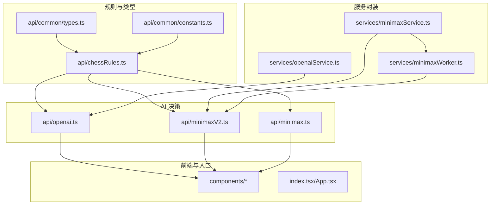
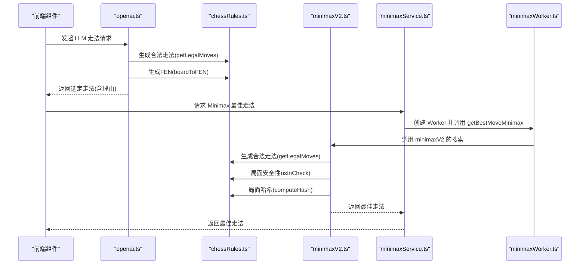
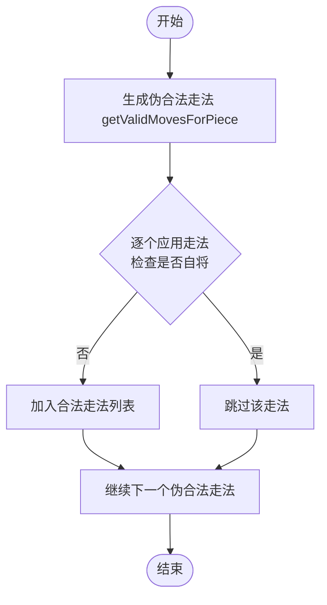
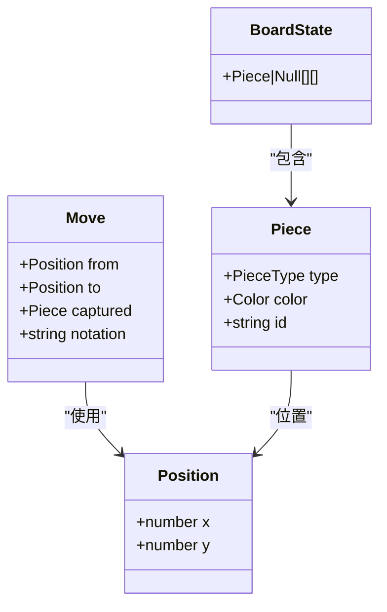
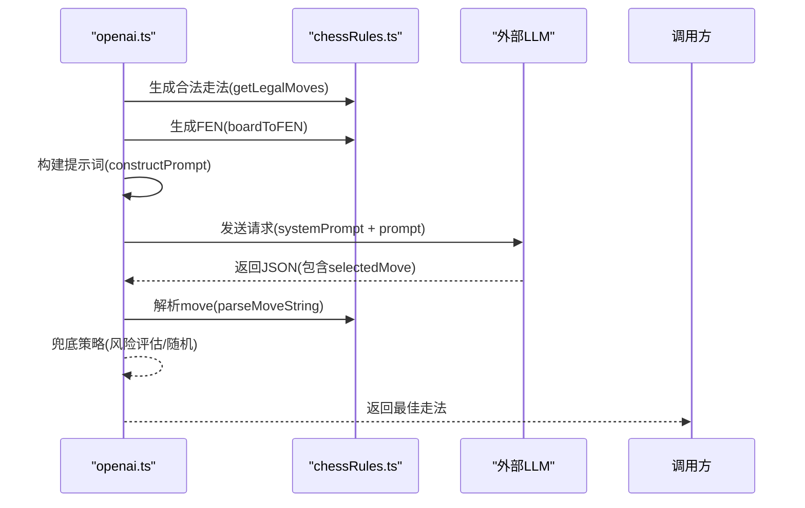
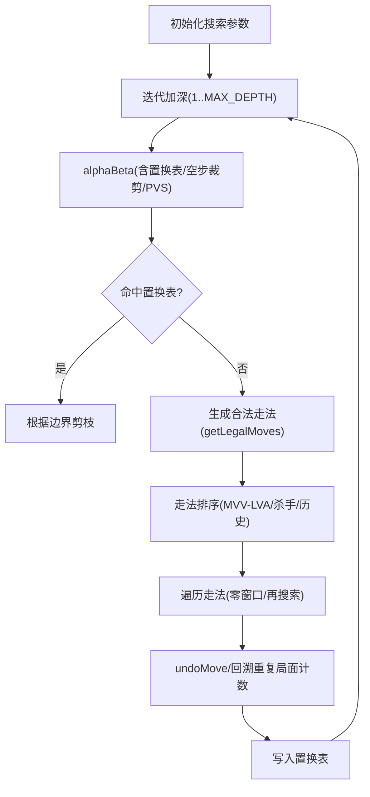
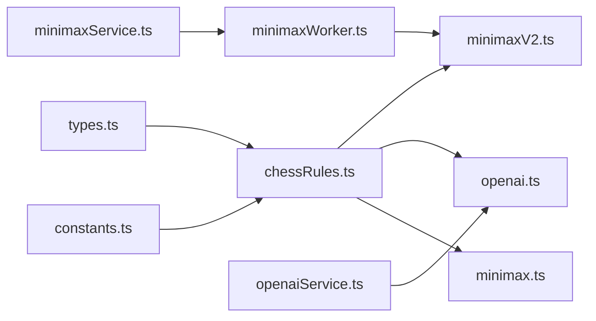
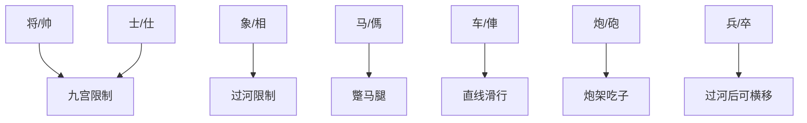

# 中国象棋规则实现

<cite>
**本文引用的文件**
- [api/chessRules.ts](file://api/chessRules.ts)
- [api/minimaxV2.ts](file://api/minimaxV2.ts)
- [api/openai.ts](file://api/openai.ts)
- [api/common/types.ts](file://api/common/types.ts)
- [api/common/constants.ts](file://api/common/constants.ts)
- [api/minimax.ts](file://api/minimax.ts)
- [services/minimaxService.ts](file://services/minimaxService.ts)
- [services/minimaxWorker.ts](file://services/minimaxWorker.ts)
- [services/openaiService.ts](file://services/openaiService.ts)
- [README.md](file://README.md)
</cite>

## 目录
1. [简介](#简介)
2. [项目结构](#项目结构)
3. [核心组件](#核心组件)
4. [架构总览](#架构总览)
5. [详细组件分析](#详细组件分析)
6. [依赖关系分析](#依赖关系分析)
7. [性能考量](#性能考量)
8. [故障排查指南](#故障排查指南)
9. [结论](#结论)
10. [附录](#附录)

## 简介
本文件聚焦于中国象棋规则实现，围绕 api/chessRules.ts 中的完整走法规则进行深入解析，涵盖飞象（相/象）、蹩马腿、炮的吃子机制、将军检测、将帅照面、胜负判定等核心逻辑。文档同时解释 generateValidMoves（对应实现为 getValidMovesForPiece）如何为不同棋子类型生成合法走法，并结合 isInCheck 和 getLegalMoves 说明局面安全性验证流程。最后给出 BoardState 与 Piece 类型的交互方式，以及该模块如何被 minimaxV2.ts 与 openai.ts 调用以支持 AI 决策，并提供面向初学者的规则图解与面向高级开发者的性能优化建议（含缓存与 Zobrist 哈希集成点）。

## 项目结构
本项目采用前后端分离的组织方式，核心规则与 AI 逻辑集中在 api 目录，服务层封装在 services 目录，前端组件位于 components 与根目录下的页面入口。与本规则文档密切相关的文件如下：
- 规则与类型：api/chessRules.ts、api/common/types.ts、api/common/constants.ts
- AI 决策：api/minimaxV2.ts、api/minimax.ts、api/openai.ts
- 服务封装：services/minimaxService.ts、services/minimaxWorker.ts、services/openaiService.ts
- 项目说明：README.md

图表来源
- [api/chessRules.ts](file://api/chessRules.ts#L1-L390)
- [api/minimaxV2.ts](file://api/minimaxV2.ts#L1-L487)
- [api/openai.ts](file://api/openai.ts#L1-L367)
- [api/minimax.ts](file://api/minimax.ts#L1-L125)
- [services/minimaxService.ts](file://services/minimaxService.ts#L1-L66)
- [services/minimaxWorker.ts](file://services/minimaxWorker.ts#L1-L19)
- [services/openaiService.ts](file://services/openaiService.ts#L1-L37)

章节来源
- [README.md](file://README.md#L1-L82)

## 核心组件
- 规则引擎（api/chessRules.ts）
  - 提供棋子走法生成、将军检测、局面克隆、移动应用、FEN 序列化、Zobrist 哈希、重复局面检测等能力
- AI 决策（api/minimaxV2.ts、api/minimax.ts）
  - 基于规则引擎进行合法性校验与局面评估，实现迭代加深、置换表、杀手走法、历史启发、空步裁剪、PVS 等优化
- LLM 辅助（api/openai.ts）
  - 通过规则引擎生成合法走法与战术分析，构建提示词并调用外部 LLM 返回最优走法
- 类型与常量（api/common/types.ts、api/common/constants.ts）
  - 定义棋盘、棋子、颜色、走法、初始布局等基础数据结构与常量

章节来源
- [api/chessRules.ts](file://api/chessRules.ts#L1-L390)
- [api/minimaxV2.ts](file://api/minimaxV2.ts#L1-L487)
- [api/openai.ts](file://api/openai.ts#L1-L367)
- [api/common/types.ts](file://api/common/types.ts#L1-L68)
- [api/common/constants.ts](file://api/common/constants.ts#L1-L91)

## 架构总览
规则引擎作为底层基础设施，向上游提供：
- 走法生成：getValidMovesForPiece（飞象、蹩马腿、炮吃子、将/士/象/马/车/兵规则）
- 安全性验证：isCheck/isInCheck（将帅照面、将军检测）
- 局面操作：cloneBoard/applyMove/undoMove（移动应用与撤销）
- 评估与序列化：evaluateBoard/boardToFEN/fenToMoveString（评估与 FEN）
- 哈希与重复局面：computeHash/REP_TABLE（Zobrist 哈希与重复局面检测）

AI 决策模块通过规则引擎完成：
- 生成合法走法（getLegalMoves）
- 局面安全性检查（isInCheck）
- 置换表与哈希缓存（computeHash/TT）
- 评估函数（evaluateBoard/位置权重）

LLM 模块通过规则引擎完成：
- 生成合法走法与战术分析（getLegalMoves、applyMove、isSquareUnderAttack）
- 构建提示词（constructPrompt/systemPrompt）

图表来源
- [api/openai.ts](file://api/openai.ts#L1-L367)
- [api/chessRules.ts](file://api/chessRules.ts#L1-L390)
- [api/minimaxV2.ts](file://api/minimaxV2.ts#L1-L487)
- [services/minimaxService.ts](file://services/minimaxService.ts#L1-L66)
- [services/minimaxWorker.ts](file://services/minimaxWorker.ts#L1-L19)

## 详细组件分析

### 规则引擎：棋子走法与核心逻辑
- 棋盘边界与位置工具
  - 边界检查：isValidPos
  - 获取棋子：getPiece
  - 将/士/象/兵/车/炮/马的走法规则均在此实现
- 将/士/象/兵/车/炮/马的走法生成
  - 将/士：九宫内斜/直移一步
  - 象/相：田字斜走两格，且不得过河，眼位被堵不可走
  - 马：走“日”字，腿被蹩不可走
  - 车：直线任意距离，遇子阻挡停止
  - 炮：移动与车相同，吃子需隔一子（炮架）
  - 兵/卒：未过河只能前进一步，过河后可左右横移
- 将帅照面与“飞象”规则
  - 将帅同列时沿竖线检查是否有对方将/帅，若有则允许“将军”走法
- 将军检测与合法性
  - isCheck/isInCheck：枚举敌方所有走法，若能攻击到己方将/帅则为将军
  - getLegalMoves：在伪合法基础上，逐一应用走法并检查下一步是否仍处于将军状态
- 局面操作与序列化
  - cloneBoard/applyMove/undoMove：克隆棋盘、执行移动、撤销移动
  - boardToFEN/fenToMoveString/parseMoveString：FEN 序列化与内部坐标字符串互转
- 评估与哈希
  - evaluateBoard：基础子力价值与位置权重
  - computeHash/Zobrist：32 位哈希，支持置换表与重复局面检测
  - REP_TABLE/RESET_REP：重复局面检测表

图表来源
- [api/chessRules.ts](file://api/chessRules.ts#L196-L205)

章节来源
- [api/chessRules.ts](file://api/chessRules.ts#L1-L390)

### 数据模型与交互
- 类型定义
  - Position：棋盘坐标（0-8 行，0-9 列）
  - Piece：棋子类型与颜色，带唯一 id
  - BoardState：10×9 的二维数组，空位为 null
  - Move：走法结构，包含来源、目标、捕获棋子与记谱
- 常量与初始布局
  - PIECE_CHARS/COL_NUMERALS/MOVE_DIRECTIONS：中文棋子名、列号、进退平方向
  - INITIAL_BOARD：标准开局布局

图表来源
- [api/common/types.ts](file://api/common/types.ts#L1-L68)

章节来源
- [api/common/types.ts](file://api/common/types.ts#L1-L68)
- [api/common/constants.ts](file://api/common/constants.ts#L1-L91)

### LLM 辅助模块：战术分析与提示词
- getGameContext：遍历所有己方棋子，生成合法走法列表，标注吃子、风险与价值
- isSquareUnderAttack：检查目标位置是否被敌方棋子攻击（基于伪合法走法）
- constructPrompt/systemPrompt：构建包含棋盘可视化、上一步信息、可选走法的提示词
- 解析与兜底：解析 LLM 返回的 JSON，若无效则回退到第一个合法走法或安全吃子

图表来源
- [api/openai.ts](file://api/openai.ts#L1-L367)
- [api/chessRules.ts](file://api/chessRules.ts#L1-L390)

章节来源
- [api/openai.ts](file://api/openai.ts#L1-L367)

### Minimax 决策模块：迭代加深与搜索优化
- getBestMoveV2：迭代加深，结合置换表、杀手走法、历史启发、空步裁剪、PVS、零窗口搜索、将军延伸等
- getLegalMoves：在 minimaxV2 中必须使用，确保搜索树中不包含非法走法
- evaluate：基础评估函数，可扩展位置权重（PST）与机动性
- applyMoveEx/undoMove：支持哈希增量更新与局面撤销

图表来源
- [api/minimaxV2.ts](file://api/minimaxV2.ts#L1-L487)
- [api/chessRules.ts](file://api/chessRules.ts#L1-L390)

章节来源
- [api/minimaxV2.ts](file://api/minimaxV2.ts#L1-L487)

### 传统 Minimax（兼容接口）
- minimax.ts 提供简化的 Minimax+Alpha-Beta 实现，适合演示与低深度搜索
- 通过 services/minimaxService.ts 与 services/minimaxWorker.ts 提供 Worker 化部署

章节来源
- [api/minimax.ts](file://api/minimax.ts#L1-L125)
- [services/minimaxService.ts](file://services/minimaxService.ts#L1-L66)
- [services/minimaxWorker.ts](file://services/minimaxWorker.ts#L1-L19)

## 依赖关系分析
- chessRules.ts 为上游依赖核心，被 minimaxV2.ts、openai.ts、minimax.ts 直接调用
- types.ts 与 constants.ts 为通用类型与常量，被所有模块共享
- services 层负责封装网络与 Worker 调用，避免 UI 线程阻塞

图表来源
- [api/common/types.ts](file://api/common/types.ts#L1-L68)
- [api/common/constants.ts](file://api/common/constants.ts#L1-L91)
- [api/chessRules.ts](file://api/chessRules.ts#L1-L390)
- [api/minimaxV2.ts](file://api/minimaxV2.ts#L1-L487)
- [api/openai.ts](file://api/openai.ts#L1-L367)
- [api/minimax.ts](file://api/minimax.ts#L1-L125)
- [services/minimaxService.ts](file://services/minimaxService.ts#L1-L66)
- [services/minimaxWorker.ts](file://services/minimaxWorker.ts#L1-L19)
- [services/openaiService.ts](file://services/openaiService.ts#L1-L37)

章节来源
- [api/chessRules.ts](file://api/chessRules.ts#L1-L390)
- [api/minimaxV2.ts](file://api/minimaxV2.ts#L1-L487)
- [api/openai.ts](file://api/openai.ts#L1-L367)
- [api/minimax.ts](file://api/minimax.ts#L1-L125)
- [services/minimaxService.ts](file://services/minimaxService.ts#L1-L66)
- [services/minimaxWorker.ts](file://services/minimaxWorker.ts#L1-L19)
- [services/openaiService.ts](file://services/openaiService.ts#L1-L37)

## 性能考量
- 缓存与置换表
  - minimaxV2.ts 使用 Map 作为简易置换表，存储键（哈希）、深度、边界标志、分数与最佳走法
  - 建议：生产环境可用定长数组替代 Map，降低内存碎片与查找开销
- 哈希与重复局面
  - chessRules.ts 已实现 Zobrist 哈希与 REP_TABLE，minimaxV2.ts 在搜索中使用 computeHash 与 REP_TABLE 进行重复局面检测
  - 建议：在 applyMoveEx 中维护 hashDelta，避免每次全盘重算
- 走法生成与排序
  - minimaxV2.ts 使用 MVV-LVA、杀手走法、历史启发进行排序，显著减少无效搜索
  - openai.ts 在战术分析阶段使用伪合法走法快速评估，避免在生成阶段引入复杂规则
- 搜索优化
  - 空步裁剪、零窗口搜索、PVS、将军延伸、Late Move Reduction 等技术已在 minimaxV2.ts 中实现
  - 建议：在高深度场景下启用更激进的裁剪策略，并限制时间以避免超时

章节来源
- [api/minimaxV2.ts](file://api/minimaxV2.ts#L1-L487)
- [api/chessRules.ts](file://api/chessRules.ts#L293-L390)

## 故障排查指南
- 合法性问题
  - 若出现“自将”或“将帅照面”错误，检查 isInCheck/getLegalMoves 的调用顺序与棋盘状态
  - 确保在 minimaxV2.ts 中使用 getLegalMoves 而非 getValidMovesForPiece
- LLM 走法解析失败
  - openai.ts 对 LLM 返回的 JSON 进行兜底：若解析失败或格式不符，回退到第一个合法走法或安全吃子
  - 检查 constructPrompt 生成的坐标与记谱是否与 parseMoveString 一致
- 置换表与哈希
  - 若出现重复局面误判或 TT 命中异常，检查 computeHash 与 applyMoveEx 的哈希增量更新是否正确
- 性能问题
  - 若搜索时间过长，检查时间控制逻辑与迭代加深步进
  - 适当降低深度或启用更严格的裁剪策略

章节来源
- [api/openai.ts](file://api/openai.ts#L1-L367)
- [api/minimaxV2.ts](file://api/minimaxV2.ts#L1-L487)
- [api/chessRules.ts](file://api/chessRules.ts#L1-L390)

## 结论
本项目以 api/chessRules.ts 为核心，构建了完整的中国象棋规则体系，覆盖飞象、蹩马腿、炮的吃子机制、将帅照面、将军检测与胜负判定等关键逻辑。通过与 minimaxV2.ts、openai.ts 的协作，实现了高性能的 AI 决策与 LLM 辅助走法选择。类型与常量模块提供了清晰的数据模型与初始布局，服务层封装了网络与 Worker 调用，便于在前端环境中稳定运行。建议在生产环境中进一步优化置换表、哈希与走法排序策略，以获得更优的性能表现。

## 附录

### 初学者友好规则图解
- 将/士：九宫内斜/直移一步
- 象/相：田字斜走两格，过河后不可过河，眼位被堵不可走
- 马：走“日”字，腿被蹩不可走
- 车：直线任意距离，遇子阻挡停止
- 炮：移动与车相同，吃子需隔一子（炮架）
- 兵/卒：未过河只能前进一步，过河后可左右横移

[本图为概念示意，无需图表来源]

### 代码片段路径示例
- 生成合法走法（象/马/炮/将/士/车/兵）
  - [getValidMovesForPiece](file://api/chessRules.ts#L26-L150)
- 将军检测
  - [isCheck](file://api/chessRules.ts#L152-L182)
  - [isInCheck](file://api/chessRules.ts#L332-L360)
- 合法性验证流程
  - [getLegalMoves](file://api/chessRules.ts#L196-L205)
- 局面操作
  - [cloneBoard](file://api/chessRules.ts#L184-L186)
  - [applyMove](file://api/chessRules.ts#L188-L193)
  - [undoMove](file://api/chessRules.ts#L280-L291)
- FEN 与坐标转换
  - [boardToFEN](file://api/chessRules.ts#L208-L236)
  - [fenToMoveString](file://api/chessRules.ts#L238-L246)
  - [parseMoveString](file://api/chessRules.ts#L248-L257)
- 评估与哈希
  - [evaluateBoard](file://api/chessRules.ts#L260-L278)
  - [computeHash](file://api/chessRules.ts#L321-L330)
- LLM 模块中的走法生成与风险评估
  - [getGameContext](file://api/openai.ts#L159-L217)
  - [isSquareUnderAttack](file://api/openai.ts#L141-L157)
- Minimax 搜索与置换表
  - [getBestMoveV2](file://api/minimaxV2.ts#L433-L487)
  - [alphaBeta](file://api/minimaxV2.ts#L268-L430)