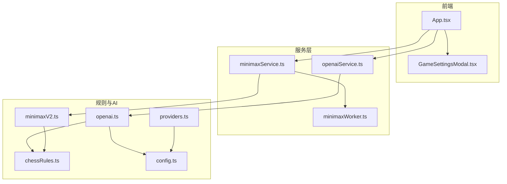
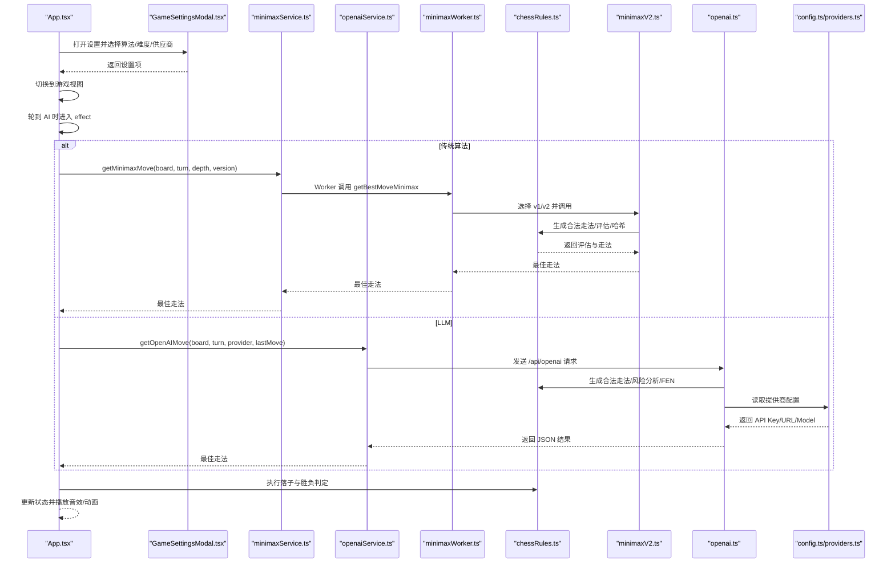
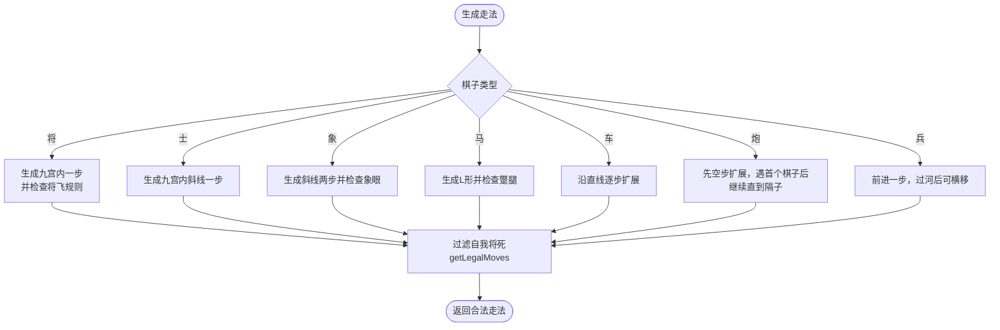
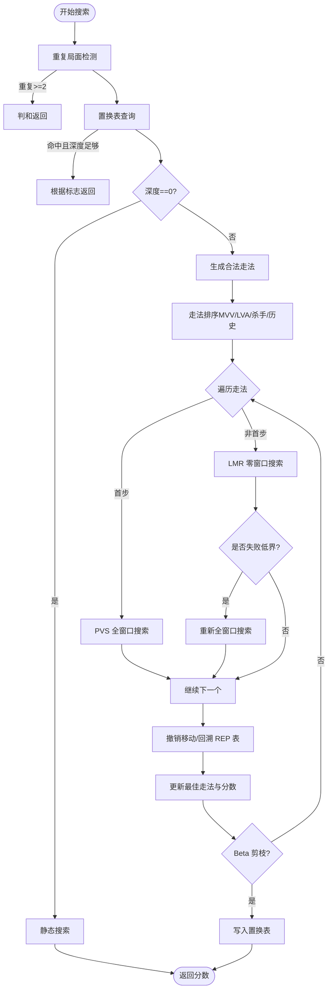
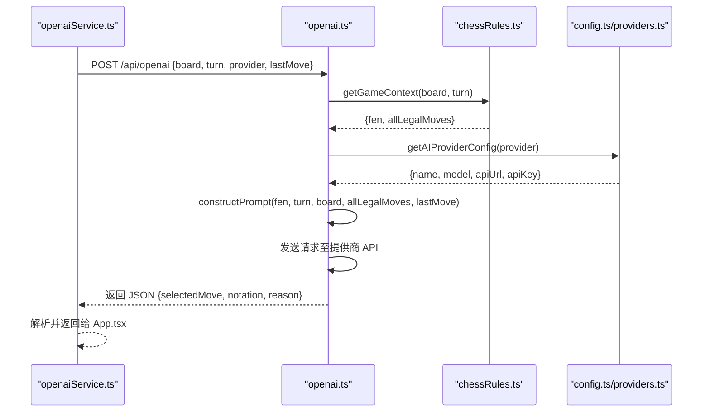
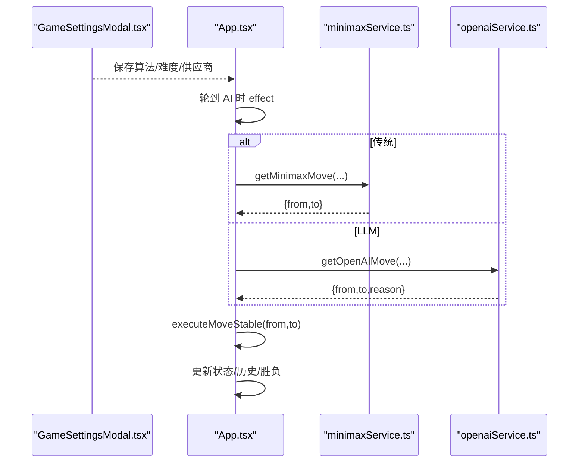
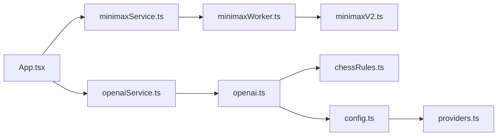

# 核心功能

<cite>
**本文引用的文件**
- [App.tsx](file://App.tsx)
- [GameSettingsModal.tsx](file://components/GameSettingsModal.tsx)
- [chessRules.ts](file://api/chessRules.ts)
- [minimaxV2.ts](file://api/minimaxV2.ts)
- [openai.ts](file://api/openai.ts)
- [minimaxService.ts](file://services/minimaxService.ts)
- [openaiService.ts](file://services/openaiService.ts)
- [minimaxWorker.ts](file://services/minimaxWorker.ts)
- [types.ts](file://services/types.ts)
- [constants.ts](file://api/common/constants.ts)
- [types.ts](file://api/common/types.ts)
- [config.ts](file://api/common/config.ts)
- [providers.ts](file://api/providers.ts)
</cite>

## 目录
1. [简介](#简介)
2. [项目结构](#项目结构)
3. [核心组件](#核心组件)
4. [架构总览](#架构总览)
5. [详细组件分析](#详细组件分析)
6. [依赖关系分析](#依赖关系分析)
7. [性能考量](#性能考量)
8. [故障排查指南](#故障排查指南)
9. [结论](#结论)

## 简介
本文件聚焦于中国象棋核心功能的系统化文档，涵盖以下三大模块：
- 中国象棋规则实现：在 chessRules.ts 中实现走法生成、将军检测、胜负判定、棋盘评估与哈希等基础能力。
- Minimax AI：在 minimaxV2.ts 中实现 Alpha-Beta 剪枝、置换表、静态搜索、杀手走法、历史启发、空步裁剪、迭代加深等优化。
- LLM AI：在 openai.ts 中通过 Prompt 构建与多提供商 API 调用，结合 chessRules 的战术分析，输出结构化走法。
同时结合 GameSettingsModal.tsx 的 UI 交互，说明用户如何在界面中选择 AI 类型与难度；并在 App.tsx 中展示 getMinimaxMove 与 getOpenAIMove 的调用集成方式。

## 项目结构
项目采用“前端 + 服务层 + 规则与AI实现”的分层组织：
- 前端层：App.tsx 与各 UI 组件（GameSettingsModal.tsx 等）负责游戏状态管理与用户交互。
- 服务层：services/* 提供与后端 API 的封装（minimaxService.ts、openaiService.ts）以及 Worker 封装（minimaxWorker.ts）。
- 规则与AI：api/* 实现中国象棋规则与 AI 算法（chessRules.ts、minimaxV2.ts、openai.ts）。
- 公共配置与常量：api/common/* 定义类型、常量与提供商配置。

图表来源
- [App.tsx](file://App.tsx#L340-L371)
- [minimaxService.ts](file://services/minimaxService.ts#L1-L66)
- [openaiService.ts](file://services/openaiService.ts#L1-L37)
- [minimaxWorker.ts](file://services/minimaxWorker.ts#L1-L19)
- [chessRules.ts](file://api/chessRules.ts#L1-L390)
- [minimaxV2.ts](file://api/minimaxV2.ts#L1-L487)
- [openai.ts](file://api/openai.ts#L1-L367)
- [config.ts](file://api/common/config.ts#L1-L49)
- [providers.ts](file://api/providers.ts#L1-L41)

章节来源
- [App.tsx](file://App.tsx#L1-L460)
- [GameSettingsModal.tsx](file://components/GameSettingsModal.tsx#L1-L337)
- [minimaxService.ts](file://services/minimaxService.ts#L1-L66)
- [openaiService.ts](file://services/openaiService.ts#L1-L37)
- [minimaxWorker.ts](file://services/minimaxWorker.ts#L1-L19)
- [chessRules.ts](file://api/chessRules.ts#L1-L390)
- [minimaxV2.ts](file://api/minimaxV2.ts#L1-L487)
- [openai.ts](file://api/openai.ts#L1-L367)
- [config.ts](file://api/common/config.ts#L1-L49)
- [providers.ts](file://api/providers.ts#L1-L41)

## 核心组件
- 中国象棋规则引擎（chessRules.ts）
  - 走法生成：针对每种棋子类型实现合法走法集合，含“将”飞规则、炮的隔子吃子、象眼、马蹩腿等规则。
  - 将军检测：枚举敌方所有合法走法，判断是否能攻击到己方将。
  - 局面评估：提供基础子力价值与位置权重（PST）的评估入口。
  - 棋盘哈希：Zobrist 哈希，支持置换表与重复局面检测。
  - FEN 与坐标转换：便于 LLM 输入输出。
- Minimax AI（minimaxV2.ts）
  - Alpha-Beta 搜索与 PVS（Principal Variation Search）。
  - 置换表（TT）、静态搜索（Quiescence）、空步裁剪（Null Move Pruning）、杀手走法、历史启发。
  - 迭代加深（Iterative Deepening）、将军延伸、时间控制。
- LLM AI（openai.ts）
  - 战术分析：生成所有合法走法，标注吃子与风险，排序推荐。
  - Prompt 构建：多维坐标棋盘、上一步信息、可选走法列表、系统提示词。
  - 多提供商适配：通过 config.ts 与 providers.ts 动态加载可用供应商。
- UI 与集成（App.tsx、GameSettingsModal.tsx）
  - 用户在 GameSettingsModal.tsx 中选择算法类型（传统/LLM）、算法版本（v1/v2）、难度（3/4/5）、LLM 供应商。
  - App.tsx 在 AI 轮次触发时调用 getMinimaxMove 或 getOpenAIMove，并执行落子与胜负判定。

章节来源
- [chessRules.ts](file://api/chessRules.ts#L26-L206)
- [minimaxV2.ts](file://api/minimaxV2.ts#L1-L487)
- [openai.ts](file://api/openai.ts#L1-L367)
- [GameSettingsModal.tsx](file://components/GameSettingsModal.tsx#L1-L337)
- [App.tsx](file://App.tsx#L340-L371)

## 架构总览
下面的序列图展示了从用户点击到 AI 落子的完整流程，包括传统 Minimax 与 LLM 两种路径。

图表来源
- [App.tsx](file://App.tsx#L340-L371)
- [minimaxService.ts](file://services/minimaxService.ts#L1-L66)
- [openaiService.ts](file://services/openaiService.ts#L1-L37)
- [minimaxWorker.ts](file://services/minimaxWorker.ts#L1-L19)
- [minimaxV2.ts](file://api/minimaxV2.ts#L1-L487)
- [openai.ts](file://api/openai.ts#L1-L367)
- [chessRules.ts](file://api/chessRules.ts#L1-L390)
- [config.ts](file://api/common/config.ts#L1-L49)
- [providers.ts](file://api/providers.ts#L1-L41)

## 详细组件分析

### 中国象棋规则实现（chessRules.ts）
- 走法生成
  - 针对“将/士/象/马/车/炮/兵”分别实现规则约束，包括：
    - 将/士限制在九宫内；
    - 象走田、不能过河；
    - 马走“日”并蹩腿；
    - 车直线长距离；
    - 炮需隔子吃子；
    - 兵过河后可横向移动。
  - 通过 isValidPos、getPiece、isPalace、crossedRiver 等辅助函数统一边界与位置判断。
- 将军检测
  - isCheck 与 isInCheck 分别提供快速检测与更严格的枚举校验，避免非法局面。
- 合法走法与局面评估
  - getLegalMoves 在伪合法基础上过滤“自我将死”，确保每一步都不会使己方将处于被攻击状态。
  - evaluateBoard 提供基础子力价值评估，为 Minimax 提供评分。
- 棋盘哈希与重复局面
  - computeHash 使用 Zobrist 哈希，applyMoveEx 返回 hashDelta，配合置换表与 REP_TABLE 支持重复局面判和。
- FEN 与坐标转换
  - boardToFEN 与 fenToMoveString 为 LLM 输入输出提供稳定格式。

图表来源
- [chessRules.ts](file://api/chessRules.ts#L26-L206)

章节来源
- [chessRules.ts](file://api/chessRules.ts#L26-L206)
- [chessRules.ts](file://api/chessRules.ts#L152-L182)
- [chessRules.ts](file://api/chessRules.ts#L184-L206)
- [chessRules.ts](file://api/chessRules.ts#L207-L258)
- [chessRules.ts](file://api/chessRules.ts#L259-L292)
- [chessRules.ts](file://api/chessRules.ts#L293-L390)

### Minimax AI（minimaxV2.ts）
- 核心优化技术
  - Alpha-Beta 剪枝与 PVS（主变搜索）显著降低搜索分支。
  - 置换表（TT）缓存历史局面的最佳走法与分数，提高重复局面命中率。
  - 静态搜索（Quiescence）处理吃子交换，避免“水平线效应”。
  - 空步裁剪（Null Move Pruning）在非将死局面快速剪枝。
  - 杀手走法与历史启发排序，提升走法顺序质量。
  - 将军延伸（Check Extension）与延迟搜索（Late Move Reduction）平衡深度与效率。
  - 迭代加深（Iterative Deepening）在时间预算内逐步加深，优先返回更稳健的走法。
- 时间控制与节点计数
  - 通过 performance.now 与 searchNodes 控制搜索节奏，避免超时。
- 评估函数
  - 基础子力价值 + 位置权重表（PST），支持红黑双方镜像查表。

图表来源
- [minimaxV2.ts](file://api/minimaxV2.ts#L268-L430)

章节来源
- [minimaxV2.ts](file://api/minimaxV2.ts#L1-L487)

### LLM AI（openai.ts）
- 战术分析引擎
  - getGameContext 生成所有合法走法，标注吃子、风险（被攻击）、粗略价值，并按价值排序。
  - getXiangqiNotation 生成符合中国象棋记谱法的字符串，便于 LLM 理解。
- Prompt 构建
  - constructPrompt 生成多维坐标棋盘、上一步信息、可选走法列表与系统提示词，要求 LLM 输出 JSON 格式的 selectedMove 与 notation。
- 多提供商适配
  - getAIProviderConfig 从环境变量读取提供商配置（名称、模型、URL、API Key），providers.ts 提供动态查询可用供应商列表。
- 容错与兜底
  - 若 LLM 返回无效或为空，自动选择安全吃子或首个合法走法，保证游戏可继续。

图表来源
- [openaiService.ts](file://services/openaiService.ts#L1-L37)
- [openai.ts](file://api/openai.ts#L1-L367)
- [chessRules.ts](file://api/chessRules.ts#L1-L390)
- [config.ts](file://api/common/config.ts#L1-L49)
- [providers.ts](file://api/providers.ts#L1-L41)

章节来源
- [openai.ts](file://api/openai.ts#L1-L367)
- [openaiService.ts](file://services/openaiService.ts#L1-L37)
- [config.ts](file://api/common/config.ts#L1-L49)
- [providers.ts](file://api/providers.ts#L1-L41)

### UI 与集成（App.tsx、GameSettingsModal.tsx）
- 用户选择
  - GameSettingsModal.tsx 支持选择算法类型（传统/LLM）、算法版本（v1/v2）、难度（3/4/5）、LLM 供应商（动态拉取）。
- 游戏主循环
  - App.tsx 在 AI 轮次触发时，根据 aiModel 决定调用 getMinimaxMove 或 getOpenAIMove，并执行 applyMove、更新历史与胜负状态。
- 胜负判定
  - 当某一方无合法走法时，判定对方获胜；若 AI 无法返回走法，视为认输。

图表来源
- [GameSettingsModal.tsx](file://components/GameSettingsModal.tsx#L1-L337)
- [App.tsx](file://App.tsx#L116-L145)
- [App.tsx](file://App.tsx#L340-L371)
- [minimaxService.ts](file://services/minimaxService.ts#L1-L66)
- [openaiService.ts](file://services/openaiService.ts#L1-L37)

章节来源
- [GameSettingsModal.tsx](file://components/GameSettingsModal.tsx#L1-L337)
- [App.tsx](file://App.tsx#L116-L145)
- [App.tsx](file://App.tsx#L340-L371)

## 依赖关系分析
- 模块耦合
  - App.tsx 仅通过服务层接口与规则/AI模块交互，保持良好解耦。
  - services/minimaxService.ts 与 services/minimaxWorker.ts 通过 Comlink 与 Worker 通信，避免阻塞主线程。
  - openai.ts 依赖 chessRules.ts 的战术分析与 FEN 转换，同时依赖 config.ts/providers.ts 的提供商配置。
- 关键依赖链
  - App.tsx → minimaxService.ts/openaiService.ts → chessRules.ts/minimaxV2.ts/openai.ts → config.ts/providers.ts

图表来源
- [App.tsx](file://App.tsx#L340-L371)
- [minimaxService.ts](file://services/minimaxService.ts#L1-L66)
- [openaiService.ts](file://services/openaiService.ts#L1-L37)
- [minimaxWorker.ts](file://services/minimaxWorker.ts#L1-L19)
- [minimaxV2.ts](file://api/minimaxV2.ts#L1-L487)
- [openai.ts](file://api/openai.ts#L1-L367)
- [chessRules.ts](file://api/chessRules.ts#L1-L390)
- [config.ts](file://api/common/config.ts#L1-L49)
- [providers.ts](file://api/providers.ts#L1-L41)

章节来源
- [App.tsx](file://App.tsx#L340-L371)
- [minimaxService.ts](file://services/minimaxService.ts#L1-L66)
- [openaiService.ts](file://services/openaiService.ts#L1-L37)
- [minimaxWorker.ts](file://services/minimaxWorker.ts#L1-L19)
- [minimaxV2.ts](file://api/minimaxV2.ts#L1-L487)
- [openai.ts](file://api/openai.ts#L1-L367)
- [chessRules.ts](file://api/chessRules.ts#L1-L390)
- [config.ts](file://api/common/config.ts#L1-L49)
- [providers.ts](file://api/providers.ts#L1-L41)

## 性能考量
- Minimax 优化
  - 置换表与 TTSize 控制内存占用与命中率；杀手走法与历史启发减少无效搜索。
  - 空步裁剪与 LMR 在保证精度前提下大幅降低搜索节点数。
  - 迭代加深与时间预算控制，避免超时。
- LLM 调用
  - Prompt 精简与走法排序减少上下文长度；兜底策略保证稳定性。
  - 动态提供商配置与可用性检测，避免无效请求。
- 前端体验
  - Worker 与服务层分离，避免 UI 卡顿；音效与动画在落子后异步播放，提升反馈。

[本节为通用指导，无需列出具体文件来源]

## 故障排查指南
- Minimax 无响应或超时
  - 检查 minimaxService.ts 的网络请求与 minimaxWorker.ts 的暴露接口是否正常。
  - 确认 App.tsx 中的调用参数（board、turn、depth、version）是否正确传递。
- LLM 返回无效
  - 检查 openai.ts 的构造 Prompt 与系统提示词是否完整。
  - 确认 config.ts 的提供商 API Key/URL/Model 是否配置正确，providers.ts 是否返回可用列表。
- 将军检测异常
  - 确认 chessRules.ts 的 isInCheck/isCheck 实现未被修改；检查走法生成是否遗漏规则（如将飞、马蹩腿）。
- 胜负判定错误
  - 检查 App.tsx 的胜负判定逻辑是否基于 getLegalMoves 的结果；确认历史记录与回退操作正确。

章节来源
- [minimaxService.ts](file://services/minimaxService.ts#L1-L66)
- [openaiService.ts](file://services/openaiService.ts#L1-L37)
- [openai.ts](file://api/openai.ts#L1-L367)
- [config.ts](file://api/common/config.ts#L1-L49)
- [providers.ts](file://api/providers.ts#L1-L41)
- [App.tsx](file://App.tsx#L211-L289)

## 结论
本项目通过清晰的分层设计与完善的规则实现，将中国象棋规则、Minimax AI 与 LLM AI 有机整合。前端通过 GameSettingsModal.tsx 提供直观的 AI 选择界面，App.tsx 将传统算法与 LLM 路径无缝接入游戏主循环。规则层的 Zobrist 哈希、置换表与评估函数为 Minimax 提供了坚实基础；LLM 路径通过 Prompt 构建与多提供商适配实现了灵活扩展。整体架构具备良好的可维护性与可扩展性，适合进一步引入更强的评估函数与更丰富的提示工程策略。