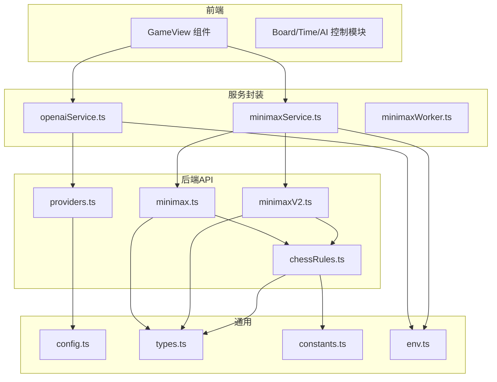
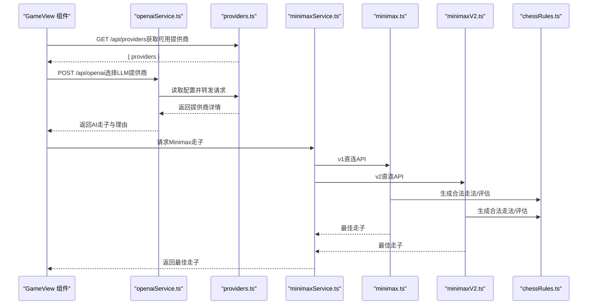
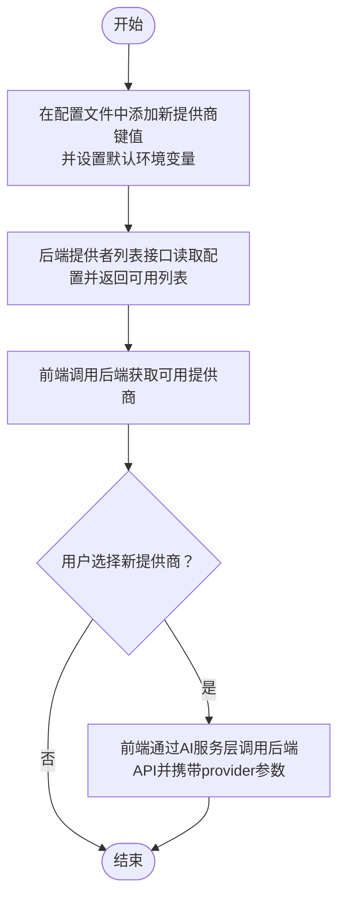
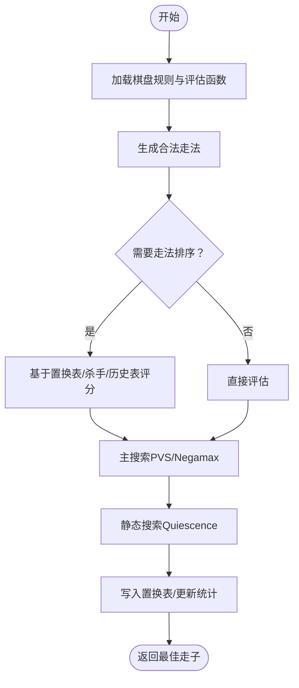
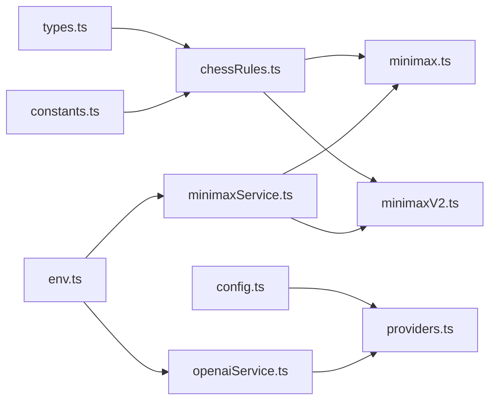

# 贡献指南

<cite>
**本文引用的文件**
- [README.md](file://README.md)
- [package.json](file://package.json)
- [api/common/config.ts](file://api/common/config.ts)
- [api/common/types.ts](file://api/common/types.ts)
- [api/common/constants.ts](file://api/common/constants.ts)
- [api/providers.ts](file://api/providers.ts)
- [api/minimax.ts](file://api/minimax.ts)
- [api/minimaxV2.ts](file://api/minimaxV2.ts)
- [api/chessRules.ts](file://api/chessRules.ts)
- [services/openaiService.ts](file://services/openaiService.ts)
- [services/minimaxService.ts](file://services/minimaxService.ts)
- [services/minimaxWorker.ts](file://services/minimaxWorker.ts)
- [services/types.ts](file://services/types.ts)
- [utils/env.ts](file://utils/env.ts)
- [components/GameView.tsx](file://components/GameView.tsx)
</cite>

## 目录
1. [简介](#简介)
2. [项目结构](#项目结构)
3. [核心组件](#核心组件)
4. [架构总览](#架构总览)
5. [详细组件分析](#详细组件分析)
6. [依赖关系分析](#依赖关系分析)
7. [性能考量](#性能考量)
8. [故障排查指南](#故障排查指南)
9. [结论](#结论)
10. [附录](#附录)

## 简介
本贡献指南面向希望为“Zen Chess”项目做出贡献的开发者，涵盖代码风格、提交规范、分支管理策略、新增LLM提供商的步骤、扩展Minimax算法与改进棋局评估函数的方法、测试建议与代码审查流程，以及如何通过GitHub Issues与Pull Requests参与社区协作。项目采用React前端与Vercel Serverless Functions后端结合的架构，支持多种AI服务提供商与传统Minimax AI。

## 项目结构
项目采用按功能域分层的组织方式：
- 前端组件位于 components/，负责用户界面与交互
- 业务与规则逻辑位于 api/，包括棋盘规则、Minimax算法、LLM集成等
- 服务封装位于 services/，负责与后端API交互、Minimax工作线程等
- 工具与环境配置位于 utils/ 与根目录配置文件
- 服务端独立在 server/，包含Vercel部署相关配置

图表来源
- [components/GameView.tsx](file://components/GameView.tsx#L1-L172)
- [services/openaiService.ts](file://services/openaiService.ts#L1-L37)
- [services/minimaxService.ts](file://services/minimaxService.ts#L1-L66)
- [services/minimaxWorker.ts](file://services/minimaxWorker.ts#L1-L19)
- [api/providers.ts](file://api/providers.ts#L1-L41)
- [api/minimax.ts](file://api/minimax.ts#L1-L125)
- [api/minimaxV2.ts](file://api/minimaxV2.ts#L1-L487)
- [api/chessRules.ts](file://api/chessRules.ts#L1-L390)
- [api/common/config.ts](file://api/common/config.ts#L1-L49)
- [api/common/types.ts](file://api/common/types.ts#L1-L68)
- [api/common/constants.ts](file://api/common/constants.ts#L1-L91)
- [utils/env.ts](file://utils/env.ts#L1-L51)

章节来源
- [README.md](file://README.md#L1-L82)
- [package.json](file://package.json#L1-L30)

## 核心组件
- LLM提供商配置与发现：通过环境变量集中配置各提供商的API Key、模型与URL，后端提供统一的提供商列表接口，前端据此动态展示可用AI服务。
- Minimax AI：提供v1与v2两个版本，v1适合演示，v2具备置换表、杀手走法、历史启发、空步裁剪、迭代加深等高级优化。
- 棋盘规则与评估：实现中国象棋规则、合法走法生成、将军检测、局面评估、Zobrist哈希等，为AI搜索与LLM提示工程提供基础。
- 前端交互：GameView整合计时、悔棋、历史、AI思考模块与棋盘，统一调度AI服务与后端API。

章节来源
- [api/common/config.ts](file://api/common/config.ts#L1-L49)
- [api/providers.ts](file://api/providers.ts#L1-L41)
- [api/minimax.ts](file://api/minimax.ts#L1-L125)
- [api/minimaxV2.ts](file://api/minimaxV2.ts#L1-L487)
- [api/chessRules.ts](file://api/chessRules.ts#L1-L390)
- [components/GameView.tsx](file://components/GameView.tsx#L1-L172)

## 架构总览
下图展示了从前端到后端的典型调用链，包括AI提供商选择与Minimax搜索两种路径。

图表来源
- [components/GameView.tsx](file://components/GameView.tsx#L1-L172)
- [services/openaiService.ts](file://services/openaiService.ts#L1-L37)
- [api/providers.ts](file://api/providers.ts#L1-L41)
- [services/minimaxService.ts](file://services/minimaxService.ts#L1-L66)
- [api/minimax.ts](file://api/minimax.ts#L1-L125)
- [api/minimaxV2.ts](file://api/minimaxV2.ts#L1-L487)
- [api/chessRules.ts](file://api/chessRules.ts#L1-L390)

## 详细组件分析

### 新增LLM提供商（以修改api/providers.ts与services/openaiService.ts为例）
- 步骤概览
  1) 在配置文件中新增提供商键值与默认环境变量映射
  2) 在后端提供者列表接口中自动读取可用提供商
  3) 在前端通过调用后端接口获取可用提供商列表
  4) 在AI服务层根据provider参数向后端转发请求
- 关键实现位置
  - 配置与发现：[api/common/config.ts](file://api/common/config.ts#L1-L49)、[api/providers.ts](file://api/providers.ts#L1-L41)
  - 前端调用：[services/openaiService.ts](file://services/openaiService.ts#L1-L37)
  - 环境与URL构建：[utils/env.ts](file://utils/env.ts#L1-L51)
- 提交规范建议
  - 在README中补充新提供商的环境变量与API端点说明
  - 在PR中附带环境变量示例与最小可验证改动

图表来源
- [api/common/config.ts](file://api/common/config.ts#L1-L49)
- [api/providers.ts](file://api/providers.ts#L1-L41)
- [services/openaiService.ts](file://services/openaiService.ts#L1-L37)
- [utils/env.ts](file://utils/env.ts#L1-L51)

章节来源
- [api/common/config.ts](file://api/common/config.ts#L1-L49)
- [api/providers.ts](file://api/providers.ts#L1-L41)
- [services/openaiService.ts](file://services/openaiService.ts#L1-L37)
- [utils/env.ts](file://utils/env.ts#L1-L51)
- [README.md](file://README.md#L1-L82)

### 扩展Minimax算法或改进棋局评估函数
- v1与v2对比
  - v1：简单Minimax+Alpha-Beta剪枝，适合演示与低深度
  - v2：引入置换表、杀手走法、历史启发、空步裁剪、迭代加深、静态搜索等，性能与质量显著提升
- 评估函数与位置表
  - 基础子力价值与位置权重（PST）可扩展，建议按棋子类型与阵营镜像设计
  - 可加入更精细的机动性、子力活跃度、局面重复检测等
- Worker化与性能
  - v2已通过Worker封装，避免阻塞UI；可在Worker内进一步拆分搜索任务或缓存中间结果
- 代码参考路径
  - v1入口与剪枝：[api/minimax.ts](file://api/minimax.ts#L1-L125)
  - v2核心搜索与优化：[api/minimaxV2.ts](file://api/minimaxV2.ts#L1-L487)
  - Worker封装与版本切换：[services/minimaxWorker.ts](file://services/minimaxWorker.ts#L1-L19)
  - Worker API类型：[services/types.ts](file://services/types.ts#L1-L5)

图表来源
- [api/minimax.ts](file://api/minimax.ts#L1-L125)
- [api/minimaxV2.ts](file://api/minimaxV2.ts#L1-L487)
- [api/chessRules.ts](file://api/chessRules.ts#L1-L390)

章节来源
- [api/minimax.ts](file://api/minimax.ts#L1-L125)
- [api/minimaxV2.ts](file://api/minimaxV2.ts#L1-L487)
- [api/chessRules.ts](file://api/chessRules.ts#L1-L390)
- [services/minimaxWorker.ts](file://services/minimaxWorker.ts#L1-L19)
- [services/types.ts](file://services/types.ts#L1-L5)

### 前端组件与交互
- GameView整合了计时、悔棋、历史、AI思考模块与棋盘渲染，统一调度AI服务与后端API
- 建议保持组件职责单一，通过props传递状态与回调，便于测试与复用

章节来源
- [components/GameView.tsx](file://components/GameView.tsx#L1-L172)

## 依赖关系分析
- 类型与常量
  - 类型定义与棋盘尺寸、初始布局等由公共模块提供，前后端共享
- 服务封装
  - openaiService与minimaxService分别封装与后端API交互的细节，降低组件耦合
- 环境与URL
  - env模块根据运行环境决定API基础URL，支持Vercel、GitHub Pages与本地开发

图表来源
- [api/common/types.ts](file://api/common/types.ts#L1-L68)
- [api/common/constants.ts](file://api/common/constants.ts#L1-L91)
- [api/chessRules.ts](file://api/chessRules.ts#L1-L390)
- [api/minimax.ts](file://api/minimax.ts#L1-L125)
- [api/minimaxV2.ts](file://api/minimaxV2.ts#L1-L487)
- [api/common/config.ts](file://api/common/config.ts#L1-L49)
- [api/providers.ts](file://api/providers.ts#L1-L41)
- [utils/env.ts](file://utils/env.ts#L1-L51)
- [services/openaiService.ts](file://services/openaiService.ts#L1-L37)
- [services/minimaxService.ts](file://services/minimaxService.ts#L1-L66)

章节来源
- [api/common/types.ts](file://api/common/types.ts#L1-L68)
- [api/common/constants.ts](file://api/common/constants.ts#L1-L91)
- [api/chessRules.ts](file://api/chessRules.ts#L1-L390)
- [api/minimax.ts](file://api/minimax.ts#L1-L125)
- [api/minimaxV2.ts](file://api/minimaxV2.ts#L1-L487)
- [api/common/config.ts](file://api/common/config.ts#L1-L49)
- [api/providers.ts](file://api/providers.ts#L1-L41)
- [utils/env.ts](file://utils/env.ts#L1-L51)
- [services/openaiService.ts](file://services/openaiService.ts#L1-L37)
- [services/minimaxService.ts](file://services/minimaxService.ts#L1-L66)

## 性能考量
- Minimax v2已内置多项优化，建议优先使用v2并配合Worker执行
- 评估函数可扩展位置权重与局面特征，但需平衡计算成本
- 前端应避免在主线程执行长时间计算，必要时使用Web Worker或服务端计算
- API调用需考虑网络延迟与错误重试，合理设置超时与降级策略

## 故障排查指南
- 环境变量未生效
  - 确认根目录存在本地环境文件，且键名与配置模块一致
  - 参考：[README.md](file://README.md#L19-L43)、[api/common/config.ts](file://api/common/config.ts#L1-L49)
- Provider不可用
  - 检查后端提供者列表接口返回的可用性字段
  - 参考：[api/providers.ts](file://api/providers.ts#L1-L41)
- Minimax无响应或卡顿
  - 使用v2版本并启用Worker；适当降低深度或增加时间限制
  - 参考：[services/minimaxService.ts](file://services/minimaxService.ts#L1-L66)、[services/minimaxWorker.ts](file://services/minimaxWorker.ts#L1-L19)
- LLM调用失败
  - 检查API Key、模型与URL配置；确认后端转发逻辑
  - 参考：[services/openaiService.ts](file://services/openaiService.ts#L1-L37)、[utils/env.ts](file://utils/env.ts#L1-L51)

章节来源
- [README.md](file://README.md#L19-L43)
- [api/common/config.ts](file://api/common/config.ts#L1-L49)
- [api/providers.ts](file://api/providers.ts#L1-L41)
- [services/minimaxService.ts](file://services/minimaxService.ts#L1-L66)
- [services/minimaxWorker.ts](file://services/minimaxWorker.ts#L1-L19)
- [services/openaiService.ts](file://services/openaiService.ts#L1-L37)
- [utils/env.ts](file://utils/env.ts#L1-L51)

## 结论
通过明确的配置与接口约定、清晰的服务封装与Worker化执行，Zen Chess实现了可扩展的AI能力与良好的用户体验。新增LLM提供商与优化Minimax算法均能在现有架构下快速落地。建议在贡献过程中遵循本文的规范与流程，确保变更的稳定性与可维护性。

## 附录

### 代码风格与最佳实践（基于仓库现状）
- TypeScript
  - 使用严格类型定义，避免any；接口与枚举尽量集中管理
  - 参考：[api/common/types.ts](file://api/common/types.ts#L1-L68)
- React
  - 组件职责单一，通过props传递状态与回调；避免在组件内直接发起网络请求
  - 参考：[components/GameView.tsx](file://components/GameView.tsx#L1-L172)
- 网络与API
  - 统一通过env模块构建API URL；对错误进行显式处理并返回可诊断信息
  - 参考：[utils/env.ts](file://utils/env.ts#L1-L51)、[services/openaiService.ts](file://services/openaiService.ts#L1-L37)

### 提交规范与分支管理
- 分支命名
  - feat/xxx：新增功能（如新增LLM提供商）
  - fix/xxx：修复缺陷（如Minimax卡顿问题）
  - refactor/xxx：重构（如优化评估函数）
  - docs/xxx：文档更新（如更新README）
- 提交信息
  - 使用动宾结构，简明扼要描述变更内容与影响范围
  - 如涉及配置项，请附带环境变量示例与API端点说明
- 审查流程
  - 提交PR前确保通过本地构建与基本功能验证
  - 在PR中说明新增提供商的配置要点与测试方法
  - 对性能敏感的改动（如Minimax优化）需附带基准测试说明

### 测试建议
- 单元测试
  - 对评估函数与走法生成进行边界条件测试
  - 参考：[api/chessRules.ts](file://api/chessRules.ts#L1-L390)
- 集成测试
  - 覆盖LLM提供商与Minimax的端到端流程，包括错误场景
  - 参考：[services/openaiService.ts](file://services/openaiService.ts#L1-L37)、[services/minimaxService.ts](file://services/minimaxService.ts#L1-L66)
- 性能测试
  - 在不同深度与时间限制下测量Minimax响应时间与节点数
  - 参考：[api/minimaxV2.ts](file://api/minimaxV2.ts#L1-L487)

### 代码审查清单
- 是否新增了必要的环境变量与配置？
- 是否保持了类型安全与接口契约？
- 是否避免了主线程阻塞（Worker/服务端）？
- 是否提供了足够的错误处理与日志输出？
- 是否更新了README或相关文档？

### 社区协作
- 报告Bug
  - 在GitHub Issues中提供：重现步骤、期望行为、实际行为、环境信息（浏览器/Node版本、系统）
- 提出功能请求
  - 描述背景、目标、影响范围与验收标准；如涉及新增LLM提供商，附带配置示例
- 提交PR
  - 选择合适的分支与标题；在描述中链接相关Issue；附带测试与性能数据