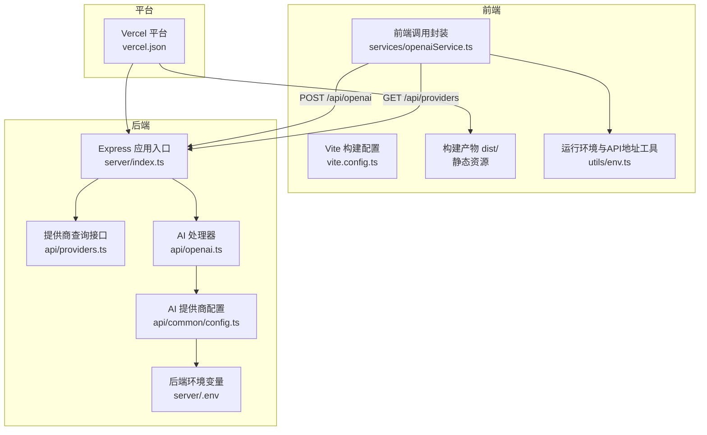
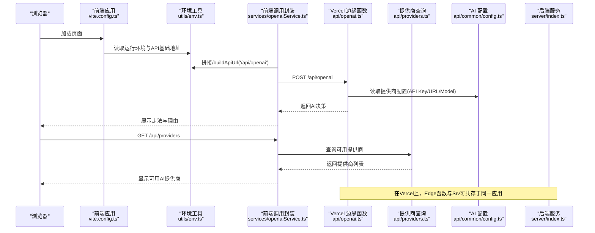
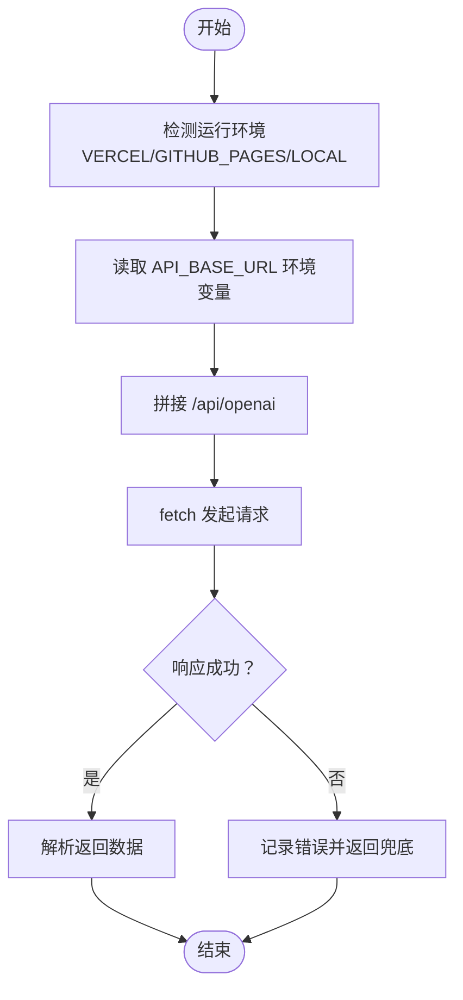
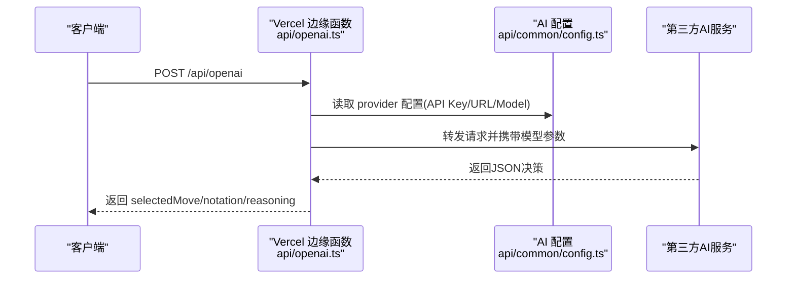
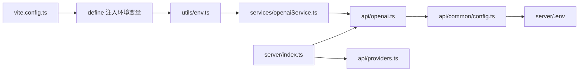

# 部署与配置

<cite>
**本文引用的文件**
- [vercel.json](file://vercel.json)
- [vite.config.ts](file://vite.config.ts)
- [package.json](file://package.json)
- [server/package.json](file://server/package.json)
- [server/index.ts](file://server/index.ts)
- [server/.env](file://server/.env)
- [utils/env.ts](file://utils/env.ts)
- [api/common/config.ts](file://api/common/config.ts)
- [api/providers.ts](file://api/providers.ts)
- [api/openai.ts](file://api/openai.ts)
- [services/openaiService.ts](file://services/openaiService.ts)
- [README.md](file://README.md)
</cite>

## 目录
1. [简介](#简介)
2. [项目结构](#项目结构)
3. [核心组件](#核心组件)
4. [架构总览](#架构总览)
5. [详细组件分析](#详细组件分析)
6. [依赖关系分析](#依赖关系分析)
7. [性能考量](#性能考量)
8. [故障排查指南](#故障排查指南)
9. [结论](#结论)
10. [附录](#附录)

## 简介
本指南面向运维与开发团队，提供将 zen_chess 应用部署到生产环境的完整流程与配置说明。内容涵盖：
- Vercel 平台的 vercel.json 配置如何支持边缘函数与静态文件部署
- vite.config.ts 中的构建配置（输出路径、代理与环境变量注入）
- 环境变量的使用方式，特别是后端 .env 中 AI API 密钥的配置方法
- 不同部署场景的指导（Vercel 全栈部署 vs 仅前端部署至 GitHub Pages）
- 构建命令（vite build）与服务器启动脚本说明

## 项目结构
该仓库采用前后端分离的结构：
- 前端：React + Vite，构建产物输出至 dist 目录
- 后端：Express 服务（server 目录），提供 AI 代理接口与健康检查
- 配置：vercel.json 控制 Vercel 构建与输出目录；vite.config.ts 控制前端构建行为
- 工具与服务：utils/env.ts 提供运行环境判断与 API 基础地址拼接；services/openaiService.ts 作为前端调用入口；api/* 提供 AI 服务配置与处理器

图表来源
- [vercel.json](file://vercel.json#L1-L4)
- [vite.config.ts](file://vite.config.ts#L1-L35)
- [server/index.ts](file://server/index.ts#L1-L64)
- [server/.env](file://server/.env#L1-L4)
- [api/common/config.ts](file://api/common/config.ts#L1-L49)
- [api/providers.ts](file://api/providers.ts#L1-L41)
- [api/openai.ts](file://api/openai.ts#L1-L127)
- [utils/env.ts](file://utils/env.ts#L1-L51)
- [services/openaiService.ts](file://services/openaiService.ts#L1-L37)

章节来源
- [vercel.json](file://vercel.json#L1-L4)
- [vite.config.ts](file://vite.config.ts#L1-L35)
- [server/index.ts](file://server/index.ts#L1-L64)
- [server/.env](file://server/.env#L1-L4)
- [api/common/config.ts](file://api/common/config.ts#L1-L49)
- [api/providers.ts](file://api/providers.ts#L1-L41)
- [api/openai.ts](file://api/openai.ts#L1-L127)
- [utils/env.ts](file://utils/env.ts#L1-L51)
- [services/openaiService.ts](file://services/openaiService.ts#L1-L37)

## 核心组件
- vercel.json：定义 Vercel 构建命令与输出目录，确保前端构建产物与后端服务在平台正确部署
- vite.config.ts：定义开发服务器端口、base 路径、环境变量注入、别名与 sourcemap 等
- server/index.ts：Express 应用入口，提供 /api/openai、/api/providers、/health 等接口
- utils/env.ts：运行环境识别与 API 基础地址拼接，支持 Vercel 与 GitHub Pages 场景
- api/common/config.ts：集中管理各 AI 提供商的模型、API 地址与密钥
- api/providers.ts 与 api/openai.ts：Vercel 边缘函数处理器，负责返回可用提供商与执行 AI 决策
- services/openaiService.ts：前端调用封装，统一发起 /api/openai 请求
- server/.env：后端环境变量示例（包含 DeepSeek 的 API Key 与 URL）

章节来源
- [vercel.json](file://vercel.json#L1-L4)
- [vite.config.ts](file://vite.config.ts#L1-L35)
- [server/index.ts](file://server/index.ts#L1-L64)
- [utils/env.ts](file://utils/env.ts#L1-L51)
- [api/common/config.ts](file://api/common/config.ts#L1-L49)
- [api/providers.ts](file://api/providers.ts#L1-L41)
- [api/openai.ts](file://api/openai.ts#L1-L127)
- [services/openaiService.ts](file://services/openaiService.ts#L1-L37)
- [server/.env](file://server/.env#L1-L4)

## 架构总览
下图展示从浏览器到 Vercel 边缘函数与后端服务的整体调用链路，以及环境变量与配置的流向。

图表来源
- [vite.config.ts](file://vite.config.ts#L1-L35)
- [utils/env.ts](file://utils/env.ts#L1-L51)
- [services/openaiService.ts](file://services/openaiService.ts#L1-L37)
- [api/openai.ts](file://api/openai.ts#L1-L127)
- [api/providers.ts](file://api/providers.ts#L1-L41)
- [api/common/config.ts](file://api/common/config.ts#L1-L49)
- [server/index.ts](file://server/index.ts#L1-L64)

## 详细组件分析

### Vercel 配置（vercel.json）
- 构建命令：通过 npm install 与 npm run build 自动安装依赖并执行前端构建
- 输出目录：dist，表示 Vercel 将把构建产物作为静态站点发布
- 适用场景：当需要将前端静态化部署时，此配置可直接生效；若需后端 API，则需配合 server/index.ts 与边缘函数

章节来源
- [vercel.json](file://vercel.json#L1-L4)

### Vite 构建配置（vite.config.ts）
- 开发服务器：端口 3000，host 绑定为 0.0.0.0，便于容器或外部访问
- 插件：启用 React 与 Comlink 插件；worker 也启用 Comlink 以支持 Web Worker
- base：设置为 "./"，确保在 GitHub Pages 子路径部署时资源引用正确
- 环境变量注入：通过 define 注入 API_BASE_URL、GITHUB_PAGES、VERCEL 等变量，供运行时使用
- 别名：@ 指向项目根目录，便于模块导入
- sourcemap：开启构建 sourcemap，便于调试

章节来源
- [vite.config.ts](file://vite.config.ts#L1-L35)

### 前端调用与环境适配（utils/env.ts 与 services/openaiService.ts）
- 运行环境识别：通过 VERCEL、GITHUB_PAGES、LOCAL 三种环境变量判断当前部署形态
- API 基础地址：优先从环境变量读取，否则为空字符串；buildApiUrl 会拼接路径
- 前端调用封装：openaiService 发起 POST /api/openai，携带 board、turn、provider、lastMove 等参数

图表来源
- [utils/env.ts](file://utils/env.ts#L1-L51)
- [services/openaiService.ts](file://services/openaiService.ts#L1-L37)

章节来源
- [utils/env.ts](file://utils/env.ts#L1-L51)
- [services/openaiService.ts](file://services/openaiService.ts#L1-L37)

### 后端服务与边缘函数（server/index.ts、api/openai.ts、api/providers.ts）
- Express 应用：提供 /api/openai（POST）、/api/providers（GET）、/health（GET）等接口
- 边缘函数：api/openai.ts 与 api/providers.ts 作为 Vercel Serverless Function，处理跨域与请求转发
- 错误处理：全局错误中间件与 404 处理，保证对外一致的错误响应格式
- 健康检查：/health 返回状态与时间戳，便于平台监控

图表来源
- [server/index.ts](file://server/index.ts#L1-L64)
- [api/openai.ts](file://api/openai.ts#L1-L127)
- [api/common/config.ts](file://api/common/config.ts#L1-L49)

章节来源
- [server/index.ts](file://server/index.ts#L1-L64)
- [api/openai.ts](file://api/openai.ts#L1-L127)
- [api/providers.ts](file://api/providers.ts#L1-L41)
- [api/common/config.ts](file://api/common/config.ts#L1-L49)

### 环境变量与密钥配置
- 后端 .env 示例：包含 DEEPSEEK_API_KEY、DEEPSEEK_API_URL、DEEPSEEK_MODEL 等键值
- 前端 README 提供了多厂商 API Key 的配置模板（OPENAI_*、GEMINI_*、DEEPSEEK_*、QIANWEN_*）
- 配置加载：api/common/config.ts 从进程环境变量读取各提供商的模型、URL 与密钥
- 运行时注入：vite.config.ts 通过 define 将 API_BASE_URL、GITHUB_PAGES、VERCEL 注入前端运行时

章节来源
- [server/.env](file://server/.env#L1-L4)
- [README.md](file://README.md#L19-L43)
- [api/common/config.ts](file://api/common/config.ts#L1-L49)
- [vite.config.ts](file://vite.config.ts#L1-L35)

## 依赖关系分析
- 前端依赖：React、Vite、@vitejs/plugin-react、vite-plugin-comlink 等
- 后端依赖：Express、CORS、dotenv、comlink 等
- 平台依赖：@vercel/node（用于 Vercel 平台集成）
- 关键耦合点：
  - utils/env.ts 与 vite.config.ts 的环境变量注入共同决定 API 基础地址
  - api/common/config.ts 与 server/.env 共同决定 AI 提供商的密钥与模型
  - server/index.ts 与 api/openai.ts、api/providers.ts 协作提供对外接口

图表来源
- [vite.config.ts](file://vite.config.ts#L1-L35)
- [utils/env.ts](file://utils/env.ts#L1-L51)
- [services/openaiService.ts](file://services/openaiService.ts#L1-L37)
- [api/openai.ts](file://api/openai.ts#L1-L127)
- [api/common/config.ts](file://api/common/config.ts#L1-L49)
- [server/.env](file://server/.env#L1-L4)
- [server/index.ts](file://server/index.ts#L1-L64)
- [api/providers.ts](file://api/providers.ts#L1-L41)

章节来源
- [vite.config.ts](file://vite.config.ts#L1-L35)
- [utils/env.ts](file://utils/env.ts#L1-L51)
- [services/openaiService.ts](file://services/openaiService.ts#L1-L37)
- [api/openai.ts](file://api/openai.ts#L1-L127)
- [api/common/config.ts](file://api/common/config.ts#L1-L49)
- [server/.env](file://server/.env#L1-L4)
- [server/index.ts](file://server/index.ts#L1-L64)
- [api/providers.ts](file://api/providers.ts#L1-L41)

## 性能考量
- 构建优化：开启 sourcemap 便于调试，但生产建议关闭以减少体积
- 资源路径：base 设置为 "./" 有利于 GitHub Pages 子路径部署，避免资源 404
- 边缘函数：将 AI 请求转发至 Vercel 边缘函数，减少跨域与代理复杂度
- 错误降级：当 AI 返回无效或空响应时，系统会返回兜底策略，提升稳定性

[本节为通用建议，无需列出具体文件来源]

## 故障排查指南
- 健康检查：访问 /health 确认后端服务正常运行
- CORS 问题：确认边缘函数与 Express 中的 CORS 头部设置
- API Key 缺失：检查 api/common/config.ts 是否正确读取环境变量；确认 server/.env 或平台环境变量已配置
- 路由 404：确认 server/index.ts 中路由注册与方法匹配
- 环境变量未生效：检查 vite.config.ts 的 define 注入与 utils/env.ts 的读取逻辑

章节来源
- [server/index.ts](file://server/index.ts#L1-L64)
- [api/openai.ts](file://api/openai.ts#L1-L127)
- [api/providers.ts](file://api/providers.ts#L1-L41)
- [api/common/config.ts](file://api/common/config.ts#L1-L49)
- [utils/env.ts](file://utils/env.ts#L1-L51)
- [vite.config.ts](file://vite.config.ts#L1-L35)

## 结论
通过 vercel.json、vite.config.ts 与 server/index.ts 的协同，zen_chess 可在 Vercel 平台上实现前端静态化与后端边缘函数的无缝集成。配合 utils/env.ts 与 api/common/config.ts 的环境变量机制，可在不同部署形态（Vercel、GitHub Pages、本地）灵活切换。建议在生产环境中关闭 sourcemap，完善日志与健康检查，并为各 AI 提供商配置正确的密钥与模型。

[本节为总结性内容，无需列出具体文件来源]

## 附录

### 构建与部署命令
- 前端构建：vite build
- 本地开发：npm run dev（前端）；在 server 目录下 npm run dev（后端）
- 生产预览：vite preview
- Vercel 部署：npm run deploy（先构建再 vercel --prod）

章节来源
- [package.json](file://package.json#L1-L30)
- [server/package.json](file://server/package.json#L1-L26)

### 环境变量清单与用途
- 后端 .env（示例）：
  - DEEPSEEK_API_KEY：DeepSeek API 密钥
  - DEEPSEEK_API_URL：DeepSeek API 地址
  - DEEPSEEK_MODEL：DeepSeek 模型名称
- 前端 README（示例）：
  - OPENAI_*：OpenAI 相关配置
  - GEMINI_*：Google Gemini 相关配置
  - DEEPSEEK_*：DeepSeek 相关配置
  - QIANWEN_*：阿里云千问相关配置
- 运行时注入：
  - API_BASE_URL：API 基础地址（Vercel 上可为空，使用相对路径）
  - GITHUB_PAGES：标记 GitHub Pages 环境
  - VERCEL：标记 Vercel 环境

章节来源
- [server/.env](file://server/.env#L1-L4)
- [README.md](file://README.md#L19-L43)
- [vite.config.ts](file://vite.config.ts#L1-L35)
- [utils/env.ts](file://utils/env.ts#L1-L51)
- [api/common/config.ts](file://api/common/config.ts#L1-L49)

### 部署场景与限制
- Vercel 全栈部署：
  - 使用 vercel.json 的构建命令与输出目录，将前端静态化并保留后端边缘函数
  - 建议在 Vercel 项目中设置环境变量（如 DEEPSEEK_*、OPENAI_* 等），以替代本地 .env
- 仅前端部署至 GitHub Pages：
  - 由于 base 设置为 "./"，适合子路径部署；但受限于静态托管，无法直接运行后端服务
  - 若需 AI 能力，需在 Vercel 上启用边缘函数或使用第三方代理

章节来源
- [vercel.json](file://vercel.json#L1-L4)
- [vite.config.ts](file://vite.config.ts#L1-L35)
- [README.md](file://README.md#L45-L70)