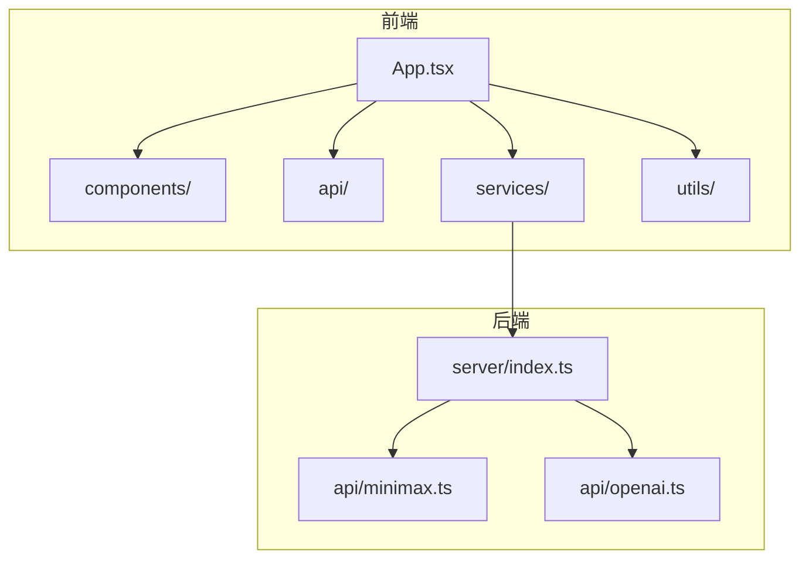
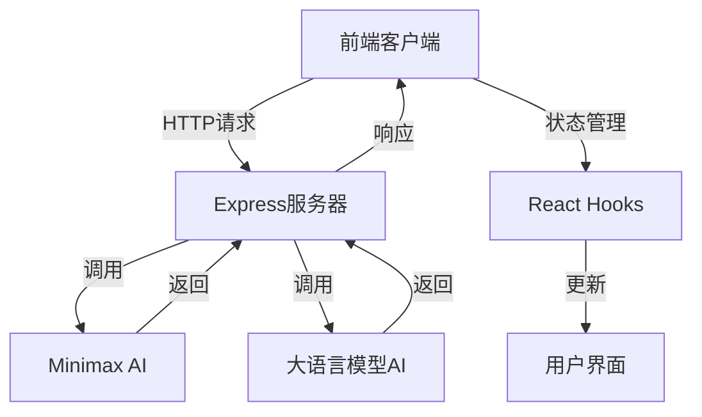
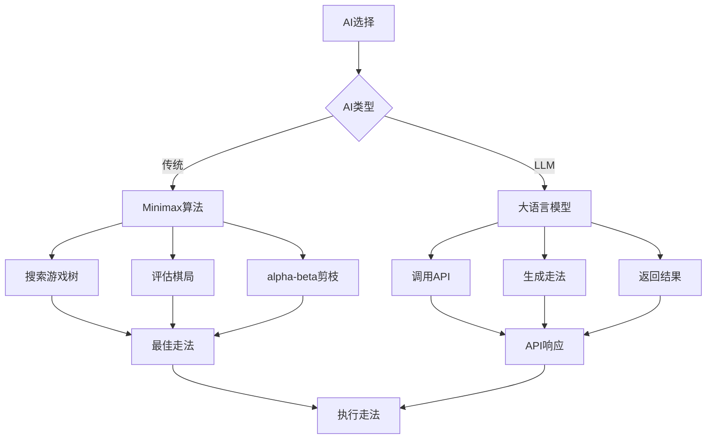
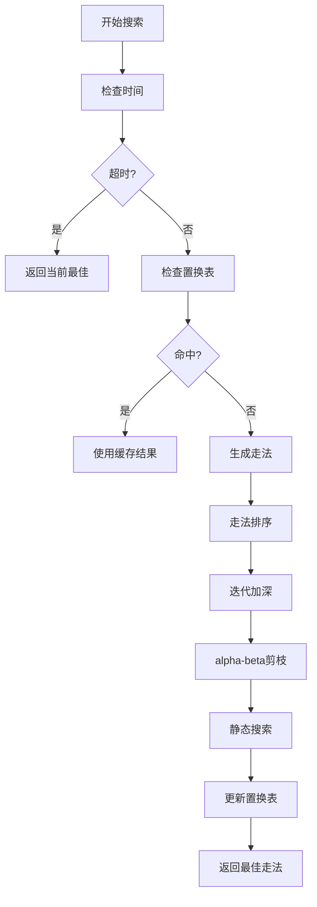
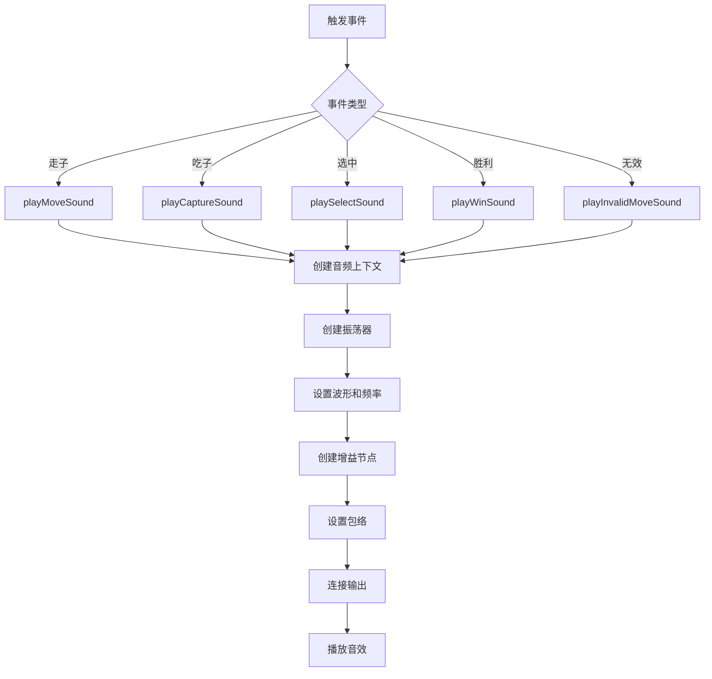

# 项目概述

<cite>
**本文档引用的文件**  
- [README.md](file://README.md)
- [package.json](file://package.json)
- [App.tsx](file://App.tsx)
- [index.tsx](file://index.tsx)
- [server/index.ts](file://server/index.ts)
- [api/chessRules.ts](file://api/chessRules.ts)
- [api/minimax.ts](file://api/minimax.ts)
- [api/minimaxV2.ts](file://api/minimaxV2.ts)
- [services/minimaxService.ts](file://services/minimaxService.ts)
- [services/openaiService.ts](file://services/openaiService.ts)
- [services/minimaxWorker.ts](file://services/minimaxWorker.ts)
- [api/common/types.ts](file://api/common/types.ts)
- [api/common/constants.ts](file://api/common/constants.ts)
- [utils/env.ts](file://utils/env.ts)
- [utils/sound.ts](file://utils/sound.ts)
</cite>

## 目录
1. [项目简介](#项目简介)
2. [项目结构](#项目结构)
3. [核心功能](#核心功能)
4. [技术架构](#技术架构)
5. [AI智能系统](#ai智能系统)
6. [前后端交互机制](#前后端交互机制)
7. [性能优化策略](#性能优化策略)
8. [游戏逻辑实现](#游戏逻辑实现)
9. [音效系统](#音效系统)
10. [配置与部署](#配置与部署)

## 项目简介

Zen Chess 是一个现代化的中国象棋对弈平台，旨在为开发者和玩家提供一个兼具技术深度与用户体验的开源解决方案。该项目融合了传统Minimax算法与大语言模型（LLM）AI的双重智能对战系统，通过React/Vite前端与Express后端的全栈架构，实现了流畅的Web端象棋对弈体验。

项目创新性地将经典AI算法与前沿LLM技术集成在同一平台，支持多种AI服务提供商，包括OpenAI、Google Gemini、DeepSeek和阿里云千问。这种双重AI架构既保留了传统算法的稳定性和可预测性，又引入了大语言模型的创造性思维和战略深度，为用户提供多样化的对战体验。

Zen Chess不仅是一个功能完整的象棋游戏，更是一个技术示范项目，展示了如何将复杂的AI算法、Web Worker性能优化和现代化前端框架有机结合，为开发者提供了一个学习和扩展的优秀范例。

**Section sources**
- [README.md](file://README.md#L1-L82)
- [package.json](file://package.json#L1-L30)

## 项目结构

Zen Chess项目采用清晰的模块化结构，将前端、后端、服务和工具组件分离，便于维护和扩展。项目根目录包含主要的前端文件和配置，而服务器端代码位于独立的server目录中。

前端部分采用React组件化架构，components目录包含棋盘、棋子、计时器、设置模态框等UI组件。api目录包含中国象棋规则、AI算法和类型定义等核心逻辑。services目录封装了与AI服务的交互逻辑，utils目录提供环境配置和音效等辅助功能。

后端服务器采用Express框架，通过简单的API端点处理AI决策请求。这种分离式架构使得前端可以独立开发和部署，同时保持与后端服务的松耦合。

**Diagram sources**
- [App.tsx](file://App.tsx#L1-L460)
- [server/index.ts](file://server/index.ts#L1-L64)

**Section sources**
- [App.tsx](file://App.tsx#L1-L460)
- [server/index.ts](file://server/index.ts#L1-L64)

## 核心功能

Zen Chess提供了完整的中国象棋对弈功能，包括人机对战、双人对战、游戏计时、悔棋、历史记录和音效反馈等。这些功能共同构成了一个专业级的象棋对弈平台。

人机对战模式支持两种AI类型：传统Minimax算法AI和基于大语言模型的AI。玩家可以根据自己的偏好选择不同的AI难度和提供商。双人对战模式允许两名玩家在同一设备上对弈，适合面对面的棋艺交流。

游戏计时功能支持可配置的时间控制，从快速对局到慢棋比赛均可实现。悔棋功能允许玩家撤销上一步或上两步（在AI对战中），增加了游戏的容错性和学习价值。历史记录功能以标准象棋记谱法显示所有走法，帮助玩家复盘分析。

音效系统为不同的游戏事件提供反馈，包括走子、吃子、选中、胜利和无效移动等，增强了游戏的沉浸感和交互体验。

**Section sources**
- [README.md](file://README.md#L5-L18)
- [App.tsx](file://App.tsx#L30-L460)
- [utils/sound.ts](file://utils/sound.ts#L1-L158)

## 技术架构

Zen Chess采用现代化的全栈技术架构，前端基于React和Vite，后端使用Express框架。这种架构选择既保证了开发效率，又提供了良好的性能表现。

前端架构采用React函数组件和Hooks，实现了状态管理和副作用处理的现代化模式。Vite作为构建工具，提供了快速的开发服务器和高效的生产构建。项目使用TypeScript进行类型安全的开发，提高了代码质量和可维护性。

后端架构简洁高效，Express服务器主要作为API网关，将前端请求转发到相应的AI处理模块。这种设计使得AI算法可以独立开发和测试，同时保持与前端的松耦合。

环境变量系统支持多种部署环境（Vercel、GitHub Pages、本地开发），通过utils/env.ts文件统一管理API基础URL，确保了配置的一致性和可移植性。

**Diagram sources**
- [App.tsx](file://App.tsx#L1-L460)
- [server/index.ts](file://server/index.ts#L1-L64)
- [services/minimaxService.ts](file://services/minimaxService.ts#L1-L66)
- [services/openaiService.ts](file://services/openaiService.ts#L1-L37)

**Section sources**
- [package.json](file://package.json#L1-L30)
- [server/index.ts](file://server/index.ts#L1-L64)
- [utils/env.ts](file://utils/env.ts#L1-L51)

## AI智能系统

Zen Chess的核心创新在于其双重AI智能系统，融合了传统Minimax算法和大语言模型（LLM）技术。这种混合架构为用户提供了两种截然不同的对战体验。

传统Minimax算法AI基于alpha-beta剪枝优化，通过搜索游戏树来寻找最优走法。项目提供了两个版本的实现：基础版本（minimax.ts）和高级版本（minimaxV2.ts），后者包含了置换表、杀手走法、历史表等高级优化技术，显著提升了搜索效率和棋力水平。

大语言模型AI通过API与多种LLM服务提供商集成，包括OpenAI、Google Gemini、DeepSeek和阿里云千问。这种AI类型不依赖传统的搜索算法，而是利用LLM的自然语言理解和推理能力来生成走法建议，展现出更具创造性和战略性的棋风。

AI系统通过Web Worker在后台线程中运行，避免了长时间计算导致的UI冻结，确保了流畅的用户体验。玩家可以在游戏设置中选择AI类型、难度级别和提供商，灵活调整对战体验。

**Diagram sources**
- [api/minimax.ts](file://api/minimax.ts#L1-L125)
- [api/minimaxV2.ts](file://api/minimaxV2.ts#L1-L487)
- [services/openaiService.ts](file://services/openaiService.ts#L1-L37)

**Section sources**
- [README.md](file://README.md#L8-L13)
- [App.tsx](file://App.tsx#L53-L60)
- [api/minimax.ts](file://api/minimax.ts#L1-L125)
- [api/minimaxV2.ts](file://api/minimaxV2.ts#L1-L487)
- [services/openaiService.ts](file://services/openaiService.ts#L1-L37)

## 前后端交互机制

Zen Chess的前后端交互通过RESTful API实现，采用JSON格式进行数据交换。前端通过fetch API向后端发送请求，后端处理请求并返回结果，形成完整的通信闭环。

主要API端点包括：
- POST `/api/openai`：处理大语言模型AI的走法决策请求
- POST `/api/minimax`：处理传统Minimax算法AI的走法决策请求
- GET `/api/providers`：获取可用的AI提供商列表
- GET `/health`：健康检查端点

请求数据包含当前棋盘状态、轮到哪方走棋、AI配置等信息。响应数据包含推荐的走法坐标和可能的推理说明。这种设计使得AI算法可以独立于前端运行，便于扩展和维护。

环境变量系统通过utils/env.ts文件统一管理API基础URL，支持多种部署环境。在本地开发时，前端和后端分别运行在不同的端口上，通过CORS配置实现跨域通信。

**Section sources**
- [server/index.ts](file://server/index.ts#L23-L41)
- [services/minimaxService.ts](file://services/minimaxService.ts#L13-L45)
- [services/openaiService.ts](file://services/openaiService.ts#L4-L36)
- [utils/env.ts](file://utils/env.ts#L47-L51)

## 性能优化策略

Zen Chess采用了多种性能优化策略，确保在复杂AI计算的同时保持流畅的用户体验。最核心的优化是使用Web Worker将AI计算移出主线程，避免UI冻结。

Web Worker通过comlink库实现主线程与工作线程之间的通信，封装了复杂的序列化和反序列化过程。minimaxWorker.ts文件作为工作线程的入口，暴露getBestMoveMinimax接口供主线程调用。

对于传统Minimax算法，项目实现了多个优化技术：
- 置换表（Transposition Table）：缓存已搜索的局面，避免重复计算
- 杀手走法（Killer Moves）：优先搜索可能产生剪枝的走法
- 历史表（History Table）：记录产生剪枝的走法，用于后续搜索的排序
- 迭代加深（Iterative Deepening）：逐步增加搜索深度，充分利用时间限制
- 静态搜索（Quiescence Search）：处理激烈的吃子交换，防止水平线效应

这些优化技术显著提升了搜索效率，在有限的时间内达到更深的搜索深度，从而提高AI的棋力水平。

**Diagram sources**
- [services/minimaxWorker.ts](file://services/minimaxWorker.ts#L1-L19)
- [api/minimaxV2.ts](file://api/minimaxV2.ts#L1-L487)

**Section sources**
- [services/minimaxService.ts](file://services/minimaxService.ts#L47-L65)
- [services/minimaxWorker.ts](file://services/minimaxWorker.ts#L1-L19)
- [api/minimaxV2.ts](file://api/minimaxV2.ts#L1-L487)

## 游戏逻辑实现

Zen Chess的游戏逻辑实现遵循中国象棋的完整规则，包括各种棋子的移动方式、将军、将死、困毙等特殊规则。核心逻辑位于api/chessRules.ts文件中，通过函数式编程方式实现了清晰的规则定义。

棋子移动规则通过getValidMovesForPiece函数实现，根据不同棋子类型应用相应的移动逻辑：
- 将/帅：在九宫格内沿直线移动一格，有"飞将"规则
- 士/仕：在九宫格内沿对角线移动一格
- 相/象：沿对角线移动两格，有"塞象眼"限制
- 马：走"日"字，有"蹩马腿"限制
- 车：沿直线任意距离移动
- 炮：移动方式同车，吃子需要"炮架"
- 兵/卒：向前移动一格，过河后可横向移动

游戏状态管理通过React状态和上下文实现，包括当前棋盘、轮到哪方、选中位置、合法走法、游戏状态等。走法执行通过applyMove函数实现，同时更新历史记录和移动列表。

胜负判定通过检查对方是否有合法走法来实现，如果没有合法走法且处于被将军状态则为将死，否则为困毙（和棋）。

**Section sources**
- [api/chessRules.ts](file://api/chessRules.ts#L1-L390)
- [App.tsx](file://App.tsx#L35-L460)

## 音效系统

Zen Chess的音效系统采用Web Audio API实现，无需外部依赖即可提供高质量的音频反馈。系统通过简单的波形合成生成不同类型的音效，包括走子、吃子、选中、胜利和无效移动等。

音效系统由多个独立函数组成，每个函数负责生成特定类型的音效：
- playMoveSound：走子音效，低频三角波模拟木板敲击声
- playCaptureSound：吃子音效，高频方波配合滤波器模拟清脆声响
- playSelectSound：选中音效，短促的正弦波模拟点击声
- playWinSound：胜利音效，升序大调琶音营造庆祝氛围
- playInvalidMoveSound：无效移动音效，不和谐的锯齿波警示错误

音效系统支持全局音量控制，通过setGlobalVolume函数调整音量大小。所有音效都考虑了音量为零的情况，避免不必要的计算和音频上下文创建。

**Diagram sources**
- [utils/sound.ts](file://utils/sound.ts#L1-L158)

**Section sources**
- [utils/sound.ts](file://utils/sound.ts#L1-L158)
- [App.tsx](file://App.tsx#L12-L13)

## 配置与部署

Zen Chess的配置与部署设计考虑了多种环境需求，支持本地开发、Vercel部署和GitHub Pages发布。环境变量系统通过.env.local文件进行配置，确保敏感信息不会提交到版本控制系统。

本地开发需要创建.env.local文件，配置各个AI服务提供商的API密钥和模型参数。安装依赖后，通过两个独立的命令启动前端和后端开发服务器。

部署到Vercel时，环境变量在Vercel控制台中配置，构建命令会自动编译TypeScript并打包前端资源。GitHub Pages部署需要调整API基础URL，确保前端能够正确访问后端服务。

项目提供了清晰的安装和运行说明，包括依赖安装、环境变量配置和服务器启动等步骤，降低了新开发者上手的门槛。

**Section sources**
- [README.md](file://README.md#L19-L63)
- [utils/env.ts](file://utils/env.ts#L6-L51)
- [package.json](file://package.json#L7-L11)